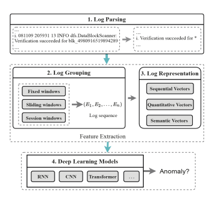
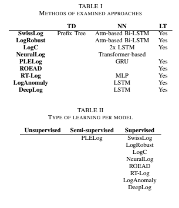
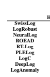

# The State Of The Art Of Log-Based Anomaly Detection

Maximilian Eckert Distributed and Operating Systems (DOS)
Technische Universitat Berlin ¨
Berlin, Germany Email: maximilian.eckert@campus.tu-berlin.de Abstract**—In this paper, we explore different ways that have**
been tried to detect unusual patterns in software logs using deep learning, which means finding these patterns automatically without needing someone to look through the logs manually. Many of these studies have shown promising results and seem like they could solve problems that other methods haven't been able to. However, when looking at these methods more broadly, it turns out that they might not work as well in real-life situations as they do in tests.

We take a closer look at how these methods for detecting anomalies in logs have been evaluated in the past and focus on a new method called SwissLog that hasn't been evaluated independently yet. Our goal is to see if these methods were evaluated properly and if SwissLog could be a solution for this matter.

Index Terms**—Anomaly Detection, Log Analysis, Deep Learning, Log Instability, Log Parsing**

## I. Introduction

In the realm of complex software systems, detecting anomalies stands out as a significant challenge for the industry. These anomalies, or unexpected behaviors, can greatly impact user satisfaction and business operations [10]. Despite the critical nature of this issue, a universally effective solution has yet to be established. Currently, many businesses rely on manually reviewing log statements [2] - a process that is not only time-consuming but also prone to overlooking crucial signals.

To address this, there has been a shift towards employing machine learning and deep learning techniques for the realtime analysis of logs. While these methods hold promise [7],
they often fall short in key areas [10]. A common shortfall is their inconsistency in accurately distinguishing between normal and abnormal behavior [2].

Numerous attempts have been made to devise a method that is dependable in real-world settings. Despite claims of high efficiency in their respective publications, subsequent metaanalyses have questioned their effectiveness [10, 7, 2].

Enter SwissLog [12], a novel approach that has yet to undergo thorough independent evaluation but appears to address many of the shortcomings identified in previous methods.

This paper delves into the current landscape of log-based anomaly detection, examining how these methods are evaluated. It aims to shed light on the discrepancy between the optimistic results reported in initial studies and the more critical findings of meta-analyses. Additionally, we assess the potential of SwissLog to provide a viable solution to the enduring challenges in this field.

II. APPROACH

In this paper, we take a closer look at the evaluation of log-based anomaly detection methods by analysing a wide selection of papers of the state of the art systems as well as comparing their results to the findings of meta studies.

The analyzed methods are:
1) SwissLog [12]
2) LogRobust [17]
3) NeuralLog [11]
4) ROEAD [5] 5) RT-Log [8]
6) PLELog [15]
7) LogC [16]
8) DeepLog [4]
9) LogAnomaly [13]
This paper leans onto SwissLog and LogRobust, as they are the state of the art systems for log-based anomaly detection.

The analyzed meta studies are:
1) Log-based Anomaly Detection with Deep Learning:
How Far Are We? [10]
2) On the effectiveness of log representation for log-based anomaly detection [14]
3) Experience Report: System Log Analysis for Anomaly Detection [7]
4) Experience Report: Deep Learning-based System Log Analysis for Anomaly Detection [2]
III. LOG-BASED ANOMALY DETECTION
In recent years, many approaches to anomaly detection using logs were proposed. Earlier methods made use of only machine learning [7], whilst nowadays the focus shifted to deep learning-based approaches [2, 17, 11, 5, 8, 12, 15, 16].

These methods are examined on a specific set of metrics, that will be discussed in a later chapter.

## A. Machine Learning Vs. Deep Learning

Some of the machine learning methods to detect anomalies from logs are SVM, PCA, Decision Tree, Invariant Mining and more. They were found to be lacking in the interpretability of their results [7, 2], speed [7] and adaptability to changing

logs during development [10, 2]. Deep learning methods repeatedly outperformed these machine learning approaches in most cases. [10, 14]. Although machine learning methods require significantly less time for training and testing, their results do not outweigh these benefits in resources [7]. Due to these results, deep learning methods are considered state of the art in this field and machine learning approaches are not regarded in this study.

## B. General Structure

Deep learning-based approaches are found to follow a similar structure in order to analyze logs and detect anomalies:
1) **Parsing Logs:** Logs are parsed into log templates with a constant and variable part using techniques like frequent pattern mining, clustering or heuristics. [10]
2) **Grouping Logs:** The logs are grouped into sequences using sliding, fixed or session windows. [10]
3) **Representation of Logs:** Logs are converted into vectors. These can be of sequential (order of logs), quantitative (occurrence of logs) or semantic (meaning of logs)
type. [10]
4) **Anomaly detection using a deep learning model:** The vectors of the previous step are fed into a deep learning model. These models commonly are convolutional neural networks (CNN), recurrent neural networks (RNN)
and transformer networks. [10]
Not all methods follow this structure. NeuralLog, for example, does not create any log templates and instead uses the raw log messages [11].

Table I shows which of the examined methods make use of tree diagrams (TD), neural networks (NN) and log templating (LT)

C. Unsupervised, Semisupervised and Supervised Methods All methods need to be trained before being able to detect anomalies in real world cases. Many methods employ a supervised training strategy in which labeled data is fed into the system.

In a contrary manner, unsupervised models do not require labels in their training data [7]. Supervised methods are generally found to be more effective and robust against changes in log data than unsupervised approaches [15, 2]. Supervised approaches also detect anomalies quicker than unsupervised methods [7]. However they require a lot labeled training data which often is not available in the real world and requires a huge amount of manual labor [10, 2].

In order to avoid relying on labeled training data and still achieve good results, semisupervised methods were developed
[15]. This approach learns from known positive data to estimate the labels of logs as normal or anomalous. Table II
provides an overview over the types of learning per model.

## D. Log Templates

A key step in detecting anomalies from logs involves categorizing them effectively. Logs often belong to the same or similar categories but contain variable elements, making it impractical to compare raw log entries directly to determine their similarity or differences. Consequently, a level of preprocessing is essential to accurately analyze and categorize these logs. This preprocessing helps in distilling the logs down to their fundamental components, enabling more effective comparison and analysis for anomaly detection.

The state of the art approach here is the parsing of log statements into log templates [10]. These log templates can then be used to group logs together. A log statement typically consists of static and variable parts. During log processing, the static parts are kept and the dynamic ones are replaced with a wildcard [10].

As an example, the log statment "User johndoe123 logged in at 14:29:11" would be parsed into "User * logged in at *". The static parts are the readable text and the variable parts are represented by "*". This makes it possible to group all log statements tracking the login of users together - even though the statements in a raw format are different.

## E. Logrobust

A special contender in the world of log-based anomaly detection methods is LogRobust [17]. According to its paper, it is the first approach that is robust to unstable, changing log data. A major problem of previous approaches was that they assumed, the structure of logs would not change. Although in the real world - especially during the early development of software - logs change quickly and drastically. [17, 12].

The differentiating factor to other methods at the time is the use of semantic vectorization. [17].

First, LogRobust parses the logs using Drain [6] into log templates. Before creating semantic vectors, the log events are preprocessed, by removing non-character tokens, stop words and splitting concatenated words according to Camel Case [3].

[17]
Then the FastText algorithm is applied to extract semantic information in form of a list of vectors - one vector for each word [9]. Using TF-IDF [1] based aggregation, this list of vectors is turned into one semantic vector per log event. A
log sequence is a list of semantic vectors, representing the individual events of the sequence. [17]
Lastly, the log sequences are fed into an Attention-based Bi-LSTM neural network that is trained on historical log data. This network classifies a sequence as either normal or anomalous.

## F. Swisslog

SwissLog [12] is a more recent approach at the problem of detecting anomalies in log sequences. Similar to LogRobust
[17], SwissLog focuses on handling changing log statements.

Additionally, this method also tries to catch underlying performance issues [12] and tries to outperform the current state of the art - LogRobust [12].

Different to all other approaches, SwissLog utilizes a completely new and different approach to log parsing [12]. As most problems with log based anomaly detection methods comes from this step - log parsing [10, 11, 12], it does not make use of preexisting semantic embedding methods like Word2Vec which have shown to be limited in their usability [12].

Instead, the log parsing begins with tokenizing the log statements using special delimiters and checking each token against a dictionary. Concatenated words are split using wordninja. The output is a wordset and a count set which are then used to group log statements by. Using the longest common sequence algorithm, logs are parsed into templates. As the variable part of these templates could also contain valid words

$$\begin{array}{c|c}\textbf{TABLE III}\\ \textbf{MertRICS}\\ \textbf{Precision}&\textbf{Recall}\\ \frac{TP}{TP+FP}&\frac{TP}{TP+FN}\\ \end{array}\left|\begin{array}{c|c}\textbf{F-measure}\\ \frac{2*Precision*Recall}{Precision+Recall}\\ \end{array}\right|\begin{array}{c}\textbf{Specificity}\\ \frac{TN}{TN+FP}\\ \end{array}$$

misclassifications could occur. To counter this issue, the logs are clustered using Prefix Tree.

Contrary to LogRobust, SwissLog adds a temporal component to not only use semantic information for anomaly detection [17, 12].

To embed the parsed log statements semantically, SwissLog utilizes Google's BERT as a service base model. Compared to other approaches there are more contextual correlations possible with this approach [12]. The result is a semantic vector per log sequence.

The temporal embedding makes performance anomaly detection possible as well. The standardized time difference between log events is extended using soft one-hot encoding to receive a time embedding vector for each log sequence.

The semantic and the temporal vector are now concatenated and fed into a pre-trained Attention-based Bi-LSTM model [12]. This neural network detects whether the log sequence is normal or anomalous.

## Iv. Evaluations

In order to prove the effectiveness of anomaly detection models, they are tested using sets of data from real world applications and evaluated using certain metrics.

## A. Metrics

There are three commonly used metrics that are used to compared models:
1) **Precision:** The relation between true positives and false positives [10, 14, 7, 2]
2) **Recall:** The relation between true positives and false negatives [10, 14, 7, 2]
3) **F-measure:** The harmonic mean of precision and recall
[10, 14, 7, 2]
A meta study proposed a fourth metric: **Specificity**. This is the relation between true negatives and false positives [10]. No other study has used this metric to evaluate log-based anomaly detection methods yet. Table III provides an overview over these four metrics.

## B. Datasets

Many of the examined papers compare models using the same datasets. In fact, the HDFS dataset was used in all referenced papers. The reason for this is, that there are just a few sets of logs publically available. [10, 7, 17, 11, 15] In some cases, researches got the opportunity to test models on proprietary data from a company that collaborated on their research. The flip side of this is, that they cannot be publicly attained and reevaluated. Table IV provides an overview over the most commonly used datasets.

TABLE IV

DATASETS

HDFS BGL Thunderbird

SwissLog Yes Yes

NeuralLog Yes Yes Yes

ROEAD Yes Yes

RT-Log Yes Yes

PLELog Yes Yes

LogC Yes Yes

LogAnomaly Yes Yes

## C. Performances

New models are generally evaluated as superior over existing approaches in their own papers [16, 8, 12, 17, 11, 5].

Some meta studies took another look at the state of the art and reevaluated some of these models [10, 2]. All of those came to the conclusion, that log-based anomaly detection is not feasible in the real world yet and the papers of the models overevaluate their approaches [10].

## V. Discussion

This section discusses the validity of the results from previous papers on the topic of log-based anomaly detection.

## A. Model Comparisons

All of the meta studies only compared a limited set of methods to one another [10, 14, 7]. Also many papers of new methods compare their approach to mostly machine learning approaches [17, 11, 5], that have been found to be mostly inferior in all cases to any deep learning methods [10, 7, 2]. Also do different scenarios change the results of a model drastically [10]. This lowers the trust in the results proposed by the model's own papers as they could have been cherry picked under ideal conditions.

## B. Metric Relevancy

A meta study stated, that the commonly used metrics
(Precision, Recall, F-measure) are not comprehensive enough to evaluate models in this task [10]. Thus it introduced Specificity, which measures the probability of a false alarm.

Using this metric, the study could show that some of the tested methods do not work well in real world applications, even though they show excellent results on the other metrics [10].

Adding to this argument, machine learning models received very high scores on the traditional three metrics (Precision, Recall, F-Measure) [7] while being found to be lacking and not fit for log-based anomaly detection [10, 7, 2].

Also, it was found, that most anomalies do not actually stem from the order of logs, which is analyzed by most models, but rather from a small set of error logs [2].

## C. The Datasets

A big issue in this field of research is the very limited amount of publicly available testing data [10, 7, 17, 11, 15]. Sometimes, proprietary datasets are used for evaluations [17, 4]. This makes it difficult to reproduce the results independently.

Additionally, these datasets could contain mislabelled data, as the labeling was a manual effort. This can create noise, that impacts the performance of anomaly detection methods [10].

One of the biggest datasets, that was used in every consulted study - HDFS - has some serious drawbacks. For one, it does not contain temporal information [10] and secondly, many log sequences are duplicates [10].

## D. Comparability Of Results

When compared to their own papers, the proposed approaches receive far different evaluations in meta papers [10, 7, 2]. There are many possible causes of this issue.

For one, there are very limited open source resources available to implement the proposed approaches independently
[2]. Thus the implementation of the compared methods might be inaccurate [10, 11, 15].

Even though the models were often tested on the same set of historical data, these pools of testing data were often only used as a basis to create synthetic subsets, that stayed proprietary [10, 17, 12]. As the training data selection strategies have a serious impact on the performance of semi-supervised models [10], this makes it hard to make an unbiased comparison.

Another issue is the selection of log sequences in training data. The shorter the log sequences, the higher inaccuracy of the model [10]. Especially fixed window selections result in poor performance [10].

## E. The State Of Log-Based Anomaly Detection

Many papers of log-based anomaly detection methods state to have solved the issue of detecting anomalies using logs in real world scenarios [11, 15, 13], only to fall short in meta studies that claim that there is no viable approach yet [10, 2].

The core issues seem to be: a variety of datasets [10, 7, 17, 11, 15], evolving systems [10, 17, 12] and the relations between log events [10, 2] while most problems stem from inaccurate log parsing [10].

Especially supervised methods might not ever be usable in real world, as they need a huge amount of labeled training data which is difficult to acquire [10, 7, 2].

An important observation we made in this study is, that SwissLog was never independently evaluated in another study.

It seems to have solved all drawbacks of other approaches.

## Vi. Conclusion And Future Work

Among all evalutated methods, none seem to solve the issue of log-based anomaly detection. An exception to that is SwissLog, which adresses the major issues in its own paper [12].

Although SwissLog seems promising, it was not yet independently evaluated. Also, as the evaluation metrics have been criticized in the past [10], not many log-based anomaly detection methods were evaluated on the new metric: Specificity.

Our conclusions suggest an independent evaluation of SwissLog. Moreover, there could be more research using Specificity as an evaluation metric for log-based anomaly detection methods.

LIST OF FIGURES
1 [10] General structure of deep-learning log-based anomaly detection methods . . . . . . . . . . . . 2 LIST OF TABLES

| I   | Methods of examined approaches   |     | 2   |
|-----|----------------------------------|-----|-----|
| II  | Type of learning per model       | 2   |     |
| III | Metrics                          | 3   |     |
| IV  | Datasets                         |     | 4   |

REFERENCES
[1] Prafulla Bafna, Dhanya Pramod, and Anagha Vaidya.

"Document clustering: TF-IDF approach". In: 2016 International Conference on Electrical, Electronics, and Optimization Techniques (ICEEOT). 2016, pp. 61–66.

DOI: 10.1109/ICEEOT.2016.7754750.

[2] Zhuangbin Chen et al. "Experience Report: Deep Learning-based System Log Analysis for Anomaly Detection". In: *CoRR* abs/2107.05908 (2021). arXiv: 2107.

05908. URL: https://arxiv.org/abs/2107.05908.

[3] Bogdan Dit et al. "Can Better Identifier Splitting Techniques Help Feature Location?" In: *2011 IEEE 19th* International Conference on Program Comprehension.

2011, pp. 11–20. DOI: 10.1109/ICPC.2011.47.

[4] Min Du et al. "DeepLog: Anomaly Detection and Diagnosis from System Logs through Deep Learning".

In: Proceedings of the 2017 ACM SIGSAC Conference on Computer and Communications Security. CCS '17.

Dallas, Texas, USA: Association for Computing Machinery, 2017, pp. 1285–1298. ISBN: 9781450349468.

DOI: 10.1145/3133956.3134015. URL: https://doi.org/
10.1145/3133956.3134015.

[5] Shangbin Han et al. "Log-Based Anomaly Detection With Robust Feature Extraction and Online Learning".

In: IEEE Transactions on Information Forensics and Security 16 (2021), pp. 2300–2311. DOI: 10.1109/TIFS.

2021.3053371.

[6] Pinjia He et al. "Drain: An Online Log Parsing Approach with Fixed Depth Tree". In: *2017 IEEE International Conference on Web Services (ICWS)*. 2017, pp. 33–40. DOI: 10.1109/ICWS.2017.13.

[7] Shilin He et al. "Experience Report: System Log Analysis for Anomaly Detection". In: *2016 IEEE 27th* International Symposium on Software Reliability Engineering (ISSRE). 2016, pp. 207–218. DOI: 10 . 1109 /
ISSRE.2016.21.

[8] Peng Jia et al. "Robust and Transferable Log-based Anomaly Detection". In: *Proc. ACM Manag. Data* 1.1
(May 2023). DOI: 10.1145/3588918. URL: https://doi. org/10.1145/3588918.

[9] Armand Joulin et al. FastText.zip: Compressing text classification models. 2016. arXiv: 1612 . 03651
[cs.CL].

[10] Van-Hoang Le and Hongyu Zhang. "Log-based anomaly detection with deep learning: how far are we?"
In: *Proceedings of the 44th International Conference* on Software Engineering. ICSE '22. Pittsburgh, Pennsylvania: Association for Computing Machinery, 2022, pp. 1356–1367. ISBN: 9781450392211. DOI: 10.1145/
3510003 . 3510155. URL: https : / / doi . org / 10 . 1145 /
3510003.3510155.

[11] Van-Hoang Le and Hongyu Zhang. "Log-based Anomaly Detection Without Log Parsing". In: 2021 36th IEEE/ACM International Conference on Automated Software Engineering (ASE). 2021, pp. 492–504.

DOI: 10.1109/ASE51524.2021.9678773.

[12] Xiaoyun Li et al. "SwissLog: Robust and Unified Deep Learning Based Log Anomaly Detection for Diverse Faults". In: 2020 IEEE 31st International Symposium on Software Reliability Engineering (ISSRE). 2020, pp. 92–103. DOI: 10.1109/ISSRE5003.2020.00018.

[13] Weibin Meng et al. "Loganomaly: Unsupervised detection of sequential and quantitative anomalies in unstructured logs." In: *IJCAI*. Vol. 19. 7. 2019, pp. 4739–4745.

[14] Xingfang Wu, Heng Li, and Foutse Khomh. "On the effectiveness of log representation for log-based anomaly detection". In: *Empirical Software Engineering* 28.6
(2023), p. 137.

[15] Lin Yang et al. "Semi-Supervised Log-Based Anomaly Detection via Probabilistic Label Estimation". In: 2021 IEEE/ACM 43rd International Conference on Software Engineering (ICSE). 2021, pp. 1448–1460. DOI: 10 .

1109/ICSE43902.2021.00130.

[16] Kun Yin et al. "Improving Log-Based Anomaly Detection with Component-Aware Analysis". In: 2020 IEEE
International Conference on Software Maintenance and Evolution (ICSME). 2020, pp. 667–671. DOI: 10.1109/
ICSME46990.2020.00069.

[17] Xu Zhang et al. "Robust log-based anomaly detection on unstable log data". In: *Proceedings of the 2019 27th* ACM Joint Meeting on European Software Engineering Conference and Symposium on the Foundations of Software Engineering. ESEC/FSE 2019. Tallinn, Estonia:
Association for Computing Machinery, 2019, pp. 807–
817. ISBN: 9781450355728. DOI: 10 . 1145 / 3338906 .

3338931. URL: https : / / doi . org / 10 . 1145 / 3338906 .

3338931.