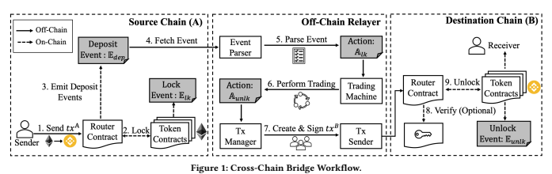
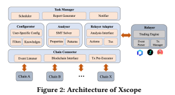

# Xscope: Hunting For Cross-Chain Bridge Attacks

Jiashuo Zhang zhangjiashuo@pku.edu.cn HCST, CS, Peking University Beijing, China Ziming Chen chenziming@stu.pku.edu.cn HCST, CS, Peking University Beijing, China

## Abstract

Cross-Chain bridges have become the most popular solution to support asset interoperability between heterogeneous blockchains.

However, while providing efficient and flexible cross-chain asset transfer, the complex workflow involving both on-chain smart contracts and off-chain programs causes emerging security issues. In the past year, there have been more than ten severe attacks against cross-chain bridges, causing billions of loss. With few studies focusing on the security of cross-chain bridges, the community still lacks the knowledge and tools to mitigate this significant threat. To bridge the gap, we conduct the first study on the security of crosschain bridges. We document three new classes of security bugs and propose a set of security properties and patterns to characterize them. Based on those patterns, we design Xscope, an automatic tool to find security violations in cross-chain bridges and detect real-world attacks. We evaluate Xscope on four popular cross-chain bridges. It successfully detects all known attacks and finds suspicious attacks unreported before. A video of Xscope is available at https://youtu.be/vMRO_qOqtXY.

## Ccs Concepts

- Security and privacy → **Software and application security**.

Jianbo Gao∗
gaojianbo@pku.edu.cn HCST, CS, Peking University Beijing, China Yue Li liyue_cs@pku.edu.cn HCST, CS, Peking University Beijing, China

| guan@pku.edu.cn Peking University Beijing, China   |
|----------------------------------------------------|

## Zhong Chen

zhongchen@pku.edu.cn HCST, CS, Peking University Beijing, China This diverse and fragmented ecosystem introduces a significant demand for asset interoperability to allow users to transfer assets between different blockchains. By introducing off-chain third-party to coordinate cross-chain trading, cross-chain bridges achieve efficient and flexible cross-chain transfers and attract a recent surge.

While gaining a market cap of billions of dollars [5], cross-chain bridges face emerging security issues. Managing assets on different blockchains with complex workflow provides significant advantages to attackers. In the past year, more than ten severe attacks leveraging both on-chain and off-chain vulnerabilities caused billions of dollars in damages. For example, PolyNetwork [1] was exploited and lost $600M due to bugs in on-chain contracts, and THORChain [2] was attacked three times in 30 days due to bugs in the off-chain relayer. With these recurrent attacks, the community still lacks knowledge and tools to mitigate the threat.

Unfortunately, the security of cross-chain bridges has not been well studied. Cross-Chain bridges involve both on-chain smart contracts and off-chain programs integrating with heterogeneous blockchains, introducing new system architecture and security requirements. However, existing studies [6, 7, 9, 11] mainly focus on the security of smart contracts on a single chain and target no cross-chain specific security issues. Characterizing the security of cross-chain bridges and protecting them against real-work attacks remains an open challenge.

This paper aims to fill this gap from two perspectives. First, we document new classes of attacks in cross-chain bridges and formulate security properties to enhance the community's understanding. Second, we propose Xscope to detect security bugs and defend cross-chain bridges against real-world attacks. Specifically, we make the following contributions:
- To the best of our knowledge, this is the first study on the security of cross-chain bridges. We present practical challenges causing security issues and document three new classes of security bugs in cross-chain bridges.

- We introduce a set of security properties and patterns that capture sufficient conditions to characterize cross-chain bridge bugs and detect real-world attacks. Based on them, we propose Xscope, an automatic tool providing both run-time monitoring and off-line analyzing functionalities for attack detection and forensics.

- We preliminarily evaluate Xscope on four cross-chain bridges and validate its effectiveness. Xscope successfully detects all reported real-world attacks and finds suspicious attacks unreported before.

## 2 Security Issues In Cross-Chain Bridges

The cross-chain bridge is an application acting as an intermediary between users on different blockchains. Users lock various tokens on different blockchains to the bridge, and the bridge takes responsibility for validating these locked tokens, performing cross-chain trading logic like deposit or swap, and unlocking target tokens to users. Correspondingly, a cross-chain bridge consists of two parts, the on-chain router contracts and the off-chain relayer. The router contracts interact with various token contracts and provide on-chain functions, including locking users' tokens and unlocking tokens to users. They also record token transfer information as specific on-chain events to communicate with the off-chain relayer. The off-chain relayer keeps fetching on-chain events from the source chain and coordinates router contracts on the destination chain to finish a cross-chain transfer.

Specifically, we show a detailed workflow of typical cross-chain bridges in Fig 1. Upon receiving the cross-chain request, the router contract on chain A will call token contracts to lock users' tokens.

In this call, the token contract will emit a lock event Elk and transfer users' tokens to the router contract. After that, the router contract will emit a deposit event Edep containing detailed information of this lock action such as asset type and amount as proof of locked assets. By parsing Edep, the relayer can learn the lock action Alk on chain A, authorize the unlock action A*unlk* on chain B, and send transactions to the router contract on chain B. The router contract will verify the transaction sender and other optional proofs like multi-signatures and call target token contracts. Eventually, the token contract emits an unlock event E*unlk* and unlocks the target tokens to the users' addresses.

2.1 Bugs in Cross-Chain Bridges Although the lock-then-unlock idea is fairly simple, cross-chain bridges face three practical challenges which have caused severe attacks in reality. First, managing various assets with inconsistent contract interfaces on heterogeneous blockchains introduces bugprone on-chain logic. Second, the big on-chain-off-chain gap causes complicated off-chain code and leads to potential inconsistency between on-chain router contracts and off-chain relayer. Third, cross-chain bridges' complex and multi-step workflow introduces large attack surfaces, including both traditional and blockchainspecific attacks. According to these three challenges, we document Table 1: Notations for States in Cross-Chain Bridges. s and d represent the source chain and the destination chain respectively.

Notation State Attributes Elk Lock Event ⟨txs,scs, assets, *amount*s, tos⟩
Edep Deposit Event ⟨txs,scs, assets, amounts, IDd, *asset*d, tod⟩
E*unlk* Unlock Event ⟨txd,scd, assetd, *amount*d, tod⟩
T(tx) Trace of tx {Event|*Event*.tx = tx} Alk Lock Action ⟨txs, IDs, IDd, assets, amounts, *asset*d, tod⟩
A*unlk* Unlock Action ⟨txs, IDd, assetd, *amount*d, tod⟩
and categorize three new classes of security bugs in existing crosschain bridges1as follows.

Unrestricted Deposit Emitting (UDE). This bug happens in Steps 2 and 3 at the router contract in Figure 1. Typically, the router contract should lock senders' tokens before emitting the deposit event Edep . The relayer will regard Edep as proof of locked tokens and authorize unlocking on the destination chain. However, mishandling complex contract interfaces like using unsafe transfer functions may let attackers bypass the lock procedure and trigger a valid deposit event directly. It will provide proof of non-existent locked tokens to the relayer and cause a false deposit on the destination chain. This bug caused Qubit, Meter.io, Wormhole, and Multichain bridges' exploits.

Inconsistent Event Parsing (IEP). This bug happens in Step 5 at the event parser in Figure 1 and causes inconsistent off-chain action Alk and on-chain event Edep. It includes two common mistakes.

First, the parser may recognize invalid events emitted by malicious contracts as valid deposit events. Second, even with a valid Edep, the parser may parse out invalid lock action Alk with wrong token types or amount, *e.g.*, recognize a fake token named "ETH" as native ETH. This bug resulted in three attacks on THORChain, and one attack on pNetwork.

Unauthorized Unlocking (UU). This bug happens in Steps 7 and 8 in Figure 1. Typically, only the trusted off-chain relayer can authorize unlock actions on the destination chain. However, key leakage caused by traditional cyberattacks or improper access control in on-chain/off-chain codes may allow unauthorized attackers to successfully call the unlock function of the router contract and 1We summarize existing attacks in cross-chain bridges at https://github.com/XscopeTool/Cross-Chain-Attacks

| Security Fact   | Intuitive Meaning                      | Inference Rule                                                                                                                                 |
|-----------------|----------------------------------------|------------------------------------------------------------------------------------------------------------------------------------------------|
| V(Elk)          | Lock Real Asset to Router Contract     | Elk .scs=Elk .assets ∧ Elk .tos=routerContracts                                                                                                |
| V(Edep)         | Real Edep Generated by Router Contract | Edep.scc=routerContracts                                                                                                                       |
| C(Elk, Edep)    | Same Asset Type and Amount             | Elk .txs=Edep .txs ∧ Elk .assets=Edep .assets ∧ Elk .amounts=Edep .amounts                                                                     |
| V(txs )         | No Lock, No Deposit                    | ∀Edep ∈ T(txs ), V(Edep) → ∃Elk ∈ T(txs ), s.t., V(Elk) ∧ C(Elk, Edep) Alk .assets = Edep.assets ∧ Alk .amounts = Edep.amounts ∧ Alk .assetd = |
| C(Alk, Edep)    | Same Asset Type, Amount and Receiver   | Edep.assetd ∧ Alk .tod = Edep.tod                                                                                                              |
| V(Alk)          | Consistent Alk Parsed from Valid tx    | V (Alk .txs ) ∧ ∃Edep ∈ T(txs ) s.t.V(Edep) ∧C(Alk , Edep )                                                                                    |
| C(Alk, Aunlk)   | Consistent Aunlk based on Valid Alk    | V (Alk )∧Aunlk .IDd = Alk .IDd ∧ Aunlk .assetd =Alk .assetd∧Aunlk .tod =Alk .tod                                                               |
| C(Aunlk, Eunlk) | Unlock Right Asset to Right Address    | Eunlk .assetd = Eunlk .assetd ∧ Aunlk .assetd = Eunlk .scd ∧Aunlk .amountd = Eunlk .amountd ∧ Aunlk .tod = Eunlk .tod                          |
| V(Eunlk)        | Authorized Unlock based on Real Lock   | ∃Aunlk , Alk ,s.t., C(Aunlk, Eunlk) ∧ C(Alk, Aunlk) ∧ V(Alk)                                                                                   |

transfer out assets. This bug caused Robin Bridge, Anyswap, and PolyNetwork's exploits.

## 2.2 Security Properties And Patterns

In this part, we formulate new security issues in cross-chain bridges and propose security properties to detect them.

We start from an observation that a cross-chain transfer shown in Figure 1 can be characterized as an execution sequence containing a serial of on-chain events and off-chain actions, i.e., Elk → Edep
→ Alk → Aunlk → E*unlk*. Specifically, Elk → Edep describes operations on the source chain: first, the token contract transfers users' tokens to the router contract and emits Elk , then, the router contract emit Edep to aggregate on-chain lock actions into a uniform representation and inform the off-chain relayer. Edep → Alk → A*unlk* describes the relayers' behaviors, *i.e.*, parse Edep to learn on-chain actions Alk and authorize unlock action A*unlk* on the destination chain. Aunlk → E*unlk* shows operations on destination chain, *i.e.*,
receive relayer's transactions and unlock target tokens to users.

Furthermore, we transform states in the sequence into representations in Table 1. For better compatibility, the representations follow the minimum principle and only contain essential attributes that can be easily derivated from most cross-chain bridges.

After simplifying the complex workflow into a four-step sequence from Elk to E*unlk*, we formulate the security issues with logical constraints in the execution sequence. Specifically, we introduce two types of security facts in Table 2 to describe the constraints, *i.e.*, Validity facts and Consistence facts, denoted by V and C respectively. Validity facts define whether a state is valid to be part of the execution sequence. For example, V(Edep) defines that only Edep emitted by the router contract can occur in an execution sequence and finally cause an unlock on the destination chain while an invalid Edep emitted by malicious contracts should never take part in a normal sequence. Consistence facts define the expected relations between two states. For example, C(Edep, Alk) requires exactly the same asset type and amount in Edep and Alk, *i.e.*, the off-chain relayer correctly learns what asset is locked to the router contract.

Based on the security facts we conduct, we introduce three security properties and patterns in Table 3 to detect three new classes of cross-chain bridge bugs. Respectively, RD ensures every valid deposit event has a corresponding valid lock event to detect the

| Table 3: Security Properties and Patterns to Detects Attacks Prop. Description Pattern RD Restricted Deposit: No Lock, No Deposit ∀txs ,V (txs ) CP Consistent Parsing: Get Real Actions ∀Alk , V(Alk) AU Authorized Unlock: Unlock as Expected ∀Eunlk , V(Eunlk)   |
|---------------------------------------------------------------------------------------------------------------------------------------------------------------------------------------------------------------------------------------------------------------------|

deposit-without-lock violations in the UDE bug. CP detects the IEP
bug by ensuring every off-chain action Alk is parsed from a valid and consistent Edep. And AU ensures every unlock event must be caused by an authorized unlock action Alk from the off-chain relayer to characterize the UU bug.

## 3 Tool Overview

Based on these security properties and patterns, we propose Xscope, an automatic tool to detect cross-chain bridge attacks. Xscope provides two modes to use: runtime monitoring and offline analyzing. In runtime monitoring mode, it is deployed as an extension of the off-chain relayer to enforce security properties and abort malicious requests. Specifically, the off-chain relayer will additionally call Xscope after generating outgoing transactions at step 7 in Figure 1. Then, Xscope will pre-execute the outgoing transactions to get complete execution sequences from Elk to E*unlk* and detect security violations in them. If a violation is detected, the relayer will abort the outgoing transactions to prevent potential loss. In offline analyzing mode, Xscope passively analyses historical requests and issues warnings for suspicious execution sequences.

Correspondingly, Xscope provides twofold benefits. With runtime monitoring mode, it protects existing bridges from real-world attacks with updatable and flexible security patterns. With off-line analyzing mode, it provides efficient forensics and accurate error location for bridges to investigate past or ongoing attacks.

Figure 2 shows the architecture of Xscope. The Chain Connector and Relayer Adaptor provide a consistent interface above different blockchains and relayers. They transform on-chain events and offchain actions into logical representations and feed them into the Analyzer. The Analyzer uses Z3 as SMT Solver to detect violations in each execution sequence. Additionally, the Configurator is introduced to support user-specific configurations, *e.g.*, filtering out transactions from specific addresses or importing external knowledge like a blacklist. The Task Manager is designed to schedule

analysis/monitor tasks, generate reports, and send notifications to users.

An example output of Xscope is shown in Figure 3. In this case, we collect over 2 million historical transactions from a cross-chain bridge named THORChain2and use Xscope to detect security violations in them. Xscope shows a list containing 56 suspicious transactions clustered in three time periods (Block 12723674-12724474, 12833114-12833448, and 12878663-12878671 on Ethereum), each labeled with relevant bugs. Xscope also supports searching, filtering, and sorting functions based on attributes like block number and transaction hash, which can help cross-chain bridges investigate those transactions efficiently.

## 4 Preliminary Evaluation

In this section, we conduct a preliminary evaluation of Xscope to validate its effectiveness in finding cross-chain bridge attacks.

Specifically, we use Xscope to analyze four popular cross-chain bridges between Ethereum and Binance Smart Chain related to six known cross-chain bridge attacks.

Table 4: Evaluation Results of Xscope Transactions Detected Attack Bug Type Transactions Reported Reported Unreported All THORChain \#1 IEP 6 6 (100%) +3 9 THORChain \#2 IEP 41 41 (100%) - 41 THORChain \#3 IEP 6 6 (100%) - 6 pNetwork IEP 3 3 (100%) - 3 Anyswap UU 4 4 (100%) - 4 Qubit Bridge UDE 16 16 (100%) +4 20 We compare detected suspicious transactions given by Xscope with the officially reported attack transactions3. The results in Table 4 show that Xscope not only successively detects all reported attack transactions covering three new classes of attacks in crosschain bridges, but also detects several unreported attack transactions. In particular, Xscope detects an unreported suspicious transaction 43 days before the major attack in Qubit Bridge on Jan 27, 2022. If this suspicious and unnoticed transaction had been detected just in time, the major attack causing 80M dollars loss might have been prevented. We have reported our findings to the Qubit team.

## 5 Related Work

Attack detection for smart contracts [6, 9, 11] and decentralized applications (DApp) [7] have been widely discussed over the past years. Rodler *et al.* [6] introduce Sereum to protect contracts against 2The data is available at https://github.com/Xscope-Tool/Data 3The official reports of these attacks and detailed comparison are available at https://github.com/Xscope-Tool/Results

## Figure 3: The Output Interface Of Xscope

re-entrancy attacks based on runtime monitoring. Zhang *et al.* [11]
propose a tool to detect Ethereum attacks using user-specific detection rules. Su *et al.* [7] propose DEFIER to automatically investigate on-chain attack incidents. To our knowledge, they all focus on a single chain and target no cross-chain specific attack. In addition, several previous studies focus on the security of atomic cross-chain swap protocols [3, 8] or generic cross-chain architectures like Polkadot [10] and Cosmos [4], which are orthogonal to application-level cross-chain bridges we discuss.

6 CONCLUSION
In this paper, we conduct the first study on the security of crosschain bridges. We document three new classes of security bugs in cross-chain bridges and introduce a set of security properties and patterns to characterize them. We propose Xscope as an automatic tool to find security violations and detect real-work attacks in cross-chain bridges. Our preliminary evaluation demonstrates the effectiveness of Xscope.

ACKNOWLEDGMENTS
This work was supported by National Key Research and Development Program of China (2020YFB1005802), National Natural Science Foundation of China (62172010), and Beijing Natural Science Foundation (M21040).

REFERENCES
[1] PolyNetwork Community. 2021. *Report*. https://medium.com/poly-network/theroot-cause-of-poly-network-being-hacked-e30cf27468f0
[2] THORChain Community. 2021. *Incidents*. https://thearchitect.notion.site/
Incidents-Community-Led-d1f85884c6df4b46ba306ceaf7d167bf
[3] Maurice Herlihy. 2018. Atomic cross-chain swaps. In *Proceedings of the 2018 ACM*
symposium on principles of distributed computing. 245–254.

[4] Kwon Jae and Buchman Ethan. 2021. *Cosmos Whitepaper*. https://v1.cosmos.

network/resources/whitepaper
[5] Wang Kevin and Choy Donovan. 2021. In Search of Interoperability: An Overview of the Cross-Chain Market. https://crypto.com/research/an_overview_of_the_
cross_chain_market-2
[6] Michael Rodler, Wenting Li, Ghassan Karame, and Lucas Davi. 2019. Sereum:
Protecting Existing Smart Contracts Against Re-Entrancy Attacks. In *Proceedings* of the Network and Distributed System Security Symposium (NDSS'19).

[7] Liya Su, Xinyue Shen, Xiangyu Du, Xiaojing Liao, et al. 2021. Evil Under the Sun:
Understanding and Discovering Attacks on Ethereum Decentralized Applications.

In *30th USENIX Security Symposium (USENIX Security 21)*. 1307–1324.

[8] Itay Tsabary, Matan Yechieli, Alex Manuskin, and Ittay Eyal. 2021. MAD-HTLC:
because HTLC is crazy-cheap to attack. In *2021 IEEE Symposium on Security and* Privacy (SP). IEEE, 1230–1248.

[9] Petar Tsankov, Andrei Dan, Dana Drachsler-Cohen, Arthur Gervais, et al. 2018.

Securify: Practical security analysis of smart contracts. In *Proceedings of the 2018* ACM SIGSAC Conference on Computer and Communications Security. 67–82.

[10] Gavin Wood. 2016. Polkadot: Vision for a heterogeneous multi-chain framework.

White Paper 21 (2016), 2327–4662.

[11] Mengya Zhang, Xiaokuan Zhang, Yinqian Zhang, and Zhiqiang Lin. 2020.

TXSPECTOR: Uncovering attacks in ethereum from transactions. In 29th USENIX
Security Symposium (USENIX Security 20). 2775–2792.