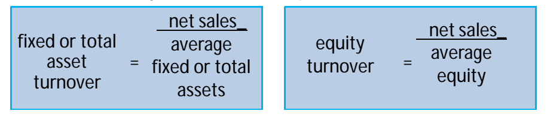
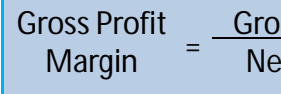
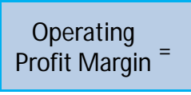
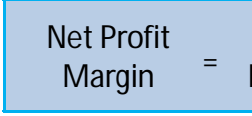
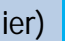

# Financial Analysis

(selected presentation slides)
M. Grimm CDI
Stuttgart, June 2011

# Financial Statement Analysis - Course Objectives

•
Understand the
(balance sheet, income statement, cash flow statement)
main building **blocks**
•
Familiarize with fundamental accounting concepts
•
Analyze and adjust line **items**
to fair value

•
Enhance managerial and financial decision taking Become a knowlegable reader of financial information:
- able to evaluate the and to ask the right questions
- aware of in accounting treatment with respect to reserves accounting, intangibles, leases, f eign currency translation, taxation, etc.

"bigger **picture"**
international differences

# Typical Users Of Financial Statements

| User Group             | Main purpose                                          |
|------------------------|-------------------------------------------------------|
| Management             | Financial decision taking, M&A, evaluation of value   |
| Shareholders/Owners    | Investment/value analysis,managementsupervision       |
| Debt Investors         | Investmentand credit/debt capacity analysis           |
| Banks and Lenders      | Credit/debt capacity, solvency and liquidity analysis |
| Suppliers              | Credit and businessrisk analysis                      |
| Employees/Stakeholders | Career decisions, investment analysis                 |
| Government/Regulators  | Regulatory supervision, corporate governance, etc.    |
| Public/Consumer        | Corporate governance, consumer protection, etc.       |

# Main Building Blocks Of Financial Statements

| Statement Type         | Reference   | Main financial information                                                                                  |
|------------------------|-------------|-------------------------------------------------------------------------------------------------------------|
| 1. Balance Sheet       | p.          | Assets(short term and long term) Liabilities(short term and long term) Equity (common, preferred, RE, etc.) |
| 2. Income Statement    | p.          | Revenue / Sales Cost/ Cost of goodssold NetIncome                                                           |
| 3. Cash Flow Statement | p.          | Cash flow from operations Cash flow from investing Cash flow from financing                                 |
| 4. Others              | p.          | ManagementDiscussion and Analysis Footnotes and additional information                                      |

# The Balance Sheet - Structural Overview

| Assets   |
|----------|

Cash & Cash Equivalents Accounts Receivables (AR)
Inventories Deferred income taxes Other current assets Gross fixed assets Accumulated depreciation Net fixed assets Other long term assets

| Total current assets   |
|------------------------|

Total long term **assets** TOTAL ASSETS

Accounts Payables (AP)

Short term debt

Other current liabilities

Total current **liabilities**

| Liabilities                            |
|----------------------------------------|
| Accounts Payables (AP) Short term debt |

Long term debt

Other long term liabilities

Common & Preferred Equity

Retained Earnings

| Other long term liabilities Total long term debt Common & Preferred Equity   |
|------------------------------------------------------------------------------|

TOTAL LIABILITIES & EQUITY

| Total Equity   |
|----------------|

# The Income Statement - Structural Overview

Income **Statement(IS)**
Net Sales/Revenues
- Cost of goodssold (COGS) Gross Profit - Selling, general & administration (SG&A) - Depreciation - Amortization - Other operating expenses Operating **Income**

- Interest and other debt expenses Income/Earnings before tax (EBT) -Tax NET INCOME

# The Cash Flow Statement - Structural Overview

Cash Flow Statement(CFS)
NetIncome
+ Depreciation/Amortization +/- Increases/Decreasesin Current Liabilities
+/- Decreases/Increasesin Current Assets Cash from operating activities(CFO)
- Capital Expenditures(Capex)
+/- Sales/Purchases of other assets Cash from investing **activities(CFI)** +/- Issuance/Redemption ofshort/long term debt
- Payment of preferred/common dividends
- Share repurchases Cash from financing **activities(CFF)**
Main CFS components:
CFO, CFI and CFF.

Supplementarynotes might be added to the CFS.

•
Changes in non-cash net working capital:
Increasesin current assets/decreases in current liabilities are uses of cash. Decreasesin current assets/increases in current liabilities are sources of cash.

•
NET CASH **FLOW**

# Financial Statement Analysis - Ratios

Ratios based on the financialstatements provide an insight into the financial performance of a company. They can provide a for decision taking.

- •
benchmark or relative performance **target**
, the respective users of financial information of the observed ratios differently: the management might primarily focus on operating performance and growth oriented ratios, whereas lenders might primarily track liquidity and risk related performance ratios. •
Depending on the **perspetive**
prioritize the relative **importance**
Ratios should always be , e.g. relative to internal changes or to industry competitors and the overall economic development.

•
put in **context**
The main intention is to for further analysis in order to understand underlying issues and to project future developments.

identify areas

# Financial Ratio Analysis - Operating Performance

•
The ratios provide an overview with respect to the of a company.

asset and equity turnover operating efficiency
•
They should be considered in the context of the respective industry.

•
Although high ratios are typically desired, there are ade -
offs between optimizing the ratios and potentially neglecting asset investmentsto support future sales growth - or - a change in the capital structure can improve a ratio without the actually desired effect on performance.

# Operating Activity - Liquidity Ratios

•
Liquidity is a key concern for the viability of a company.

•
High liquidity ratios are typically preferred (e.g. by creditors), however, they can also expose weaknesses in management/investingprocesses.

Cash Ratio Quick Ratio Current Ratio

| Cash +                            |                     |                     |                     |
|-----------------------------------|---------------------|---------------------|---------------------|
| marketable securities             | Cash +              |                     |                     |
| securities + receivables          | Current             |                     |                     |
| Assets (incl. Inventory)          |                     |                     |                     |
| Cash                              |                     |                     |                     |
| Current Liabilities               | Current Liabilities | Current Liabilities | Current Liabilities |
| Degree of asset liquidity falling |                     |                     |                     |

# Operating Activity - Cash Conversion

•
Aim to reduce the time required to convertinvested capital back into cash.

•
Although low cycle values are typically desired to reduce net working capital, there are potential trade-offs, e.g. between credit terms/AR and sales.

| Cash                  |                                |                          |                              |
|-----------------------|--------------------------------|--------------------------|------------------------------|
| Conversion Cycle      | Av. Acc.Rec. Collection Period | Average Inventory Period | Av. Acc. Pay. Payment Period |
| =                     | +                              | -                        |                              |
| 365                   | _                              |                          |                              |
| acc. receiv. turnover | 365                            | _                        |                              |
| inventory turnover    | 365                            | _                        |                              |
| acc. payable turnover |                                |                          |                              |
| Cash                  |                                |                          |                              |
| Conversion Cycle      | =                              | +                        | -                            |
| Cash                  |                                |                          |                              |
| Conversion Cycle      | 365                            | _                        |                              |
| (net sales/           |                                |                          |                              |
| Av. Acc.Rev.)         | 365                            | _                        |                              |
| (CoGS/                |                                |                          |                              |
| Av. Inventory)        | 365                            | _                        |                              |
| (CoGS/                |                                |                          |                              |
| Av. Acc.Pay.)         |                                |                          |                              |
| =                     | +                              | -                        |                              |

June 2011 M. Grimm, CDI, Stuttgart, June 2011 - please observe the copyrights 11

# Financial Ratio Analysis - Operating Profitability

Net Sales
- Cost of Goods Sold (CoGS)
Gross Profit
- Operating Expense (SG&A, etc.)
Operating Profit (EBIT)
- Interest Earnings before tax (EBT)
- Tax Net Income (NI)

| Gross Profit_ Net Sales   |
|---------------------------|

•
General objective to achieve (production and operating efficiency),
relative to respective industry competitors.

high margins on a sustainable basis
•
In order to conservatively assess the future profitability it is important to only consider .

income from continuing operations

# Growth Rate And Dupont-Analysis (Roe)

•
The attainable of a company can be approximated by the return on equity (ROE) and the retention rate (RR); , whereby the RR = (1- payout ratio) = ( 1- dividends/netincome)
growth **rate**
g = ROE*RR
•
DuPont Analysis: Breaking ROE (= NI/Equity) up in individual components.

(note: use end-of-year equity, rather than averages)

| Asset         |                     |    |          |
|---------------|---------------------|----|----------|
| ROE           | =                   | x  | Turnover |
| Profit Margin | Leverage            |    |          |
| x             | (Equity Multiplier) |    |          |

| Net Income_   | x      |    |
|---------------|--------|----|
| x             |        |    |
| Sales         | Sales  | _  |
| Assets        | Assets | _  |
| Equity        |        |    |

Calculate the ROE and compare the result if the debt-to-asset ratio changes +/- 20%
June 2011 13 M. Grimm, CDI, Stuttgart, June 2011 - please observe the copyrights

# Limitations To Financial Ratio Analysis

Financial ratio analysisis . The analysis is
(so adjustments might be required to obtain a fair picture of the facts) and the information should of the general business cycle, industry cycle, developments, practices and sensitivitiesto seasonality, firm specific changes, the type of the business and its products or services, etc.

•
limited by several **factors**
dependent on the quality of the underlying financial data always be seen in context Financial ratio analysis can help to identify sources of weaknesses.

However,the application . Simply aiming to maximize a ratio without being can be counter-productive with respect to other objectives. For instance, aiming to reduce working capital with the objective to minimize financing costs can cause sales and profitability to decline as the credit terms might constrain competitiveness.

•
always needs to consider the "bigger **picture"**
aware of potential tradeoffs