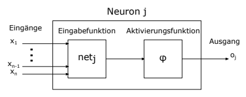

Bachelorarbeit

Umsetzung einer High-Performance FPGA-Schnittstelle für maschinelles Lernen Fabian Dillkötter Februar 2019 Gutachter:
Prof. Dr. Katharina Morik M. Sc. Sebastian Buschjäger Technische Universität Dortmund Fakultät für Informatik Lehrstuhl für Künstliche Intelligenz (LS 8) https://www-ai.cs.uni-dortmund.de

## Inhaltsverzeichnis

| 1     | Einleitung                          | 1   |    |
|-------|-------------------------------------|-----|----|
| 1.1   | Motivation und Zielsetzung          |     | 1  |
| 1.2   | Aufbau der Arbeit                   |     | 2  |
| 1.3   | Verwandte Arbeiten                  |     | 2  |
| 2     | FPGAs                               | 5   |    |
| 2.1   | Aufbau und Besonderheiten           |     | 5  |
| 2.2   | Konfiguration                       |     | 6  |
| 2.3   | Verwendete Hardware                 |     | 7  |
| 3     | PCI Express                         | 9   |    |
| 3.1   | Wahl der Schnittstelle              |     | 9  |
| 3.2   | Aufbau von PCIe Netzwerken          |     | 9  |
| 3.3   | PCIe Übertragungsablauf             |     | 12 |
| 3.4   | FPGA IP Core für PCIe Kommunikation | 13  |    |
| 4     | Schnittstellenentwurf               | 15  |    |
| 4.1   | Xillybus                            |     | 15 |
| 4.1.1 | Linux Treiber                       | 15  |    |
| 4.1.2 | FPGA IP Core                        |     | 16 |
| 4.1.3 | Kommunikationsablauf                | 18  |    |
| 4.2   | Anforderungen                       |     | 20 |
| 4.2.1 | Perzeptron                          |     | 20 |
| 4.2.2 | Metriken                            | 21  |    |
| 5     | Implementierung                     | 23  |    |
| 5.1   | Xillybus Parameter                  | 23  |    |
| 5.2   | FPGA Code                           | 24  |    |
| 5.2.1 | Loopback                            |     | 24 |
| 5.2.2 | Perzeptron                          |     | 24 |
| 5.3   | Blockdesign                         |     | 27 |
| i     |                                     |     |    |

ii *INHALTSVERZEICHNIS*

| 5.4                   | Hostanwendung              | 29   |    |
|-----------------------|----------------------------|------|----|
| 6                     | Evaluation                 | 33   |    |
| 6.1                   | Konfiguration              |      | 33 |
| 6.1.1                 | Realisierungsaufwand       |      | 33 |
| 6.1.2                 | Ressourcenbedarf           | 34   |    |
| 6.2                   | Übertragungsleistung       | 37   |    |
| 6.2.1                 | Verzögerungszeiten         | 37   |    |
| 6.2.2                 | Datendurchsatz             | 38   |    |
| 6.3                   | Performanz des Perzeptrons |      | 40 |
| 6.4                   | Praxistauglichkeit         | 41   |    |
| 7                     | Fazit und Ausblick         | 45   |    |
| Abbildungsverzeichnis | 47                         |      |    |
| Literaturverzeichnis  | 49                         |      |    |
| Erklärung             | 55                         |      |    |

## Einleitung 1.1 Motivation Und Zielsetzung

Am 9. März 2016 gewann die künstliche Intelligenz (KI) AlphaGo von Google DeepMind gegen Lee Sedol im Spiel Go. Go ist ein Brettspiel mit vielfach höherer Komplexität als Schach und Sedol gilt als einer der besten Spieler der Welt. Dieser Triumph bekam weltweit große mediale Aufmerksamkeit, da noch kurz vor den Spielen ein Sieg der KI aufgrund der hohen Komplexität von Go für unmöglich gehalten worden war [6]. Damit wurden einer breiten Öffentlichkeit die Fortschritte von KIs und insbesondere der Techniken des maschinellen Lernens aufgezeigt. Grundlage des Erfolgs war ein automatisiertes Training mit großen Datenmengen. Zunächst erfolgte ein Training von AlphaGo mithilfe von 30 Millionen vorab gespeicherten Spielzügen. Der zweite Schritt basierte auf einem Training von AlphaGo Instanzen untereinander [7].

Das Gebiet des maschinellen Lernens hat große Erfolge erzielt und ist mittlerweile in vielen Bereichen eine etablierte Methode für verschiedenste Problemlösungen geworden. Dabei sind häufig große Datenmengen erforderlich, welche effizient verarbeitet werden müssen, um in akzeptabler Zeit ein gutes Ergebnis zu erreichen. In den letzten Jahren wurden die großen Fortschritte im Bereich des maschinellen Lernens auch durch deutliche Verbesserungen der Rechenleistung ermöglicht. Die Verarbeitung von großen Datenmengen erfordert die Konzeption neuer Hard- und Software. Es wurden Möglichkeiten entwickelt, die Rechenleistung der Central Processing Units (CPUs) durch externe Hardware zu beschleunigen. Neben Graphics Processing Units (GPUs) stehen auch Field Programmable Gate Arrays (FPGAs) im Fokus der Forschung. Dabei bieten die umfangreichen Möglichkeiten für parallele Datenverarbeitung bei FPGAs zwar viel Potenzial für Hardwarebeschleunigung bei maschinellen Lernverfahren, doch die Leistung kann dabei nur so gut sein, wie es der Datentransfer zum FPGA erlaubt. Um die zusätzliche Leistung nutzen zu können, muss eine Kommunikationsschnittstelle genutzt werden, über die Daten zwischen CPU und FPGA ausgetauscht werden. Ziel dieser Arbeit 1 ist, eine Schnittstelle für die Kommunikation mit einem FPGA zu realisieren. Diese soll anschließend in Bezug auf maschinelles Lernen evaluiert werden, wobei die Anforderungen dieses Fachbereichs berücksichtigt werden sollen. Erstrebenswert sind dabei eine hohe Datenrate und eine niedrige Latenz.

## 1.2 Aufbau Der Arbeit

In den ersten beiden Kapiteln sollen die Grundlagen der Arbeit erläutert werden. Dabei wird auf die Funktionsweise und Konfiguration von FPGAs im Allgemeinen eingegangen und die Vorteile dieser Rechenplattform werden herausgearbeitet. Außerdem wird die Kommunikationstechnologie Peripheral Component Interconnect Express (PCIe) vorgestellt und mit anderen Standards verglichen.

Anschließend werden der Anwendungsfall einer PCIe Schnittstelle für FPGAs im Kontext des maschinellen Lernens diskutiert und die geplante Umsetzung präsentiert. Im fünften Kapitel stehen die Realisierung dieser Schnittstelle und die Verwirklichung der entwickelten Anwendungen im Vordergrund. Darauf folgen die Auswertung der Ergebnisse dieser Arbeit und abschließend eine Zusammenfassung des erarbeiteten Ansatzes sowie die Vorstellung der gewonnenen Erkenntnisse. Zusätzlich werden weitere Optimierungsmöglichkeiten aufgezeigt.

## 1.3 Verwandte Arbeiten

Im Bereich des maschinellen Lernens ist die Laufzeit eines Ansatzes häufig nur durch die verfügbare Rechenleistung limitert. Daher liegt eine Erforschung der Möglichkeiten zur Hardwarebeschleunigung nahe, wie sie z. B. in [14] schon 1996 durchgeführt wurde. Dabei wurde der Einsatz von FPGAs im Zusammenhang mit neuronalen Netzen als vielversprechend bewertet. Auch im direkten Vergleich zu CPUs und GPUs sind FPGAs eine valide Alternative, wie beim Einsatz zur Beschleunigung der Berechnung einer Fitnessfunktion bei evolutionären Algorithmen von J. A. Gomez-Pulido et al. [13] gezeigt wurde. Aus diesem Grund ist der Einsatz eines FPGAs als Koprozessor im Bereich des maschinellen Lernens weit verbreitet [21]. R. Narayanan et al. [29] zeigten, dass Klassifizierungsalgorithmen auf FPGAs die fünffache Geschwindigkeit im Vergleich zu einer Implementierung ohne Koprozessor erreichen können. Der Apriori-Algorithmus, ein Verfahren zum Entdecken von Korrelationen in einer Datenbasis, hat häufig eine lange Laufzeit, da er mit großen Datenbanken verwendet wird. Die Realisierung auf einem FPGA konnte in diesem Anwendungsfall eine Beschleunigung der Laufzeit um mindestens den Faktor 4 bewirken [3]. Verschiedene Methoden aus dem Bereich des maschinellen Lernens, wie z. B. Support Vector Machines oder K-means, konnten stark beschleunigt werden und wiesen dabei einen geringeren Energiebedarf als Systeme ohne Koprozessor auf [15, 38, 31, 32].

Eine effiziente Umsetzung eines Algorithmus auf einem FPGA kann jedoch nur sinnvoll eingesetzt werden, wenn der Datentransfer ebenso effizient erfolgt. Eine langsame Kommunikation kann andernfalls einen Geschwindigkeitsvorteil der Logik zunichtemachen. Aus diesem Grund ist eine performante PCIe Schnittstelle für FPGAs für viele Anwendungsbereiche von Interesse. Dementsprechend wurde dieses Thema in anderen Umgebungen bereits mehrfach behandelt.

So entwickeln H. Kavianipour et al. in [17] ein PCIe Interface speziell für einen optimierten Direct Memory Access (DMA) am IceCube Neutrino Observatory am Südpol und erreichen Übertragungsraten von über 700 MB/s. Auch L. Rota et al. setzen für den Teilchenbeschleuniger an der Angströmquelle Karlsruhe auf eine DMA Schnittstelle, um die großen zu verarbeitenden Datenströme übertragen zu können [36].

Die genannten Schnittstellenimplementierungen sind jedoch sehr anwendungsspezifisch, weshalb der Fokus dieser Arbeit auf einer universell einsetzbaren Schnittstelle liegen soll.

4

## Kapitel 2 Fpgas

In dieser Arbeit soll eine PCIe Schnittstelle für ein FPGA Board entwickelt werden. Hierfür wird im Folgenden der grundlegende Aufbau eines FPGAs erklärt. Anschließend folgt die Schilderung eines typischen Konfigurationsablaufs für ein FPGA, wobei auch die verwendeten Programmierwerkzeuge vorgestellt werden. Schließlich wird die eingesetzte Hardware präsentiert.

## 2.1 Aufbau Und Besonderheiten

FPGAs sind eine besondere Art eines Integrierten Schaltkreises (IC), welcher dazu konfiguriert werden kann, sich wie eine logische Gatterschaltung zu verhalten. Programmierbare Logikblöcke (CLBs) sind mithilfe von programmierbaren Verbindungen matrixförmig vernetzt und bilden mit I/O-Blöcken und zum Teil noch anderen Bestandteilen (Multipliziereinheiten, eingebetteten Prozessoren, Digital Signal Processor Blöcken, Blockram, Taktgeneratoren und weiteren) einen solchen IC. Die einzelnen CLBs bestehen in FPGAs des Herstellers Xilinx aus Lookup-Tabellen (LUTs) und Flip-Flops. Die CLBs von anderen Herstellern sind teilweise anders aufgebaut, doch in dieser Arbeit wird, wie in Kapitel 2.3 beschrieben, ein FPGA von Xilinx verwendet. Ein schematischer Aufbau eines CLBs ist in Abbildung 2.1 dargestellt. Durch unterschiedliche Konfiguration können CLBs verschiedene Funktionen übernehmen, z. B. jene von Speicherblöcken oder allgemeinen Logikblöcken [12].

Die CLBs sind an ein Netzwerk aus programmierbaren Verbindungen angebunden, welche dem FPGA durch freie Konfigurationsmöglichkeiten Flexibilität verleihen. Diese Verbindungen nehmen ca. 80-90% der Fläche auf dem FPGA ein, während die Logik nur 10-20% belegt [9]. Da diese Vernetzung matrixförmig ist, wird eine parallele Verarbeitung von verschiedenen Operationen ermöglicht. In dieser Eigenschaft unterscheiden sich FPGAs zusammen mit Application Specific Integrated Circuits (ASICs) von General Purpose Prozessoren (GPPs) wie beispielsweise CPUs. Eine schematische Zeichnung von diesen Ver-

netzungen ist in Abbildung 2.2 skizziert.

Im Unterschied zu FPGAs ist die Konfiguration von ASICs ab dem Zeitpunkt der Produktion festgelegt und kann nicht verändert werden. Da die Funktion dieser Schaltung also schon bei der Fertigung feststeht, kann sie für eine Anwendung genau optimiert werden.

Daher sind ASICs deutlich effizienter als FPGAs und weisen ungefähr einen zwölffach geringeren Energieverbrauch, eine 20 bis 40 Mal kleinere Fläche und eine dreimal höhere Geschwindigkeit auf [19]. Der Aufwand, bis ein funktionsfähiger ASIC fertiggestellt ist, ist jedoch immens hoch, da zuerst große finanzielle und zeitliche Investitionen notwendig sind. Bei niedrigen Stückzahlen lohnt sich daher der Einsatz von FPGAs, da diese durch ihre kurzfristig mögliche Neukonfiguration in verschiedenen Einsatzbereichen verwendet werden können. Noch vielseitiger sind CPUs, jedoch erlaubt die Parallelität von FPGAs eine deutlich höhere Effizienz. Der sequenziellen Abarbeitung von Operationen auf GPPs steht hier die parallele Ausführung von unterschiedlichen Berechnungsschritten auf FPGAs gegenüber. Die höhere Taktfrequenz von CPUs kann bei Einsatz eines FPGAs mit optimierter Konfiguration mehr als ausgeglichen werden [30].

## 2.2 Konfiguration

Der Name "Field Programmable" basiert darauf, dass die Funktion des Chips nach Fertigung "in the field" festgelegt oder verändert werden kann [20]. Für eine Veränderung der Funktion muss ein FPGA neu konfiguriert werden. In dem betrachteten Fall folgt eine solche Veränderung der Software dem Muster in Abbildung 2.3. Im ersten Schritt wird die gewünschte Anwendung in einer Hochsprache programmiert. Infrage kommen dabei

z. B. MATLAB, Java, oder wie im hier behandelten Fall C [28]. Aus diesem Code wird mittels High-Level-Synthese (HLS) ein Entwurf in Hardwarebeschreibungssprache (HDL,
meist VHDL oder Verilog) erzeugt. Xilinx bietet für diesen Schritt die Software Vivado HLS, welche im Verlauf dieser Arbeit genutzt wird. Die HLS wird verwendet, um die höhere Abstraktion und den geringeren Programmieraufwand von Hochsprachen auszunutzen, allerdings ist die Performanz von nativen HDL Anwendungen den durch HLS erzeugten meistens überlegen [26]. Dieser Performanzverlust ist nicht erheblich genug, um eine HDL
Programmierung in diesem Anwendungsfall zu rechtfertigen.

Die weitere Konfiguration erfolgt mit der Vivado Design Suite von Xilinx. Zusammen mit Xilinx und Intellectual Property (IP) Komponenten von Drittanbietern werden die so erzeugten Blöcke in einem Blockdiagramm zusammengefügt und die Ein-/Ausgänge korrekt verbunden. Die IP Blöcke werden von Xilinx oder Drittanbietern kostenpflichtig oder frei zur Verfügung gestellt und bieten vorgefertigte Logikblöcke, die in Projekte eingebunden werden können. Bei der darauf folgenden Simulation wird versucht, das reale Verhalten eines FPGAs zu emulieren, um so die Funktion des erstellten Block Designs zu prüfen. Anschließend errechnet Vivado im Syntheseschritt eine Realisierung eines Systems, welches den vorher erarbeiteten Funktionen und Vorgaben entspricht. Dabei entsteht die Netzliste, ein Schaltplan der elektrischen Verbindungen der Bauteile. Die Implementierung setzt diese Netzliste dann für das konkrete FPGA um und viele relevante Daten werden errechnet. Neben der Energiebelastung und der Ressourcenauslastung können an dieser Stelle Timing Probleme erkannt werden, bevor die Schaltung auf das FPGA geladen wird. Schließlich wird der Bitstream generiert, um diesen über eine Schnittstelle des Rechners auf das FPGA zu übertragen.

## 2.3 Verwendete Hardware

In dieser Arbeit wird das AC701 Evaluation Kit der Firma Xilinx Inc. eingesetzt. Das enthaltene Board bietet ein XC7A200T-2FBG676C FPGA der Artix-7 Reihe und weist abhängig von der Konfiguration bis zu 215.360 Logikzellen, 740 Digital Signal Processor (DSP) slices, 13.140 kB Block RAM, 1 GB DDR3 RAM und 500 I/O Pins auf [50]. Für die Kommunikation stehen 10/100/1000 MBit/s Ethernet, ein Enhanced Small Form-factor Pluggable (SFP+) Cage, ein High Definition Multimedia Interface (HDMI) Ausgang, eine USB zu Universal Asynchronous Receiver Transmitter (UART) Brücke und ein 4-Lane PCIe Anschluss der Version 2.1 zur Verfügung [49]. Dieses Board ist in einen Desktop PC
mit einer Intel Xeon W3565 CPU und 24 GB RAM eingebaut und wird unter Ubuntu 14.04.5 LTS 64-Bit betrieben. Die Konfiguration erfolgt mit einem Windows 10 (64-Bit) Notebook von Dell über den USB-JTAG Anschluss auf dem Board.

Im AC701 Evaluation Kit sind zusätzlich zum FPGA Board neben Daten- und Stromkabeln noch eine Evaluationskarte zum Testen vom Xilinx Analog-to-Digital Converter und der Analog Mixed Signal Technologie enthalten. Außerdem wird dazu eine Lizenz der Vivado Design Suite für das verbaute FPGA bereitgestellt.

## Pci Express

In diesem Kapitel soll zuerst die Wahl des PCIe Standards begründet werden. Anschließend wird dessen Aufbau und Funktionsweise erklärt und eine erste obere Schranke für die mögliche Übertragungsrate berechnet. Abschließend werden verfügbare Frameworks für PCIe Kommunikation mit FPGAs aufgezeigt und die Entscheidung für eines davon begründet.

## 3.1 Wahl Der Schnittstelle

Für die bidirektionale Kommunikation zwischen Hostcomputer und FPGA Board stehen die folgenden Möglichkeiten zur Verfügeung: USB zu UART, Ethernet, SFP+ und PCIe 2.1 mit 4 Lanes. Der HDMI Ausgang des Boards wird nicht weiter betrachtet, da hiermit nur eine Kommunikation in eine Richtung möglich ist. Als eine performante Schnittstelle scheiden die USB zu UART Brücke und Ethernet aus, da hier technisch nur niedrige Übertragungsraten erreichbar sind. Die verbaute Single-Chip Brücke von Silicon Laboratories Inc. unterstützt sogar nur die USB 2.0 Full Speed Datenrate [39], weshalb sie für viele Anwendungen unbrauchbar ist. Der SFP+ Verbinder ist für weitaus höhere Übertragungsraten von bis zu 1.250 MB/s geeignet [40]. Seine maximale Übertragungsrate wird von der PCIe 2.1 x4 Schnittstelle mit 2.000 MB/s noch deutlich übertroffen (Abbildung 3.1).

Darüber hinaus steht bei der PCIe Schnittstelle in beide Richtungen gleichzeitig die volle Geschwindigkeit zur Verfügung. Aus diesem Grund wird in dieser Arbeit eine Kommunikation über PCIe gewählt.

## 3.2 Aufbau Von Pcie Netzwerken

Im Gegensatz zum Vorgänger, dem Bus-System PCI, bei welchem mit parallelen Kupferleitungen mehrere Steckplätze physisch verbunden sind, ist PCIe wie ein Netzwerk aufgebaut.

PCIe ist eine Schnittstelle, bei der die Datenbits nacheinander (seriell) übertragen werden

und die gesamten angeschlossenen Elemente ein paketbasiertes Netz bilden. Die einzelnen Komponenten, die über PCIe kommunizieren, sind mit einem Netzwerkverteiler durch Punkt-zu-Punkt-Verbindungen angeschlossen. Anders als noch bei PCI konkurrieren die angeschlossenen Geräte nicht mehr um den Zugriff auf den Bus, sondern jede Verbindung zwischen zwei Kommunikationspartnern hat einen eigenen Satz Empfangs- und Sendeleitungen, den sogenannten Link. Ein Link besteht aus einer bestimmten Anzahl an Lanes.

Als Lane wird ein einzelnes Leitungspaar aus jeweils einer Leitung für jede Richtung bezeichnet. Die einzelnen Leitungen können Daten nur in eine Richtung übertragen (simplex),
doch da die Leitungen immer als Paar zu einer Lane zusammengehören, kann jede Lane gleichzeitig in beide Richtungen mit voller Geschwindigkeit übertragen (dual simplex). Die Elemente, welche mit PCIe verbunden werden können, werden von der PCIe Spezifikation [33] in vier Klassen eingeteilt:
- *Root Complex*: Der *Root Complex* ist die Basis eines PCIe Netzes. Er ist die Verbindung zwischen Arbeitsspeicher, CPU und anderen angeschlossenen Geräten. Diese Kompenente übernimmt die Verwaltung der verbundenen Peripherie und der Zugriffe in beide Richtungen.

- *PCIe-PCI Bridge*: Um mit älteren Systemen wie PCI kompatibel zu sein, stellen diese Bridges das Verbindungsglied zu PCIe dar.

- Switch: *Switches* sind direkt mit dem *Root Complex* verbunden. An sie können mehrere *Endpoint* Komponenten angeschlossen werden. Die angeschlossenen Geräte können untereinander oder mit dem *Root Complex* kommunizieren.

- *Endpoint*: Alle Geräte, welche selbst PCIe Transaktionen senden oder empfangen, werden als *Endpoint* bezeichnet. Diese Komponenten können entweder an einen Switch oder direkt an den *Root Complex* angeschlossen sein.

Der genaue Aufbau eines PCIe Netzwerkes ist variabel und hängt von den angeschlossenen Geräten ab. Ein beispielhafter Aufbau ist in Abbildung 3.2 dargestellt.

Um externe Geräte als Endpoint an PCIe anzubinden, existieren Steckplätze, deren Aufbau von der unterstützten Anzahl an Lanes abhängig ist. Ein Steckplatz für eine solche Komponente ist in einen linken und einen rechten Kontaktteil aufgeteilt, wobei sich im linken Teil, unabhängig von der Anzahl der unterstützten Lanes, immer 22 Kontakte für die Stromversorgung und Baugruppenkommunikation befinden. Die Anzahl der Steckkontakte im rechten Teil ist abhängig von den Lanes. Das AC701 Board unterstützt 4 Lanes und hat damit 42 Kontakte für die eigentliche Datenübertragung [49]. Insgesamt wird das Board also mit 64 Kontakten an der PCIe Schnittstelle verbunden. PCIe hat je nach Version eine theoretische Übertragungsrate (ohne Protokoll Overhead) von 250 bis 1.969 MB/s pro Lane und Richtung. In der Entwicklung ist der Standard PCIe 5.0, womit die höchste Rate im Jahr 2019 nochmals verdoppelt werden soll [1]. Im vorliegenden Fall wird PCIe 2.1 x4 mit einer maximalen Übertragunsrate von 2 GB/s pro Richtung eingesetzt. Diese Übertragungsrate wird aus drei Werten berechnet. Der Standard 2.1 hat eine Symbolrate von 5 GT/s, dies gibt die übertragenen Symbole pro Zeiteinheit an. Dabei sind nicht nur die Informationsbits enthalten, sondern auch Bits, welche für die Übertragung an sich übermittelt werden müssen. Die Zusammensetzung der übertragenen Bits wird durch den Leitungscode festgelegt. Ein a/b Leitungscode bedeutet, dass für a Bits Informationen insgesamt b Bits über die Leitung übertragen werden müssen. PCIe 2.1 verwendet einen 8b/10b Leitungscode, es wird also mit 10 Leitungs-Bits ein Byte Informationen kodiert. Die zusätzlich übertragenen Bits verhindern unter anderem lange Folgen von Nullen oder Einsen, welche technische Probleme hervorrufen könnten. Daher ergibt sich die maximale Übertragungsrate durch:

5 GT
s×
$$\times\,{\frac{8\,{\mathrm{Bit}}}{10\,{\mathrm{Bit}}}}\times4\,{\mathrm{I}}$$
× 4 Lanes = 16 GBit
2 GByte
s
$$\mathrm{ess}={\frac{10\,\mathrm{GBIt}}{\mathrm{s}}}={\frac{Z}{\,}}$$

| Physical      | Data Link   | Transaction   | Data Link   | Physical   |        |      |
|---------------|-------------|---------------|-------------|------------|--------|------|
| Layer         | Layer       | Layer         | Layer       | Layer      |        |      |
| Anfang        | Sequenz     | Header        | Payload     | ECRC       | LCRC   | Ende |
| 1 Byte        | 2 Bytes     | 12 Bytes      | 4 Bytes     | 4 Bytes    | 1 Byte |      |
| 0-4.096 Bytes |             |               |             |            |        |      |

## 3.3 Pcie Übertragungsablauf

Die Übertragung von Daten erfolgt nach der PCIe Spezifikation [33] nach einer Architektur aus drei Schichten. Das Schichtenmodell wird aus den drei Schichten Physical Layer, Data Link Layer und Transaction Layer gebildet. Die Physical Layer ist die unterste Schicht und bildet die Signalübertragung zwischen zwei Geräten ab. Diese findet über mehrere Lanes mit jeweils einer Leitung für das Senden und Empfangen statt. In der Physical Layer werden jeweils am Anfang und am Ende des Paketes 1 Byte Informationen hinzugefügt, um die Grenzen des Paketes anzuzeigen.

Darüber befindet sich die Data Link Layer, welche als Sicherungsschicht dem Paket aus der Transaction Layer eine Sequenznummer und eine zyklische Redundanzprüfung anfügt. Die Sequenznummer belegt 2 Bytes. Als zyklische Redundanzprüfung werden 4 Bytes Link Layer Cyclic Redundancy Check (LCRC) angefügt, womit ein Positive Acknowledgement with Retransmission (PAR) Verfahren umgesetzt wird. Dieses Verfahren sorgt mittels Empfangsbestätigungen und erneuten Übertragungen bei Ausbleiben von diesen für einen korrekten Datentransfer. Außerdem wird hier eine Datenflusssteuerung umgesetzt, welche die Aufgabe hat, Pakete nur dann zu senden, wenn der Empfangspartner bereit für den Transfer ist.

Die oberste Schicht ist die Transaction Layer, welche Anfragepakete aus einem Datenund einem Headerteil zur Übertragung an die Data Link Layer erstellt. Dabei werden nur noch die Sender und Empfänger des Paketes berücksichtigt und keine dazwischenliegenden Switches. In der Transaction Layer werden 12 Bytes für einen Header angefügt, welcher z. B. die ID des Anforderers, ein Tag und eine Adresse enthält. Bei 64-Bit Adressierung ist der Header 16 Bytes groß, da die Adresse dann 4 Bytes mehr benötigt, doch in dem vorliegenden Fall wird eine 32-Bit Adressierung eingesetzt. Darauf folgt der zu übertragende Datenteil (Payload), welcher bis zu 4.096 Bytes groß sein kann. Am Ende des Transaction Layer Paketes werden noch 4 Bytes End-to-End Cyclic Redundancy Checksum (ECRC) angefügt, eine Prüfsumme, die mittels Division errechnet wird. Diese kann Bitfehler in den übertragenen Daten offenbaren [48]. Die Zusammensetzung eines Paketes wird in Abbildung 3.3 visualisiert. Die Grundlage der Übertragung von Informationen über PCIe bilden Transaktionen. Der PCIe Standard [33] definiert Transaktionen als eine Serie von Übertragungen von Paketen, welche insgesamt Informationen von einem Kommunikationspartner zu einem anderen Kommunikationspartner übermitteln. Transaktionen bestehen aus einer Anfrage und der Erfüllung dieser Anfrage. Insgesamt existieren vier Transaktionstypen:
- *Memory Transaction*: Diese Art von Transaktion wird verwendet, wenn ein Gerät direkt auf einen Speicher (meist den Arbeitsspeicher) zugreift. Die wichtigsten Speichertransaktionen sind *Memory Read Request, Memory Read Complete* und *Memory* Write Request. Wenn ein PCIe Gerät etwas aus dem Arbeitsspeicher lesen möchte, sendet es mit dem *Memory Read Request* die gewünschte Speicheradresse und die Datenmenge. Der *Root Complex* greift auf den Arbeitsspeicher zu, ruft die gewünschten Daten ab und sendet diese mit (ggf. mehreren) *Memory Read Completions*. Wenn ein Gerät den Arbeitsspeicher beschreiben will, sendet es die zu schreibenden Daten mittels *Memory Write Request* an den *Root Complex*, welcher dann den Speicherzugriff ausführt. Um die Leistungsfähigkeit der Kommunikation zu erhöhen, kann auf eine Bestätigung des erfolgreichen Schreibvorgangs verzichtet werden.

- *I/O Transaction*: Transaktionen dieser Art erlauben das Lesen und Schreiben von Daten älterer Geräten. Sie werden nur für die Abwärtskompatibilität zu PCI unterstützt und verlieren im Laufe der Zeit an Bedeutung, da die Verbreitung dieses
Protokolls nachlässt.

- *Configuration Transaction*: Jedes PCIe Gerät hat einen Konfigurationsspeicherbereich von 4 kB. Um die Konfiguration der Geräte zu steuern, stehen dem Root Complex diese Transaktionen zur Verfügung. Die unterstützten Arten sind *Configuration* Read Request, Configuration Read Completion, Configuration Write Request und Configuration Write Completion.

- *Message Transaction*: Um eine Kommunikation zwischen Geräten zu ermöglichen, welche kein Datentransfer ist, existieren *Message Transactions*. Es gibt viele Anwendungsfälle für diese Transaktionsart, z. B. Interrupts, Fehlermeldungen oder die Verwaltung der Energieversorgung.

Die *Memory Transactions* ermöglichen die Nutzung von DMA, womit PCIe gegenüber anderen Schnittstellen einen großen Vorteil hat. Wenn ein Gerät über PCIe mit DMA auf den Arbeitsspeicher zugreift, muss diese Transaktion nicht von der CPU verwaltet werden, wodurch diese entlastet wird.

## 3.4 Fpga Ip Core Für Pcie Kommunikation

Für die Datenübertragung über PCIe mit dem FPGA werden ein IP Core seitens des FPGAs und ein Treiber für die Seite des Host Computers benötigt. Da die Entwicklung beider Komponenten mit einem hohen Aufwand verbunden ist, gibt es verschiedene Frameworks, die in unterschiedlichem Umfang die wichtigsten Kommunikationsfunktionen bereitstellen. Hier gibt es mehrere Ansätze, welche an dieser Stelle kurz verglichen werden sollen. Xilinx selbst bietet für die FPGAs der Artix-7 Serie einen IP Core an [47]. Dieses Modul wird ohne weitere Kosten durch die Xilinx Vivado Design Suite Software bereitgestellt.

Der Xilinx IP Core setzt die drei Schichten aus den PCIe Basis Spezifikationen um. Die für die jeweilige Schicht notwendigen Informationen werden dem zu übertragenden Datenpaket hinzugefügt. Die ankommenden Pakete werden schrittweise von der Physical Layer Repräsentation zu der Transaction Layer Repräsentation verarbeitet, sodass der Nutzer keine Datenvorverarbeitung bei Verwendung der PCIe Schnittstelle vornehmen muss.

Um diesen IP Core zu ergänzen, wurde von M. Vesper et al. die Open Source Bibliothek JetStream entwickelt. In ihrem Tagungsbeitrag [45] werden vielversprechende Ergebnisse präsentiert, doch der Quellcode wurde nicht vollständig veröffentlicht. Die verfügbaren Quelldateien werden seit dem 01.01.2016 nicht mehr gepflegt und Nachfragen blieben unbeantwortet. Daher kann dieser Ansatz nicht weiter betrachtet werden.

M. Jacobsen et al. stellen in [16] das alternative Framework RIFFA vor, welches flexibel mit verschiedenen FPGAs, Betriebssystemen und Programmiersprachen kompatibel ist.

Dabei erzielen sie mehr als 90% der theoretisch möglichen Übertragungsrate. Die letzte Aktualisierung des Projektes wurde am 08.09.2016 vorgenommen und auch wenn der Code weiterhin verfügbar ist, ist die Webseite mit Dokumentation und Support des Projektes nicht mehr erreichbar.

Xillybus ist eine kommerzielle Lösung, bestehend aus einem IP Core und einem Interface für die Host Anwendung [54]. Für akademische Anwendungsszenarien werden kostenlose Lizenzen bereitgestellt. Dieses Framework ist mit FPGAs von Xilinx und Intel kompatibel und mit Windows und Linux Betriebssystemen nutzbar. Diese Flexibilität und die einfache Einbindung in bestehende Projekte machen Xillybus zu einer beliebten Option [41]. Die genauere Funktionsweise von Xillybus wird in Kapitel 4.1 erläutert.

T. B. Preußer und R. G. Spallek haben in ihrem Tagungsbeitrag [34] RIFFA und Xillybus verglichen und kommen zu dem Ergebnis, dass für eine stabile Kommunikation mit hoher Leistung Xillybus die bessere Lösung ist. Zu RIFFA wird geraten, wenn die Umsetzung des PCIe Standards oder das Vorgehen beim Entwurf eines Treibers von Grund auf erlernt werden soll. Aus diesem Grund wurde für den vorliegenden Anwendungsfall eine Umsetzung mit Xillybus gewählt.

## Schnittstellenentwurf

In diesem Kapitel wird der Entwurf einer PCIe Schnittstelle mit der vorgestellten Hardware erläutert. Zuerst werden dafür der Aufbau und die Funktionsweise des Xillybus IP Cores und des Treibers des Host PCs dargestellt. Anschließend werden die Anforderungen, welche an eine solche Anwendung im Gebiet des maschinellen Lernens gestellt werden, erläutert.

## 4.1 Xillybus

Das Xillybus Framework besteht aus einem IP Core auf der FPGA Seite und einem Treiber für den Host PC. Dabei bietet Xillybus nicht nur eine PCIe DMA Engine, sondern auch Hilfsmittel für die Konfiguration von Ende-zu-Ende Verbindungen. Die beiden Bestandteile werden im Folgenden einzeln vorgestellt.

## 4.1.1 Linux Treiber

Von Xillybus sind Treiber für Windows 7 (32/64-Bit) und Linux kostenfrei verfügbar. Der Linux Treiber kann auf der Xillybus Webseite heruntergeladen werden, ist jedoch bei dem Betriebssystem des eingesetzten Host PCs Ubuntu 14.04 bereits enthalten. Eine Installation ist daher nicht notwendig. Sobald der Treiber ins Betriebssystem geladen wird (in der Regel beim Booten), erkennt dieser automatisch die angeschlossene Hardware und die darauf konfigurierten IP Cores.

Abhängig von den im IP Core hinterlegten Parametern werden DMA Buffer im Arbeitsspeicher des Host PCs mittels Memory Allocation reserviert. Die Parameter bestimmen, wie viele Datenströme (Streams) angelegt werden sollen, wie viele DMA Buffer diese benötigen und welche Größe die Buffer haben sollen. Durch den Treiber werden außerdem Gerätedateien für die Anwendungslogik angelegt. Diese Dateien können konventionell geöffnet, gelesen und beschrieben werden. Damit kann jede beliebige Programmiersprache für die Hostanwendung gewählt werden, welche Möglichkeiten zur Dateibearbeitung bietet.

Die DMA Buffer werden befüllt, der jeweils anderen Seite der Schnittstelle übergeben, bestätigt und gelesen. Dieses Verfahren nutzt Besonderheiten des PCIe Standards aus, sodass die Schreib-/Lesevorgänge des FPGA Boards im Arbeitsspeicher nicht von der CPU des Host Rechners verwaltet werden müssen und die CPU damit signifikant entlastet wird. PCIe ermöglicht es im Gegensatz zu anderen Schnittstellen, dass Geräte direkt, "an der CPU vorbei", auf den Arbeitsspeicher des Rechners zugreifen können. Durch solche DMA
Vorgänge wird die CPU bei hohen Datenraten stark entlastet.

Auf der Hostseite muss also keine neue Programmierschnittstelle (API) erlernt werden, da sich die Kommunkation hier wie jede andere Dateiverarbeitung verhält. Trotzdem müssen einige Dinge beachtet werden, um auf die Besonderheiten der zugrundeliegenden Kommunikation Rücksicht zu nehmen. So wird in der FPGA Logik festgelegt, welche Streams synchron und welche asynchron sind. Synchrone Streams sind teilweise einfacher zu nutzen, doch asynchrone Streams haben meist einen höheren Datendurchsatz, weshalb für diese Arbeit asynchrone Streams gewählt wurden. Gerade bei Anwendungen mit großem Datenvolumen können synchrone Streams die Geschwindigkeit drosseln, da der Datenfluss unterbrochen werden kann, weil die Anwendung von der CPU verdrängt wurde oder anderweitig beschäftigt ist [53].

## 4.1.2 Fpga Ip Core

Der Xillybus IP Core ist als ein Bundle aus mehreren Blöcken aufgebaut [52]. Er enthält den Xilinx PCIe Interface IP Core für die Kommunikation zum Host PC über PCIe. Darüber hinaus enthält er mehrere First In - First Out Buffer (FIFOs). Diese zeichnen sich dadurch aus, dass sie Daten in derselben Reihenfolge aus einer Warteschlange ausgeben, wie sie zu dieser hinzugefügt wurden [8]. Die FIFOs bilden die Schnittstelle zur Anwendungslogik auf dem FPGA. Zwischen den FIFOs und dem Xilinx IP Core befindet sich ein interner Xillybus IP Core, welcher die Datenübertragung verwaltet, indem er abhängig von den Signalen der FIFOs (empty und full) einen Datentransfer initiiert. Dieser interne Core agiert vollkommen unabhängig von der Anwendungslogik. Sobald ein DMA Buffer vom Xillybus Treiber freigegeben wurde, kann der interne IP Core auf die enthaltenen Daten zugreifen. Auf der anderen Seite erkennt dieser anhand der "full" und
"empty" Signale der FIFOs, wann Daten gelesen bzw. geschrieben werden können. Der Datenfluss auf FPGA Seite ist in Abbildung 4.1 dargestellt.

Xillybus bietet drei verschiedene Revisionen des IP Cores an. Revision A sind die ältesten und potenziell langsamsten Cores mit einer Datenübertragungsrate von maximal 800 MB/s. Auf Anfrage wird Zugang zu den höheren Revisionen gewährt, diese sind Revision B mit bis zu 1.700 MB/s und Revision XL mit bis zu 3.500 MB/s. Der Leistungsunterschied ist vor allem auf die Wortbreite der internen Datenübertragung zurückzuführen, welche von 32 Bit (Revision A) auf 64 Bit (Revision B) bzw. 128 Bit (Revision XL) erhöht wurde.

Außerdem erlauben Revision B und Revision XL breitere Wortbreiten bei der Kommuni-

kation mit der Anwendungslogik auf dem FPGA. Bei der Konfiguration des IP Cores müssen viele Parameter festgelegt werden, welche später über den genauen Ablauf der Kommunikation entscheiden. So müssen beispielsweise die gewünschten Buffer angegeben werden, welche dann im Arbeitsspeicher des Host PCs reserviert werden. Um die Konfiguration und Verwaltung der gewünschten IP Cores zu vereinfachen, bietet Xillybus ein Web Interface für deren Generierung an. Der Ablauf einer solchen Konfiguration wird hier nun kurz aufgezeigt. Im ersten Schritt der Erstellung eines neuen Cores muss dieser für die spätere Verwaltung benannt werden. Um die Netzliste korrekt erstellen zu können, muss darüber hinaus festgelegt werden, aus welcher Gerätereihe das FPGA stammt, auf dem später der Core integriert werden soll. Zudem muss das Betriebssystem des Host Rechners angegeben werden, da der Core für Windows und Linux unterschiedlich angepasst werden muss. Wenn der Core erstellt ist, müssen die Gerätedateien angelegt werden. Der hier gewählte Name entspricht später dem Namen der Gerätedatei im */dev* Ordner, daher kann die Host Programmierung nie ohne eine abgestimmte Core Konfiguration funktionieren. Darüber hinaus muss die Richtung der Gerätedatei aus Upstream, Downstream und Bidirektional ausgewählt werden. Dabei entspricht Upstream der Verbindung FPGA zu Host, Downstream der Verbindung Host zu FPGA und eine bidirektionale Datei entspricht jeweils einem Down- und einem Upstream, welche mit derselben Datei angesprochen werden können. Xillybus bietet die Möglichkeit, die internen Parameter der Gerätedateien automatisch abhängig von dem ausgesuchten Verwendungszweck und der erwarteten Übertragungsrate zu setzen, jedoch lässt eine manuelle Konfiguration mehr Optimierungen zu. Für die Kommunikation mit der Anwendung auf dem FPGA kann die Wortbreite gewählt werden, wobei bei einem Revision A Core Breiten von bis zu 32 Bit erlaubt und bei Revision B oder XL bis zu 256 Bit möglich sind. Des Weiteren muss zwischen einem synchronen und einem asynchronen Stream gewählt werden, da bei diesen das Verhalten bei Lese- und Schreibvorgängen stark abweicht. Um den Systemressourcenverbrauch und die Performanz zu beeinflussen, können zudem die Bufferanzahl und die Buffergröße gewählt werden. Für eine hohe Übertragungsrate sind viele und große Buffer von Vorteil, jedoch dürfen die Werte auch nicht zu hoch gewählt werden, um zu verhindern, dass das Betriebssystem die Speicherreservierung verweigert. Andererseits sollte die Buffergröße auch nicht zu gering gewählt werden, da sonst die CPU belastet und die Leistung beeinträchtigt werden kann. Dies geschieht, da jedes Mal, wenn ein DMA Buffer gefüllt oder geleert wird, ein Interrupt an den Host gesendet wird. Bei der Wahl der Buffer müssen daher Kompromisse in Kauf genommen werden. Wenn alle Optionen eingestellt wurden und die Konfiguration des FPGA bevorsteht, kann der Core generiert und eingebunden werden.

## 4.1.3 Kommunikationsablauf

Im Folgenden wird ein beispielhafter Datenfluss von Host zu FPGA (Downstream) erläutert und anschließend kurz die Gegenrichtung (Upstream) dargestellt.

Der Datentransfer wird mit einem *write()* Aufruf mit der Gerätedatei des Streams als Parameter auf dem Host PC gestartet, wobei der Buffer mit den Daten sowie die Größe des Buffers übergeben werden. Der Treiber versucht nun, so viele Daten wie möglich in die DMA Buffer zu kopieren. Der Buffer wird an den Xillybus IP Core übergeben wenn eine von drei Bedingungen erfüllt ist:
- es sind 10 ms seit dem letzten *write()* Aufruf vergangen - *write()* wurde mit einem leeren Datenargument aufgerufen
- der Buffer ist komplett gefüllt Damit informiert der Treiber, dass diese Daten gelesen werden können und garantiert, diesen Buffer nicht zu beschreiben, bis die FPGA Seite ihn wieder freigegeben hat. Anschließend wählt der Treiber mittels Rundlaufverfahren den nächsten Buffer zum Beschreiben aus. Aus den DMA Buffern im RAM des Host Rechners werden die Daten anschließend vom Xillybus IP Core in das FIFO auf dem FPGA kopiert. Dieser Datentransfer ist abhängig davon, ob dem IP Core DMA Buffer mit Daten übergeben wurden, und von dem *full* Signal des FIFOs. Die Daten werden mithilfe des Xilinx PCIe IP Cores übertragen, ohne dass die CPU des Hostrechners die Übertragung steuern muss. Nachdem der Buffer geleert wurde, wird er von der FPGA Seite wieder freigegeben. Die Anwendungslogik auf dem FPGA kann nun eigenmächtig nach Bedarf Daten aus dem FIFO abrufen und diese verarbeiten. Dabei muss das *empty* Signal des FIFOs beachtet werden, um einen Unterlauf zu vermeiden. Der komplette Datentransfer in dieser Richtung ist in Abbildung 4.2 dargestellt. Ein Upstream beginnt damit, dass die Anwendungslogik auf dem FPGA zu übertragende Daten in den FIFO schreibt. Auch in dieser Richtung muss der Zustand des FIFOs beachtet

4.1. XILLYBUS 19

werden, genauer muss das *full* Signal respektiert werden, um einen Überlauf zu vermeiden. Wenn ein FIFO Daten enthält und in einem DMA Buffer noch Speicher frei ist, verwendet der Xillybus IP Core das PCIe Interface, um Daten in einen Buffer im RAM des Host PCs zu schreiben. Auch hier wird die CPU nicht durch die Schreibvorgänge belastet. Dieser Datentransfer funktioniert nach dem Rundlaufverfahren, dementsprechend befüllt der IP
Core einen Buffer, gibt diesen für den Host Treiber frei und fährt mit dem Beschreiben des nächsten Buffers fort.

Der Treiber reagiert auf *read()* Aufrufe mit der Gerätedatei des Streams als Parameter, indem er Daten aus einem DMA Buffer in den Buffer der Host Anwendung kopiert. Falls durch diesen Aufruf ein DMA Buffer komplett geleert wurde, wird dieser wieder für den Xillybus IP Core freigegeben.

Dieser Ablauf ist in Abbildung 4.3 veranschaulicht.

## 4.2 Anforderungen

An die Schnittstelle werden verschiedene Anforderungen gestellt, die sie bestmöglich erfüllen sollte. Da die entwickelte Lösung im Gebiet des maschinellen Lernens eingesetzt werden soll, wird beispielhaft ein einfaches Perzeptron auf dem FPGA umgesetzt. Anhand dieses Prototypen soll exemplarisch die Leistungsfähigkeit der Schnittstelle untersucht werden. Außerdem soll grundsätzlich eine möglichst hohe Übertragungsrate erreicht werden, um so die Vorteile von PCIe auszunutzen. Dabei soll darüber hinaus die Latenz der entwickelten Schnittstelle untersucht werden. In den folgenden Abschnitten werden der Aufbau und die Funktionsweise eines Perzeptrons sowie die zu ermittelnden Maßzahlen vorgestellt.

## 4.2.1 Perzeptron

Das Perzeptron als Lernmodell für KI wurde 1958 von F. Rosenblatt vorgestellt [35]. Es handelt sich dabei um eine Sonderform eines neuronalen Netzes, welches anhand von variablen Gewichtungen und Schwellenwerten Eingabevektoren klassifiziert und einen Ausgabevektor ausgibt. Ein Perzeptron kann dabei aus mehreren Lagen von künstlichen Neuronen oder in der simpelsten Form auch nur aus einem einzelnen Neuron bestehen. Die Neuronen werden abhängig vom angewandten Modell verbunden. So werden beispielsweise Multi-layer feed-forward Netze gebildet, indem die Neuronen in eine Eingabeschicht, eine Ausgabeschicht und eine Anzahl von verdeckten Schichten gruppiert werden. Die Verbindungen sind dabei so aufgebaut, dass ein Neuron aus Schicht i alle Ausgänge der Schicht i − 1 als Eingang hat und am Ausgang jeweils eine Verbindung zu allen Neuronen der Schicht i + 1 besitzt [42].

Die Neuronen haben im Allgemeinen entweder eine globale Eingabe oder aber individuell gewichtete Ausgaben von anderen Neuronen in Form von reellen Zahlen als Eingänge. Eine Aktivierungsfunktion ermittelt für jedes Neuron abhängig von dessen Zustand wiederum eine reelle Zahl als Ausgabe. Der allgemeine Aufbau eines Neurons ist in Abbildung 4.4 dargestellt. Wesentliche Eigenschaft von Perzeptrons ist, dass die variablen Gewichtungen und Parameter der Aktivierungsfunktionen der Neuronen nicht zur Zeit der Implementierung festge-

| Nutzdatenmenge(Bytes)   | Berechnung       | Paketeffizienz(%)   |
|-------------------------|------------------|---------------------|
| 4                       | 4/(4+24)         | 14,29               |
| 16                      | 16/(16+24)       | 40,00               |
| 64                      | 64/(64+24)       | 72,73               |
| 256                     | 256/(256+24)     | 91,43               |
| 1.024                   | 1.024/(1.024+24) | 97,71               |
| 4.096                   | 4.096/(4.096+24) | 99,42               |

Abbildung 4.5: Berechnung der Paketeffizienz legt, sondern durch Trainingsdaten selbstständig erlernt werden. Hierfür müssen Lernregeln festgelegt werden, welche definieren, wie die Parameter der Neuronen beim Training modifiziert werden sollen. Ein klassisches Anwendungsgebiet von Perzeptrons ist die Mustererkennung. Dabei wird das Perzeptron mit einer Trainingsdatenmenge trainiert, welche Beispiele mit dem gesuchten Muster und solche ohne dieses Muster enthält. Anschließend ist das Perzeptron in der Lage, auch bei neuen Daten das trainierte Muster zu erkennen.

Der genaue Aufbau des in dieser Arbeit verwendeten Perzeptrons folgt in Kapitel 5.2.2.

## 4.2.2 Metriken

Für Kommunikationsschnittstellen wird häufig die Datenübertragungsrate als Maßzahl der Leistungsfähigkeit verwendet. Diese berechnet sich nach der Formel C =
D
t
, wobei C die Datenübertragunsrate, D die übertragene Datenmenge in Bytes und t die Übertragungszeit in Sekunden ist. Die Einheit der Datenübertragungsrate ist Byte/s bzw. MB/s. Da bei dieser Maßzahl jedoch auch Steuerdaten in der Datenmenge enthalten sind, ist für eine anwendungsnahe Abschätzung der nutzbaren Geschwindigkeit der Datendurchsatz besser geeignet. Beim Datendurchsatz werden nicht die gesamten übertragenen Daten, sondern nur die Nutzdaten pro Sekunde gezählt. In jeder der drei PCIe Schichten kommen mehrere Bytes Overhead zum übertragenen Paket hinzu. In [48] wird von Xilinx beschrieben, wie sich der Overhead für PCIe Pakete zusammensetzt. In dem hier betrachteten Fall sind dies durch die Physical Layer 2 Bytes, durch die Data Link Layer 6 Bytes und durch die Transaction Layer 16 Bytes (vgl. Kapitel 3.3). Aus diesen Parametern kann wie folgt die Paketeffizienz berechnet werden:
P aketeff izienz =*Nutzdatenmenge* Nutzdatenmenge + *Overhead* Aus dem Overhead im hier betrachteten Fall ergeben sich die in Tabelle 4.5 beispielhaft dargestellten Werte. Wie in 4.5 erkenntlich verläuft die Paketeffizienz nicht linear zur Nutzdatenmenge. So erreicht eine Nutzdatenmenge von 4 Bytes nur eine Effizienz von 14,29%
und bei einer Datenmenge von 16 Bytes bereits 40%. Bei sehr großen Nutzdatenmengen ist der Effizienzunterschied nicht mehr signifikant, so erreicht eine Nutzdatenmenge von 1024 Bytes bereits eine Effizienz von 97,71% und eine Vervierfachung der Datenmenge erhöht die Effizienz um nicht einmal zwei Prozentpunkte. Die Betrachtung der Paketeffizienz ist elementar für die Bewertung der Kommunikation, da der Datendurchsatz bei einer Nutzdatenmenge von 4 Bytes auf 14,29% der Datenübertragungsrate nach oben beschränkt wird. Wenn nur sehr wenige Daten übertragen werden, kann die maximale Leistung von PCIe also nicht ausgenutzt werden. Eine genaue Berechnung des Datendurchsatzes erfolgt in Kapitel 6.2.2. Eine andere wichtige Maßzahl zur Bewertung einer Schnittstelle ist die Latenz. Diese Metrik wird auch Verzögerungszeit genannt und gibt die Zeitspanne an, wie lange ein Signal vom Sender bis zum Empfänger für die Übertragung benötigt. In dem vorliegenden Fall betrifft dies die Kommunikationszeit zwischen Logik auf dem FPGA und Anwendung auf dem Host PC. Damit verbunden ist die Round Trip Time (RTT), welche die Zeitspanne beschreibt, die ein Paket benötigt, um den Weg vom Sender zum Empfänger und wieder zurück zu durchlaufen. Bei der Konfiguration von FPGAs ist immer der Ressourcenbedarf einer Anwendung ein wichtiger Aspekt der Bewertung. Für die Schnittstelle ist die Laufzeit der Konfiguration des FPGAs ein wichtiger Gesichtspunkt, um die Tauglichkeit des FPGAs für den Einsatz als Koprozessor einschätzen zu können. Eine zu lange Konfigurationszeit könnte unter Umständen eine Laufzeitverringerung annihilieren und so effektiv zu einer längeren Zeitspanne bis zu einem Ergebnis führen.

Darüber hinaus müssen die Ressourcen des FPGAs effektiv genutzt werden, wofür Stromverbrauch sowie der verbrauchte Platz auf dem FPGA betrachtet werden. Ein möglichst geringer Bedarf an den Ressourcen des FPGAs ist erstrebenswert, da diese nur begrenzt vorhanden sind und für die Anwendungslogik noch ausreichend zur Verfügung stehen sollten.

## Implementierung 5.1 Xillybus Parameter

Im ersten Schritt muss der Xillybus IP Core generiert werden. Hierfür wird ein Revision XL Core für ein Artix-7 FPGA und einen Host mit Linux Betriebssystem erstellt. Um die Performanz evaluieren zu können, benötigt dieser Core eine Gerätedatei für den Upstream und eine Gerätedatei für den Downstream. Der Upstream wird als asynchron konfiguriert und eine Wortbreite in den FIFOs von 64 Bit festgelegt. Diese Wortbreite muss in der Evaluation beachtet werden, da für die Übertragung eines 64 Bit Wortes der gleiche Zeitschlitz benötigt wird wie für ein kleineres Wort. Ein Zeitschlitz ist dabei die feste Dauer der Übertragung eines Wortes. Anschließend müssen die DMA Buffer für diesen Stream konfiguriert werden. Um Probleme bei der Reservierung des Speichers zu vermeiden, sollten die Buffer aller Streams zusammen unter Linux nicht größer als 8 MB sein. Die Bufferanzahl sollte möglichst gering gehalten werden, da mehr Buffer zu mehr Interrupts führen können und damit die Leistung der CPU beeinträchtigen können. Allerdings sollte die Größe eines einzelnen Buffers 128 kB nicht übersteigen, da sonst ebenfalls Probleme bei der Reservierung des Speichers auftreten können (vgl. Kapitel 4.1.2). Um diese Anforderungen möglichst gut zu erfüllen, werden für den Upstream 32 Buffer mit jeweils 128 kB Größe, also insgesamt 4 MB Speicher, reserviert. Dem Upstream wird der Gerätename *xillybus_read_64* gegeben, unter welchem der Stream auf dem Host PC ansprechbar ist.

Der Downstream wird analog konfiguriert, also ebenfalls asynchron mit einer Wortbreite von 64 Bit und mit 32 Buffern von je 128 kB. Um die DMA Bandbreite noch weiter zu optimieren, bietet Xillybus noch die Möglichkeit, Daten auf dem FPGA RAM zu buffern. Um eine hohe Übertragungsrate zu erreichen, werden 16 Segmente von je 512 Bytes auf dem RAM des FPGAs reserviert. Analog zum Gerätenamen des Upstreams wird dem Downstream der Name *xillybus_write_64* zugewiesen.

Die gewählten Parameter erfüllen die gestellten Vorgaben, doch kann jeder Stream bis zu
\#def ine DATA_TYPE long long *// Bestimmt den Da ten typ der Ein /Ausgabe* void loopback (DATA_TYPE ∗data_in , DATA_TYPE ∗data_out ) {
DATA_TYPE x1 ;
x1 = ∗data_in++; *// In p u t Daten v e r a r b e i t e n*

// H ier wü rde e i n e Berechnung s t a t t f i n d e n
∗data_out++ = x1 ; *// Ou tpu t Daten v e r a r b e i t e n*
}

## Abbildung 5.1: Loopbackfunktion In C

12800 Interrupts an den Host generieren. Diese hohen Werte können die Performanz der CPU senken, doch um die Leistung der Schnittstelle evaluieren zu können, ist die Parameterwahl optimal.

## 5.2 Fpga Code

In diesem Abschnitt werden die beiden Anwendungen erklärt, welche auf dem FPGA umgesetzt werden. Diese sind eine Loopbackfunktion und ein einfaches Perzeptron. Dabei wird außerdem der relevante Teil des Programmcodes erläutert.

## 5.2.1 Loopback

Da eine realistische Messung der Performanz erzielt werden soll, wird bis in die HLS der gleiche Entwicklungsablauf befolgt wie bei einer funktionalen Anwendung. Erst in dem HLS Block, wo bei einer realen Anwendung die Datenverarbeitung stattfinden würde, wird stattdessen eine Loopbackfunktion implementiert. Bei dieser Funktion handelt es sich um ein Codefragment, welches alle Eingabedaten, die über ein FIFO eingelesen werden, direkt wieder in ein FIFO der Ausgabe schreibt. Die **data_in* und **data_out* Operatoren sind keine Zeiger im klassischen Sinne, sondern symbolisieren Datentransfer mit der zugrundeliegenden Kommunikationsstruktur (AXI Stream). Daher sollen sie nach [51] immer mit dem Zusatz ++ verwendet werden. Der verwendete Code ist in Abbildung 5.1 dargestellt.

## 5.2.2 Perzeptron

Um die Funktionsweise der Schnittstelle in einer funktionalen Anwendung im Kontext des maschinellen Lernens zu evaluieren, wird ein Perzeptron realisiert. Da der Fokus auf der Kommunikationsschnittstelle liegt, wird eine simple Anwendung gewählt. Dafür wird ein einfaches Perzeptron umgesetzt. Ein solches Perzeptron besteht aus nur einem einzelnen Neuron mit variablen Gewichtungen.

Wie in [27] bewiesen wurde, hat ein solches neuronales Netz starke Beschränkungen. So kann bereits eine logische XOR Funktion nicht auf diese Art erlernt werden. Eine XOR Funktion gibt genau dann die Ausgabe 1 aus, wenn exakt einer der Eingänge den Wert 1 hat. Komplexere Perzeptrons mit mehreren Schichten sind nicht auf diese Weise limitiert [37, S. 22]. Die Limitierung ist darauf zurückzuführen, dass ein solches einfaches Perzeptron nur konvergent lernen kann, wenn der Trainingsdatensatz linear separierbar ist. Zwei Mengen mit Tupeln der Dimension n heißen linear separierbar, wenn sie durch eine Hyperebene getrennt werden. Für n = 2 bedeutet dies, dass eine Gerade existieren muss, welche die beiden Mengen voneinander trennt [25]. Diese starke Einschränkung von einfachen Perzeptrons ist im vorliegenden Fall nicht von Bedeutung, da keine reale Datenverarbeitung notwendig ist und die Trainingsdaten so gewählt werden können, dass das Perzeptron zu einem sinnvollen Ergebnis kommen kann.

Der Aufbau folgt der Beschreibung in Kapitel 4.2.1. Die Eingabefunktion net addiert die gewichteten Eingaben auf. Dabei folgt die Eingabe des Neurons der Formel:

$$n e t=\sum_{i=1}^{n}w_{i}x_{i}$$

Die Anzahl an Eingaben wird hierbei mit n bezeichnet. wiist die Gewichtung von Eingabe xi. Als Aktivierungsfunktion ϕ wird anstelle einer Stufenfunktion eine Sigmoidfunktion
verwendet, da diese differenzierbar ist. Um eine Verschiebung der Aktivierungsfunktion zu
ermöglichen, wird der variable Bias b zum Ergebnis der Eingabefunktion addiert. Gewählt
wird die logistische Funktion:
ϕ =1
$$\varphi={\frac{}{1+e^{-(n e t+b)t}}}$$
Um das einfache Perzeptron in C umzusetzen, müssen dort zuerst die wichtigsten Parameter festgelegt sowie Funktionen zum Zurücksetzen der Variablen und zum Berechnen der
logistischen Funktion implementiert werden. Die Parameter bestimmen die Art und Größe der Eingabe und Ausgabe. Hierbei ist von Bedeutung, dass FPGAs deutlich effizienter
bei der Verarbeitung von Daten in Festkommadarstellung sind als bei Berechnungen mit Fließkommazahlen [46]. Außerdem wird die Lernrate bestimmt und die Größe eines Batches
festgelegt. Ein Batch ist die Menge an Beispielen, nach deren Verarbeitung die Gewichtungen der Eingaben und der Bias angepasst werden sollen [37, S. 719-720]. Darüber hinaus
wird eine Vorhersagefunktion benötigt, welche aus einer Menge von Eingabedaten eine
Ausgabe bestimmt. Die Vorhersagefunktion besteht aus der oben genannten Eingabefunktion und der Aktivierungsfunktion. Die Ausgabe o der Funktion entspricht der geschätzten
Wahrscheinlichkeit, dass den Eingabeparametern x1..xn die Ausgabe 1 zugeordnet wird.
Ein Rückgabewert von 0,7 entspricht also einer geschätzten Wahrscheinlichkeit von 70% einer Klassifizierung zu Ausgabe 1. Da dieser Wert über 50% liegt, sagt das Perzeptron also die Klasse 1 als Ergebnis voraus. Diese Codebasis ist in Abbildung 5.2 dargestellt.
Kern des Perzeptrons ist die Traningsmethode. Es existieren verschiedene Methoden für
\#def ine MODEL_TYPE double *// Ausgabe typ*
\#def ine DATA_TYPE double *// E ing abe ty p* \#def ine DIM 2 *// Dimension der E ing abe d a ten* \#def ine L 0. 5 *// Le rn r a te* \#def ine BATCHSIZE 2. 0 *// Anzahl an B e i s p i e l e n pro Batch* MODEL_TYPE w[DIM] = { 0}; *// Gew ich te* MODEL_TYPE b = 0 ; *// B ias* MODEL_TYPE gW[DIM] = {0 }; *// Grad ien ten der Gew ich te* MODEL_TYPE gB = { 0}; *// Gra d ien t de s B ias* MODEL_TYPE l o s s = 0 ; *// k um u l i e r t e r Loss b i s B a t c h s i z e e r r e i c h t i s t* MODEL_TYPE b l o s s = 0 ; *// Loss de s l e t z t e n Ba tches* short bCnt = 0 ; *// Batch Count* void r e s e t ( ) { *// Zurü c k s e t z e n von a l l e n V a r i a bl e n* memset (w, 0 , s i z e o f (w ) ) ;
b = 0 ;
memset (gW, 0 , s i z e o f (gW) ) ;
gB = 0 ;
l o s s = 0 ;
b l o s s = 0 ;
bCnt = 0 ;
}
MODEL_TYPE sigma (MODEL_TYPE x ){ *// L o g i s t i s c h e Funk t ion* return 1.0/ (1.0+ exp(−x ) ) ;
}
MODEL_TYPE p r e d i c t (DATA_TYPE x [DIM] ) { *// V o r h e r s a g e f u n k t i o n* DATA_TYPE tmp = 0 ;
// E i n g a b e f u n k t i o n :
for (unsigned short i = 0 ; i < DIM; ++i ) {
tmp += w[ i ] ∗ x [ i ] ;
}
// A k t i v i e r u n g s f u n k t i o n :
return sigma ( tmp+b ) ;
}
Abbildung 5.2: Grundfunktionen des Perzeptron Codes das Anpassen der Gewichte, in diesem Fall wird eine Art von Backpropagation umgesetzt. Die Funktionsweise von Backpropagation bei einem einfachen Perzeptron wird nachfolgend kurz erläutert und die Realisierung in C dargestellt. Backpropagation gehört zu den überwachten Lernverfahren, was bedeutet, dass beim Training immer die korrekte Ausgabe (Zielwert y) bekannt sein muss. Außerdem muss die Genauigkeit der Ausgabe o durch eine Fehlerfunktion E gemessen werden können. Das Grundkonzept von Backpropagation ist es, die Gewichtungen, welche für Fehler verantwortlich sind, zu verändern. Bei einer korrekten Klassifizierung werden daher alle Gewichtungen beibehalten [37, S. 733-736]. Dem quadratischen Fehler wird der Faktor 12 hinzugefügt, womit die Ableitung der Funktion vereinfacht wird:

$$E={\frac{1}{2}}(y-o)^{2}$$

Diese Fehlerfunktion soll durch Veränderung der Gewichte bei der Zielwertberechnung minimiert werden. Die Fehler werden als Loss aufsummiert, bis die Batchgröße erreicht ist. Dann werden die aufsummierten Losswerte durch die Batchgröße geteilt, wodurch der durchschnittliche Loss im letzten Batch errechnet wird. Die neue Gewichtung wineu von Eingabe i berechnet sich durch

$$w_{i_{n e u}}=w_{i_{a l t}}-L*{\frac{1}{B a t c h}}*g W_{i},$$

wobei L die Lernrate und *Batch* die Batchgröße ist. Der Gradient gWi wird mit dem Wert 0 initialisiert und für jedes neue Beispiel wird

$$g W_{i_{n e u}}=g W_{i_{a t t}}+x_{i}*(o-y)*o*(1-o)$$

berechnet, bis die gewünschte Batchgröße erreicht ist. Dann werden die Gewichtungen angepasst und der Gradient zurückgesetzt. Analog dazu wird auch die Gewichtung des Bias berechnet. Dieser Ablauf wurde in der *train* Methode umgesetzt (Abbildung 5.3).

Schließlich wird noch eine Adapterfunktion benötigt, welche die Eingaben verwaltet, je nach Bedarf die anderen Funktionen aufruft und das Ergebnis ausgibt. Dies ist die Hauptmethode, welche später im Blockdiagramm die Ein-/Ausgänge des Blocks bestimmt und die Kommunikation abwickelt. Die Realisierung ist ebenfalls in Abbildung 5.3 dargestellt.

## 5.3 Blockdesign

Beim Blockdesign werden die IP Cores zusammengeführt und verbunden. Insgesamt besteht das Design aus drei Blöcken. Der Xillybus IP Core wird wie in Kapitel 5.1 beschrieben konfiguriert und zum Blockdiagramm hinzugefügt. Dieser Block benötigt Verbindungen zu den externen PCIe Ports.

Der zweite Block des Designs wird von der HLS erzeugt und enthält die Loopback- bzw.

void t r a i n (DATA_TYPE x [DIM] , DATA_TYPE y ) { *// T r a i n i n g s f u n k t i o n* MODEL_TYPE pred = p r e d i c t ( x ) ;
MODEL_TYPE tmpLoss = 0. 5 ∗ ( pred−y ) ∗ ( pred−y ) ;
MODEL_TYPE d e ri v = ( pred−y )∗ pred∗(1−pred ) ;
for (unsigned short i = 0 ; i < DIM; ++i ) {
gW[ i ] += d e ri v ∗x [ i ] ;
}
gB += d e ri v ;
l o s s += tmpLoss ;
bCnt++;
i f ( bCnt >= BATCHSIZE) {
for (unsigned short i = 0 ; i < DIM; ++i ) {
w[ i ] −= 1.0 /BATCHSIZE∗L∗gW[ i ] ;
gW[ i ] = 0 ;
}
b −= 1.0 /BATCHSIZE∗L∗gB ;
gB = 0 ;
bCnt = 0 ;
b l o s s = l o s s /BATCHSIZE;
l o s s = 0 ;
}
}
void p e r z e p t ro n (double ∗data_in , double ∗data_out ) {
\#pragma AP i n t e r f a c e a x i s po r t=data_in \#pragma AP i n t e r f a c e a x i s po r t=data_out \#pragma AP i n t e r f a c e ap_ctrl_none po r t=return DATA_TYPE x [DIM ] ; MODEL_TYPE output ;
// E ing abe d a ten l e s e n :
DATA_TYPE modus = ∗data_in++;
x [ 0 ] = ∗data_in++;
x [ 1 ] = ∗data_in++;
DATA_TYPE y = ∗data_in++;
// D a t e n v e r a r b e i t u n g :
i f (modus==0){
output = p r e d i c t ( x ) ;
} e l s e i f (modus==1) {
t r a i n ( x , y ) ;
output = b l o s s ;
} e l s e i f (modus==2){
r e s e t ( ) ;
output = 1 . 0 ;
} e l s e { output = 400; } ∗data_out++ = output ; *// Ausgabeda ten s c h r e i b e n*
}

 

Perzeptronlogik. Der *data_in* Port wird mit dem *from_host_read_64* Port des Xillybus IP Cores verbunden und *data_out* mit *to_host_write_64*. Außerdem wird *ap_rst_n* mit to_host_read_64_open verbunden, damit die Logik zurückgesetzt wird, wenn die xillybus_read_64 Gerätedatei geschlossen wird.

Schließlich wird eine Clock für die Anwendung benötigt. Dafür wird dem Diagramm ein Clocking Wizard mit einer Ausgangsfrequenz von 100 MHz hinzugefügt. Diese Frequenz wird gewählt, um möglichst hohe Leistungen zu ermöglichen ohne dabei eine Gefahr von Timingproblemen hervorzurufen. Der Ausgang des Blocks *clk_out1* wird mit den Clock Eingängen *ap_clk* des Xillybus Blocks und des HLS Blocks verbunden. Darüber hinaus wird der *reset* Eingang des Clocking Wizards mit dem *quiesce* Ausgang des Xillybus Blocks verbunden, welcher den Wert 1 annimmt, wenn der Xillybus Treiber auf dem Host PC nicht geladen ist.

Ein nach diesem Muster erstelltes Blockdiagramm ist in Abbildung 5.4 dargestellt.

## 5.4 Hostanwendung

Um die optimalen Leistungsdaten der Verbindung zu ermitteln, muss die Anwendung auf dem Host PC einige Regeln beachten.

Nach der Initialisierung der Variablen werden zuerst die Gerätedateien
(*/dev/xillybus_read_64* und */dev/xillybus_write_64*) als Read-only bzw. Write-only geöffnet. Diese Dateien sind für die Kommunikation mit dem FPGA notwendig und dürfen nicht von einem anderen Programm verwendet werden. Die *read* und *write* Funktionalitäten bekommen eigene Prozesse, um zu erreichen, dass die beiden Richtungen unabhängig voneinander arbeiten und keinesfalls auf die andere warten müssen. Für diesen Zweck teilt sich der weitere Programmablauf durch *fork()* in einen Eltern- und einen Kindprozess auf.

## Elternprozess

Der Elternprozess ist für den Datentransfer zum FPGA hin zuständig und benötigt daher die *xillybus_read_64* Datei im weiteren Verlauf nicht mehr. Aus diesem Grund wird sie geschlossen. Anschließend wird der benötigte Speicher für die zu übertragenden Daten im Arbeitsspeicher reserviert. Je nach gewünschter Funktion werden die Daten, welche transferiert werden sollen, mit einer festgelegten Größe generiert bzw. geladen.

Da nun die Datenübertragung folgt, muss bei einer Leistungsmessung an dieser Stelle die aktuelle Systemzeit gespeichert werden, um später die Dauer der Übertragung errechnen zu können. Die Daten werden in einer *while* Schleife in getrennten Teilen in die Gerätedatei geschrieben. Dabei gibt der Rückgabewert des *write()* Aufrufs an, wie viele Daten tatsächlich geschrieben wurden. Dem nächsten Aufruf beim nächsten Schleifendurchlauf werden daher nur die noch fehlenden Daten übergeben. Wichtig ist, dass *EINTR* Fehler beachtet werden. Diese zeigen an, dass der *write()* Aufruf durch ein Signal unterbrochen wurde, ohne dass Daten geschrieben werden konnten [23]. Wenn ein solcher Fehler erkannt wurde, wird der Aufruf einfach wiederholt. Wenn alle Daten geschrieben wurden, ist die Abbruchbedingung der Schleife erfüllt und die Übertragung damit beendet. Bei der Leistungsmessung wird zu diesem Zeitpunkt wieder die Systemzeit ermittelt und die Differenz zwischen End- und Startzeitstempel errechnet. Das hierbei ermittelte Ergebnis entspricht der Zeitspanne in µs, welche für das Schreiben der gewünschten Daten benötigt wurde.

Zum Schluss wird die Gerätedatei *xillybus_write_64* wieder geschlossen, um sie für andere Prozesse freizugeben.

## Kindprozess

Für die Verarbeitung der ankommenden Daten ist der Kindprozess zuständig, daher wird hier die *xillybus_write_64* Datei nicht weiter benötigt und geschlossen. Da vorher definiert wurde, in welcher Form und Menge die Daten vorliegen, kann nun passend der Speicher für die ankommenden Daten reserviert werden. Eine genaue Messung der Zeitspanne, welche benötigt wird um alle Daten zu lesen, gestaltet sich als schwieriger als beim Schreiben der Daten, da kein genauer Startzeitpunkt ermittelt werden kann. Nur durch eine künstliche Verzögerung kann garantiert werden, dass bereits Daten zum Lesen bereitstehen, wenn der *read()* Aufruf getätigt wird. Wie im Elternprozess werden auch hier wieder solange Daten in einer *while* Schleife übertragen, bis die vorher spezifizierte Menge erreicht ist. Im Kindprozess wird jedoch die Kommunikation vom FPGA zum Host abgewickelt und daher die *read()* Funktion statt der *write()* Funktion verwendet. Auch hier wird der *EINTR* Fehler behandelt. Nachdem die gewünschte Datenmenge übertragen wurde, wird ein Zeitstempel gespeichert.

Mit diesem Zeitstempel kann nun die Dauer des Lesevorgangs (mit der Differenz zum Startzeitpunkt des Lesevorgangs), sowie die Gesamtdauer der Datenverarbeitung durch das FPGA (mit der Differenz zum Startzeitpunkt des Schreibvorgangs) berechnet werden. Abschließend wird noch die *xillybus_read_64* Datei geschlossen, um diese nicht weiter zu blockieren.

## Evaluation

Bei der Bewertung der entwickelten Schnittstelle werden zunächst die ermittelten Attribute der Konfiguration des FPGAs vorgestellt. Anschließend werden die Messungen der Performanz der Kommunikation präsentiert und die Werte in dem Kontext von anderen Schnittstellen bewertet. Abschließend wird die Praxistauglichkeit der realisierten Lösung für Anwendungen im Gebiet des maschinellen Lernens evaluiert.

## 6.1 Konfiguration

Die Konfiguration eines FPGAs ist bedingt durch den Aufbau immer mit einem gewissen Aufwand verbunden. Diese notwendigen Bemühungen werden im nächsten Abschnitt aufgelistet. Darauf folgend wird dann der Ressourcenbedarf der entwickelten Konfiguration des FPGAs ermittelt und bewertet. Hierzu werden verschiedene Maßzahlen zur Beurteilung herangezogen.

## 6.1.1 Realisierungsaufwand

Der Realisierungsaufwand einer Software mit Hardwarebeschleunigung durch ein FPGA, welche über die entwickelte Schnittstelle kommuniziert, ist immer höher als der Aufwand bei der Implementierung einer Applikation ohne Hardwarebeschleunigung. Dies ist bedingt durch die Besonderheiten bei der Programmierung von FPGAs und die zusätzliche Schnittstelle nicht anders möglich.

Es muss zusätzlich zur Software auf dem Host PC noch eine weitere Anwendung für den Einsatz auf dem FPGA implementiert werden. Der entwickelte Code für die FPGA Seite muss dabei noch durch die HLS übersetzt, wenn nicht sogar von Grund auf in einer Hardwarebeschreibungssprache wie Verilog oder VHDL programmiert werden. Anschließend muss der so erzeugte Block in das Blockdiagramm eingefügt und mit bestehenden Elementen verbunden werden. Es muss darauf geachtet werden, dass das gesamte Blockdesign nicht die Begrenzungen des FPGAs übersteigt. Insbesondere ist zu beachten, dass das FPGA genügend LUTs für die entworfene Konfiguration bereitstellt. Für die Synthese von Applikationen in Vivado wurden im Durchschnitt auf dem eingesetzten Laptop 14 Minuten benötigt. Dies ist bei jeder Neukonfiguration des FPGAs notwendig. Außerdem muss der Host PC neu gestartet werden, damit der Treiber korrekt geladen ist und die Kommunikation mit dem FPGA funktioniert. Dies nahm bei den durchgeführten Versuchen weitere zwei Minuten in Anspruch.

Darüber hinaus muss die Software auf dem Host PC mit Funktionen für die Kommunikation mit dem FPGA ausgestattet werden. Dieser Aufwand bei der Umsetzung einer Anwendung muss immer beachtet werden. Für einfache Anwendungen mit kurzer Laufzeit lohnt sich eine Beschleunigung durch einen Koprozessor daher nicht. Die vorgestellte Schnittstelle hat diesen Aufwand jedoch auf ein Minimum reduziert, so werden dem Entwickler einer Anwendung die meisten Aufgaben beim Entwurf der Kommunikation von dem vorhandenen Grundgerüst abgenommen. Die Anbindung an die Software auf dem Host PC wird durch das Unterstützen von Lese-
/Schreibbefehlen jeder Art (*read()* und *write()* in C) hochgradig vereinfacht.

## 6.1.2 Ressourcenbedarf

Im Gebiet des maschinellen Lernens ist der Ressourcenbedarf eines Systems eine wichtige beschränkende Größe. Daher sollten bei der Umsetzung von Applikationen in diesem Gebiet die benötigten Mittel betrachtet werden. Vivado bietet zur Abschätzung des Strombedarfs einige automatisiert generierte Berichte, deren Inhalt gruppiert nach Anwendung im Folgenden kurz präsentiert werden soll. Anschließend wird die Auslastung der Ressourcen des FPGAs ermittelt und vorgestellt.

## Energieverbrauch Loopback

Bei Umsetzung der Loopback Anwendung hat das FPGA einen Leistungsbedarf von insgesamt 1,26 W. Diese Leistung wird hauptsächlich für die PCIe Kommunikation benötigt, da die Anwendung an sich sehr simpel ist. Insgesamt 0,68 W bzw. 53% benötigen die vier PCIe Transceiver, welche für jede Lane notwendig sind. 0,06 W bzw. 5% benötigt der Xilinx PCIe Block für den Datentransfer. 0,15 W (12%) der Gesamtleistung sind statische Leistung des Gerätes, womit noch insgesamt 30% der Leistung für dynamische Zwecke übrig bleiben. Der Mixed-Mode Clock Manager (MMCM), welcher für die Generierung von benutzerdefinierten Clocks notwendig ist, verbraucht von diesem dynamischen Teil 57% (17% oder 0,21 W der Gesamtleistung). 20% (6% der Gesamtleistung) sind auf weitere clockbezogene Zwecke zurückzuführen, womit zusätzliche 0,08 W verbraucht werden. Für speicherbezogene Dienste werden 5% der Gesamtleistung (0,06 W) aufgebracht, womit nur jeweils 1%
für Signale und Logik verbleiben.

Anhand der Übersicht der Leistungsaufnahme in Abbildung 6.1 ist erkennbar, dass bei der Loopback Anwendung der Großteil der Leistung von PCIe-bezogenen Teilen verbraucht wird. Dies ist aufgrund des simplen Aufbaus der Applikation leicht nachvollziehbar. Bei anspruchsvolleren Anwendungen ist eine höhere Leistungsaufnahme zu erwarten, eine niedrige als die hier genannte ist jedoch mit dieser PCIe Schnittstelle nicht realisierbar.

## Energieverbrauch Perzeptron

Die Umsetzung des Perzeptrons auf dem FPGA ist deutlich komplexer als die Loopback Anwendung. Daher ist auch ein höherer Energiebedarf zu erwarten. Der gesamte Energiebedarf liegt bei der Perzeptron Anwendung mit 1,64 W ungefähr 30% über dem der Loopback Anwendung (Siehe Abbildung 6.2). Der Grund dafür ist der deutlich höhere Bedarf an Logikschaltungen. Im Vergleich zur Loopback Anwendung ist der Anteil am Gesamtenergiebedarf der Logik achtmal höher und der Anteil der kommunikationsbezogenen Teile ist geringer. Im Gegensatz zur Loopback Konfiguration werden außerdem DSPs benötigt, welche nun 4% der Gesamtleistung ausmachen. Insgesamt lässt sich also feststellen, dass mit steigender Komplexität der Logik der Anteil der Schnittstelle am Energiebedarf sinkt. Da die Perzeptron Anwendung die Grenzen des FPGAs bei weitem nicht ausnutzt (vgl. auch der folgende Abschnitt "FPGA Auslastung"), wird erwartet, dass bei einer anspruchsvolleren Logik der Energiebedarf der Schnittstelle weiter in den Hintergrund tritt.

Verfügbar 134.600 269.200 365 400

| LUTs   | Register   | Block RAM   | I/O-Blöcke   |
|--------|------------|-------------|--------------|

Loopback 5.242 (3,89%) 6.652 (2,47%) 14 (3,84%) 5 (1,25%)

Perzeptron 19.368 (14,39%) 19.661 (7,30%) 14 (3,84%) 5 (1,25%)

## Fpga Auslastung

Bei der Entwicklung von Anwendungen für GPPs wird in der Regel nicht die Architektur des Prozessors in den Entwicklungsprozess einbezogen. Die Software ist in der Regel mit jedem Prozessor ausführbar, nur die Laufzeit kann sich unterscheiden. Der Entwurf einer Konfiguration für die Ausführung auf einem FPGA folgt einem anderen Ablauf. So ist es ein elementarer Bestandteil der Konfiguration, dass geprüft wird, ob das FPGA die erstellte Konfiguration überhaupt ausführen kann. Wenn die Ressourcen des FPGAs in einer Hinsicht nicht ausreichen (z. B. wenn nicht genügend Block RAM zur Verfügung steht), kann die Anwendung so nicht ausgeführt werden und muss angepasst werden, bis das FPGA sie bewältigen kann.

Aus diesem Grund sollte die PCIe Schnittstelle möglichst wenige Ressourcen des FPGAs in Anspruch nehmen, da andernfalls Probleme bei der Integration von Anwendungslogik auftreten können. In Abbildung 6.3 sind die ermittelten Werte der Auslastung für die beiden entwickelten Anwendungen aufgelistet. Diese werden im Folgenden erläutert. Wie in Kapitel 2.1 dargestellt wurde, sind LUTs ein elementarer Bestandteil eines FPGAs.

Die Leistungsfähigkeit eines FPGAs hängt stark von der Anzahl an LUTs ab, da diese Logikoperationen durchführen können oder als Speicher dienen. Wenn eine Konfiguration zu viele LUTs benötigt, lässt sie sich nicht auf das FPGA programmieren, da nicht die notwendigen Ressourcen im Chip verbaut sind. Bei der Loopbackanwendung wurden 4.914 LUTs für Logikfunktionen und 328 als Speicher verwendet. Dies stellt eine sehr geringe Auslastung dar, es bleiben noch 96,11% der LUTs ungenutzt. Dieser hervorragende Wert zeigt, dass mit der Schnittstelle komplexe Anwendungen umgesetzt werden können, welche viele LUTs benötigen. Die Konfiguration der Perzeptron Anwendung unterstreicht diesen Eindruck, da auch nach Integration dieser Logik noch 85,61% der LUTs ungenutzt bleiben. Das FPGA ist also in dieser Hinsicht bei weitem noch nicht ausgelastet und mit der Schnittstelle sind auf dem FPGA noch aufwendigere Anwendungen möglich. Ein weiterer Grundbaustein von FPGAs sind die Flip-Flops. Diese können jeweils ein Bit abbilden und bilden in Gruppen sogenannte Register. In diesen Registern können Daten zwischengespeichert oder weitergeleitet werden [43]. Das verwendete FPGA in der evaluierten Konfiguration stellt pro LUT zwei Register zur Verfügung und bietet damit insgesamt 269.200 Register. Von dieser Menge wurden bei der Loopback Applikation insgesamt 6.652 Flip-Flops in Registern benötigt, was noch 97,53% ungenutzt lässt. Bei der Perzeptron Anwendung steigert sich der Bedarf auf 19.661, doch in gleicher Weise bleibt hier noch ein hoher Anteil
(92,7%) frei. Auch dieser Wert lässt darauf schließen, dass die realisierte Schnittstelle noch viel Potenzial für die Umsetzung von diffizilen Algorithmen bietet.

Das AC701 Evaluation Board verfügt über insgesamt 365 Block RAM Einheiten. Diese sind eine Art Arbeitsspeicher und ermöglichen das Zwischenspeichern von Daten auf dem FPGA. Die festen Speichereinheiten können Logikzellen sparen und damit komplexere Anwendungen ermöglichen. 14 Einheiten werden von den beiden Designs verwendet, womit noch 96,16% der verfügbaren Elemente verbleiben.

Weiterhin verfügt das FPGA noch über 400 I/O Blöcke, wovon bei den beiden Konfigurationen drei als Master und zwei als Slave Pads verwendet werden. Diese geringe Anzahl lässt sich damit erklären, dass die PCIe Transceiver andere Pins verwenden, sogenannte Gigabit Transceiver I/O Pins, und keine anderen Kommunikationswege verwendet werden.

Insgesamt lässt sich feststellen, dass sehr wenige Ressourcen des FPGAs für die Schnittstelle benötigt werden. Dies ist für den Einsatz in praktischen Anwendungen sehr wichtig, da hier für die Anwendungslogik auf diese Weise viele Mittel bereitstehen. Ein hoher Ressourcenbedarf hingegen würde die Umsetzung von einigen Applikationen erschweren.

## 6.2 Übertragungsleistung

Wie in Kapitel 4.2.2 beschrieben eignen sich vor allem die Maßzahlen Latenz, RTT und Datendurchsatz für eine Evaluation der Schnittstelle. In den folgenden Abschnitten werden daher die ermittelten Werte für verschiedene Datentransfers vorgestellt und bewertet.

## 6.2.1 Verzögerungszeiten

Die Latenz einer Schnittstelle ist ein wichtiges Bewertungsmaß, da mindestens diese Zeitspanne bei jeder Kommunikation anfällt, unabhängig davon, welche Daten übertragen werden und welchen Zustand der Hostrechner und das FPGA haben. Die Latenz sollte daher möglichst gering sein, um nur minimale Verzögerungen zwischen dem Versenden der Daten vom Host PC bis zur Verarbeitung der Daten am FPGA hinnehmen zu müssen.

Die vorgestellte Schnittstelle wird sowohl im Hinblick auf die Latenz als auch im Hinblick auf die RTT untersucht. Dafür wird ein einzelnes Paket versendet und die Zeit gemessen, bis es wieder am Absender ankommt. Im Gegensatz zur Latenz ist für die RTT auch die Zeit relevant, welche für das Lesen und Zurücksenden auf der Seite des Empfängers benötigt wird. Die RTT ist damit immer größer oder gleich zur zweifachen Latenz. Für beide Maßzahlen werden jeweils 100 Versuche durchgeführt und der Durchschnittswert präsentiert. Die durchschnittliche Latenz der Schnittstelle beträgt 49,14 µs. Werte von dieser Größenordnung sind jedoch nur erreichbar, wenn nach dem Schreibbefehl der beschriebene Buffer manuell übergeben wird (wie in Kapitel 4.1.3 beschrieben erfolgt dies mit einem leeren Schreibbefehl). Ansonsten erhöht sich die Latenz um 10 ms, da ein nicht komplett gefüllter Buffer erst nach dieser Zeitspanne übergeben wird. Der ermittelte Durchschnittswert der RTT beträgt 101,78 µs. Da es sich allgemein bei der RTT um eine sehr kurze Zeitspanne handelt, in der das Verhalten der CPU nicht vorhergesagt werden kann, weist sie eine hohe Varianz auf. Die niedrigste gemessene RTT beträgt 37 µs und die höchste RTT beträgt 204 µs. Da die CPU jederzeit durch andere Prozesse blockiert werden kann, ist eine solche Streuung nicht zu vermeiden, wenn nicht auf einer niedrigen Betriebssystemebene ein eigener Treiber umgesetzt wird. Insgesamt wird somit deutlich, dass die Schnittstelle eine RTT von weit unter einer Millisekunde besitzt, welche jedoch trotzdem bei dem Einsatz beachtet werden sollte. Operationen mit einer Ausführungszeit von unter 99 µs können nicht durch Nutzung des FPGAs als Koprozessor beschleunigt werden, es sei denn sie werden für viele Daten hintereinander ausgeführt.

Dann kann die parallele Datenverarbeitung wieder einen Laufzeitvorteil hervorrufen. Es sollten Algorithmen vermieden werden, bei denen die an den Koprozessor übermittelten Werte von vorherigen Ergebnissen des Koprozessors abhängen. Ansonsten addieren sich die Latenzen für jede Übertragung auf, was die Laufzeit des Algorithmus verschlechtert.

## 6.2.2 Datendurchsatz

Die entwickelte Schnittstelle soll in Anwendungen eingesetzt werden, bei denen große Datenmengen auf das FPGA übertragen werden müssen. Die benötigte Zeit für den Datentransfer soll möglichst kurz gehalten werden, um den Geschwindigkeitsvorteil einer Hardwarebeschleunigung durch ein FPGA zu erhalten. Ein wichtiges Kriterium für die Bewertung der Schnittstelle im Hinblick darauf, ob sie sich für den praktischen Einsatz eignet, ist, wie schnell Daten übertragen werden können. Um die Leistungsfähigkeit verlässlich einschätzen zu können, werden Messreihen mit verschiedenen Parametern durchgeführt. Dabei wird jede Parameterkombination 100 Mal ausgeführt, damit Ausreißer und der Einfluss von Messungenauigkeiten minimiert werden.

Unterschiede in den einzelnen Messungen sind vor allem durch die CPU des Host PCs zu

erklären, deren Verhalten nicht zuverlässig vorhergesagt werden kann. Die Ausführung des Host Prozesses wird so, z. B. durch die CPU Auslastung, aufgrund von anderen laufenden Prozessen, beeinflusst.

Die beiden wesentlichen Parameter sind die Paketgröße und die Paketanzahl. Die Paketgröße beschreibt die Datenmenge, welche in einem Datenpaket enthalten ist, das an das FPGA
gesendet werden soll. Der kleinste betrachtete Wert ist hierbei 8 Bytes, was (in der eingesetzten Programmiersprache C) einer einzelnen Variable des Typs "long long" entspricht.

Diese Paketgröße ist nicht mit der Größe des PCIe Pakets zu verwechseln. Die Größe des PCIe Pakets kann nur mühsam beeinflusst werden, da die PCIe Kommunikation von dem Xillybus Treiber abgewickelt wird. Eine Möglichkeit, die Paketgröße zu kontrollieren, ist, nach jedem *write()* Aufruf mit einer gewählten Datenmenge erneut *write()* mit einem leeren Datenparameter aufzurufen. Wie in Kapitel 4.1.3 erläutert hätte dies eine sofortige Übergabe des beschriebenen Buffers an den Xillybus IP Core auf dem FPGA zur Folge.

Da ein solches Verhalten in der Praxis jedoch nicht gewünscht ist und der Fokus dieser Arbeit auf einer realitätsbezogenen Wertung der Schnittstelle liegt, wird diese Möglichkeit nicht weiter betrachtet. In produktiven Anwendungen ist der genaue Ablauf des Datentransfers nicht relevant, lediglich die effektive Dauer der Übertragung ist von Bedeutung. In Abbildung 6.4 ist der erreichte Datendurchsatz bei dem Transfer von sehr kleinen (8 Bytes) und sehr großen (800 kB) Paketen dargestellt. Dabei entspricht der Datendurchsatz (in MB/s) jeweils dem Wert für die Übertragung vom Host zum FPGA. Wenn die Schnittstelle doppelt durchlaufen wird, also alle Daten zum FPGA und zurück gesendet werden, entspricht der Datendurchsatz für den kompletten Weg dem jeweils halben Wert des Dargestellten. Deutlich erkennbar ist, dass die Schnittstelle bei kleinen Datenmengen noch nicht ihre volle Geschwindigkeit erreicht. Bis zu einer Datenmenge von 20 MB liegt der erzielte Durchsatz noch zum Teil deutlich unter 400 MB/s. Ab ungefähr 40 MB übertragenen Daten nähert sich der Durchsatz seinem Maximalwert von ungefähr 500 MB/s nur noch langsam. Bei den durchgeführten Tests ist eine Konvergenz gegen diesen Wert erkennbar.

Wie zu erwarten ist die Varianz bei den geringen Datenmengen höher, da bei insgesamt kurzen Übertragungen die unvorhersehbare Prozessausführung des Host Rechners einen höheren Einfluss auf das Ergebnis hat.

Außerdem wird deutlich, dass die Paketgröße im Gegensatz zur Datenmenge keinen Einfluss auf die effektive Übertragungsgeschwindigkeit hat. Über das gesamte Spektrum an betrachteten Datenmengen sind die erzielten Durchsatzgeschwindigkeiten nahezu kongruent. Somit ist die Schnittstelle gleichermaßen für Anwendungen mit hoher Paketgröße sowie für Anwendungen mit geringer Paketgröße geeignet. Beispielhafte Messungen des Datendurchsatzes bei realen Datensätzen folgen in Kapitel 6.4.

## 6.3 Performanz Des Perzeptrons

Nachdem ein einfaches Perzeptron wie in Kapitel 5.2.2 beschrieben implementiert wurde, soll dieses nun evaluiert werden. Dafür wurde es mit einer selbsterstellten Trainingsdatenmenge trainiert. Die Beispiele in dieser Menge bilden das Verhalten eines logischen OR
Gatters ab, die Ausgabe ist also 1, wenn mindestens einer der Eingänge den Wert 1 hat. Die Menge umfasst 100.000 Elemente, welche aus den möglichen Ein-/Ausgabekombinationen eines solchen Gatters in zufälliger Reihenfolge zusammengesetzt sind. An das Perzeptron werden beim Training also für jedes Trainingselement jeweils 8 Bytes übertragen, um den gewünschten Modus (Training) anzugeben und jeweils 8 Bytes für jede Ein-/Ausgabe. Bei zwei Eingaben beträgt die Beispielgröße demnach 32 Bytes. Die Messungen der benötigten Zeiten wurde jeweils 100 Mal vorgenommen und die errechneten Mittelwerte folgend präsentiert. Für das Training mit der kompletten Trainingsdatenmenge wurden 167,52 ms benötigt. Dies entspricht einer Rate an Datenverarbeitung von 19,10 MB/s. Da diese Rate deutlich unter den beobachteten Übertragungsraten liegt, muss der Grund für diese verhältnismäßig langsame Verarbeitung in der Ausführung der Trainingsmethode liegen. Diese These wird durch einen Versuch validiert, in welchem die selbe Datenmenge im Vorhersagemodus übertragen wurde. Es wurde also der Parameter für den Modus so gesetzt, dass das Perzeptron nicht trainiert wird, sondern Vorhersagen macht. Da die Berechnung der Vorhersage weniger Rechenschritte benötigt als das Training, wird hier eine höhere Verarbeitungsrate erwartet. Diese Erwartung bestätigt sich, da in diesem Modus für die Übertragung im Durchschnitt 95,62 ms benötigt wurden, was einer Verarbeitungsrate von 33,47 MB/s entspricht. Bei Messungen der Übertragungsdauer ohne Anwendungslogik auf dem FPGA wurden im Durchschnitt Verarbeitungszeiten von 14,43 ms erreicht. Dies zeigt, dass die Transferzeit der Daten nur einen geringen Anteil an der gesamten Laufzeit hat. Die Geschwindigkeit der Verarbeitung ist also mehr von der Implementierung und Optimierung der Logik abhängig als von der Schnittstelle. Die Schnittstelle ist bei der untersuchten Anwendung nicht der limitierende Faktor. Da der Fokus der Arbeit nicht auf einer effizienten Implementierung eines Perzeptrons liegt, gibt es an dieser Stelle noch großes Optimierungspotenzial. So könnte der Code, welcher für die HLS verwendet wurde, noch für die Ausführung auf einem FPGA angepasst werden. Außerdem könnten mehrere (gegebenenfalls identische) Perzeptrons in das Blockdesign integriert und mit der Schnittstelle verbunden werden, um parallel mehr Daten zu verarbeiten.

Funktional sind die Implementierung und das Training als erfolgreich zu bewerten, da nach Verarbeitung der Trainingsdatenmenge zu allen vier Eingabekombinationen der beiden Parameter die gewünschte Ausgabe vorhergesagt wird. Die logische OR Funktion wird also korrekt abgebildet.

## 6.4 Praxistauglichkeit

Die entwickelte Schnittstelle soll für Applikationen auf dem Gebiet des maschinellen Lernens eingesetzt werden. Da sie eine flexible Lösung darstellt und nicht für einen speziellen Anwendungsfall entwickelt ist, soll sie möglichst einfach und gut in unterschiedliche Projekte integrierbar sein.

Eine Stärke der Schnittstelle ist daher, dass die Hostanwendung in nahezu jeder Programmiersprache entwickelt werden kann. Die Kommunikation mit dem FPGA wird durch das Schreiben und Lesen von Dateien übernommen, einer Funktion, die von praktisch allen Hochsprachen unterstützt wird. Damit kann die Schnittstelle auch gut in bereits bestehende Anwendungen integriert werden, da der bereits enwickelte Code nicht in eine spezielle Sprache übersetzt werden muss. Außerdem müssen beim Einsatz der Schnittstelle weder der Aufbau noch die Besonderheiten von PCIe erlernt werden, die Verbindung kann daher als Black Box angesehen werden, deren inneres Verhalten für den Einsatz nicht beachtet werden muss. Wie in Kapitel 6.2.2 gezeigt muss auch die Paketgröße der Eingabe nicht optimiert werden, um eine performante Verbindung zu erreichen. Im praktischen Einsatz müssen bei Anwendungen im Gebiet des maschinellen Lernens häufig große Datensätze zum FPGA übertragen werden [21]. Damit die Leistung der Schnittstelle realitätsnah verdeutlicht wird, werden verschiedene gängige Datensätze übertragen und dabei die Geschwindigkeit der Schnittstelle gemessen. In Abbildung 6.5 sind die betrachteten Datensätze aufgelistet. Bei der Auswahl wurde darauf geachtet, dass die Datensätze aus verschiedenen Fachgebieten stammen und die Daten unterschiedlich zusammen-

| Beispielgröße                                            | Beispiele   | Gesamtgröße   | Durchsatz   | Transferzeit   |      |
|----------------------------------------------------------|-------------|---------------|-------------|----------------|------|
| in Bytes                                                 | in MB       | in MB/s       | in s        |                |      |
| Bilderkennung MNIST [22]                                 | 784         | 60.000        | 47,04       | 465,13         | 0,10 |
| Covertype [5]                                            | 46          | 581.012       | 26,73       | 410,04         | 0,07 |
| CIFAR-10 [18]                                            | 3.072       | 60.000        | 184,32      | 473,44         | 0,39 |
| Physik Higgs [4]                                         | 120         | 250.000       | 30          | 422,43         | 0,07 |
| FACT [2]                                                 | 88          | 200.000       | 17,60       | 367,86         | 0,05 |
| Sprache IMDb [24]                                        | 20.000      | 25.000        | 500         | 479,26         | 1,04 |
| Abbildung 6.5: Beispielhafte Übertragung von Datensätzen |             |               |             |                |      |

## Gesetzt Sind.

Der MNIST Datensatz besteht aus Bildern von handgeschriebenen Ziffern. Diese sind als 28*28 Pixel Matrix hinterlegt, wobei jedes Pixel als Graustufendarstellung einen Byte belegt. Im Trainingsdatensatz sind 60.000 Bilder enthalten, womit die Gesamtgröße 47,04 MB beträgt [22]. Mit dem Datensatz wurden bereits verschiedene Lernmethoden, wie beispielsweise neuronale Netze oder Support Vector Machines, umgesetzt und die Mustererkennung evaluiert [10]. Ein weiterer Datensatz, welcher hauptsächlich für Mustererkennung verwendet wird, ist der Covertype Datensatz. Dieser enthält 581.012 Beispiele, bestehend jeweils aus 54 Merkmalen, wovon zehn jeweils als Gleitkommazahl (vier Bytes) und 44 als Binärwert vorliegen. Die Binärdaten wurden im vorliegenden Fall als sechs Bytes codiert. Dieser Datensatz wird verwendet, um mittels Methoden des maschinellen Lernens verschiedene Bewaldungsarten zu erkennen [5]. Verfügbar ist der Datensatz im UCI Machine Learning Repository [11]. Ebenso ist CIFAR-10 [18] ein etablierter Datensatz aus dem Gebiet der Bilderkennung. Er enthält 60.000 32*32 Bilder, wobei von jedem Pixel der Rot-, Grün- und Blauwert als 8 Bit Integer hinterlegt ist. Dieser Datensatz ist eine Untermenge aus einer Datenbank von 80 Millionen Bildern [44].

Aus dem Anwendungsgebiet Physik werden Daten verwendet, die vom First G-APD Cherenkov Telescope (FACT) [2] gesammelt wurden. Von den über 600 TB an gesammelten Daten wurde ein Datensatz von 200.000 Beispielen mit jeweils 22 Merkmalen in Form von Gleitkommazahlen gewählt. Darüber hinaus wird ein Datensatz betrachtet, welcher in der "Higgs Boson Machine Learning Challenge" veröffentlicht wurde. Dabei handelt es sich um Daten, die vom ATLAS Teilchendetektor am Large Hadron Collider von der Kernforschungsorganisation CERN gesammelt wurden. Der Trainingsdatensatz umfasst 250.000 Beispiele mit 30 Merkmalen, welche als Gleitkommazahl vorliegen [4]. Die ausgewählten Datensätze haben nur wenige Merkmale, was charakteristisch für Daten aus der Physik ist. Da häufig die Merkmale jedoch als Gleitkommazahlen vorliegen, ist die Beispielgröße trotzdem nicht klein. Als letztes wird noch ein typischer Datensatz aus dem Bereich der Verarbeitung von natürlichsprachlichen Texten gewählt. Der IMDb Datensatz wurde für die Sentimentanalyse entwickelt, bei welcher erkannt werden soll, ob die Rezension eines Filmes positiv oder negativ ist. Der Trainingsdatensatz enthält 25.000 Beispiele mit jeweils 10.000 Merkmalen, die als Integer hinterlegt sind [24]. Dies ergibt eine Gesamtgröße von 500 MB. Bei der Verarbeitung von natürlichsprachlichen Texten sind solche hochdimensionalen Daten gängig und stellen damit teilweise eine besondere Herausforderung dar.

In Abbildung 6.5 sind die erreichten Übertragungsleistungen von der Schnittstelle mit den genannten Datensätzen dargestellt. Hier wird jeder Datensatz 100 Mal übertragen und die ermittelten Durchschnittswerte werden präsentiert. Dabei wird deutlich, dass die Komposition der Daten keinen Einfluss auf den Datendurchsatz zu haben scheint. Lediglich die Gesamtgröße des Datensatzes beeinflusst die Übertragungsgeschwindigkeit. So erreicht die Schnittstelle eine höhere Geschwindigkeit, je mehr Daten übertragen werden müssen. Dies ist ein sehr positives Ergebnis für die Bewertung der Schnittstelle im praktischen Einsatz, da sie unabhängig von der Zusammensetzung der Daten einen konstanten Durchsatz erreicht. Außerdem bleiben alle Transferzeiten unter zwei Sekunden, also können gängige Datensätze mit der Schnittstelle in kurzer Zeit auf das FPGA übertragen werden.

# Kapitel 7 Fazit Und Ausblick

In dieser Arbeit wurde eine PCIe Schnittstelle für die Kommunikation mit einem FPGA
realisiert. Diese Schnittstelle wurde im Hinblick auf eine Anwendung im Bereich des maschinellen Lernen evaluiert. Die besonderen Anforderungen an eine Schnittstelle in diesem Fachbereich wurden dabei berücksichtigt. Das Ziel einer praxisnahen Umsetzung wurde erreicht, indem ein geeignetes Framework ermittelt wurde. Anschließend wurde eine Schnittstelle realisiert und ein einfaches Perzeptron als Beispielanwendung umgesetzt. Die Schnittstelle wurde mit realen Datensätzen aus dem Bereich des maschinellen Lernens getestet. Die entwickelte Schnittstelle hat bei praxisnahen Versuchen einen Durchsatz von fast 480 MB/s erreicht. Diese Geschwindigkeit ermöglicht es, innerhalb kurzer Zeit gängige Datensätze aus verschiedenen Anwendungsgebieten zu übertragen (vgl. Kapitel 6.4). Der erreichte Datendurchsatz erweist sich also als gut und ermöglicht eine Anwendung bei Algorithmen im Gebiet des maschinellen Lernens. Die minimale Latenz bei der Datenübertragung lag bei 49,14 µs. Diese Latenz ist niedrig genug, um die Laufzeit von produktiven Applikationen nicht erheblich zu erhöhen. Operationen mit einer sehr kurzen Laufzeit (geringer als die RTT) können jedoch nicht durch Einsatz eines FPGAs und dieser Schnittstelle beschleunigt werden. Es konnte gezeigt werden, dass die Schnittstelle vielseitig einsetzbar ist, da sie nicht für einen spezifischen Algorithmus optimiert wurde. Unabhängig von der zu übertragenden Datenmenge und Datenzusammensetzung lassen sich kurze Übertragungszeiten erreichen.

Da die betrachtete Verbindung wenige Ressourcen auf dem FPGA belegt (vgl. Kapitel 6.1.2), sind Berechnungen mit hohem Ressourcenbedarf auf dem FPGA umsetzbar. Ein besonderer Vorteil der Schnittstelle ist die Kompatibilität zu vielen Programmiersprachen, wodurch sie flexibel einsetzbar ist. Auch in bestehende Projekte kann die Schnittstelle so integriert werden. Perspektivisch sind die erreichten Leistungen bei der Realisierung eines einfachen Perzeptrons jedoch noch optimierbar. Durch sorgfältige Anpassung der HLS Parameter könnte die Anwendung weiter beschleunigt werden. Außerdem könnten mehrere Instanzen gleichzeitig in das Design integriert werden, wodurch die Datenverarbeitung parallelisiert und damit der Datendurchsatz gesteigert werden könnte. Darüber hinaus bietet ein einfaches Perzeptron zwar eine gute Möglichkeit zur Evaluation der Schnittstelle, doch das Leistungspotenzial des FPGAs wird bei weitem nicht ausgenutzt. Da die Schnittstelle sehr ressourcenschonend umgesetzt ist, können auch komplexere Strukturen wie neuronale Netze mit mehreren Neuronen und Schichten realisiert werden.

Gefordert war eine Kommunikationsmöglichkeit, die den Aufwand der Umsetzung einer Anwendung mit einem FPGA erleichtert. Wenn eine Methode aus dem Bereich des maschinellen Lernens durch ein FPGA als Koprozessor beschleunigt werden soll, eignet sich die vorgestellte Schnittstelle sehr gut. Die Schnittstelle ermöglicht eine Abstraktion der Kommunikation, wodurch der Fokus weiterer Arbeiten auf der Implementierung von Algorithmen mit Beschleunigung durch das FPGA liegen kann. Außerdem kann ein hoher Durchsatz erreicht werden, wenn die Logik auf dem FPGA die übermittelten Daten schnell verarbeiten kann.

Es wurde gezeigt, dass die Schnittstelle bei der Umsetzung eines sequenziellen Algorithmus mit geringen Datenmengen unter Umständen eine hohe Latenz aufweisen kann. Die Reduzierung dieser Latenz sollte in Folgearbeiten untersucht und wenn möglich reduziert werden. Als Ansatz kann hierbei die Realisierung eines eigenen Treibers im Betriebssystemkernel verfolgt werden.

Mit modernerer und leistungsstärkerer Hardware sind außerdem noch bessere Übertragungsdaten zu erwarten. Die PCIe Version 5.0, welche sich in der Entwicklung befindet, erreicht Symbolraten von 32 GT/s und der modernere Leitungscode 128b/130b reduziert den Overhead von 20% (bei 8b/10b) auf ungefähr 1,54% [1]. Bei Ausnutzung von 16 Lanes ist die theoretisch mögliche Datenrate mehr als 30 Mal höher als die der hier betrachteten Version 2.1 x4. Zusammenfassend lässt sich sagen, dass die angestrebte PCIe Schnittstelle zur Kommunikation mit einem FPGA erfolgreich und sehr ressourcenschonend umgesetzt werden konnte. Sie genügt den Anforderungen des maschinellen Lernens an eine Schnittstelle vollkommen und weist hinsichtlich des Datendurchsatzes und der niedrigen Latenz sehr gute Ergebnisse auf. Sie ist somit vielfältig einsetzbar und zukunftstauglich, da durch leistungsstärkere Hardware und sorgfältige Optimierung der Konfiguration perspektivisch noch höhere Übertragungsraten erzielt werden könnten.

# Abbildungsverzeichnis

| 2.1   | CLB Aufbau                                                                         |     | 6   |
|-------|------------------------------------------------------------------------------------|-----|-----|
| 2.2   | Verbindungspfade auf FPGA                                                          |     | 6   |
| 2.3   | FPGA Konfigurationsablauf                                                          | 7   |     |
| 3.1   | Theoretisch mögliche Datenraten von verschiedenen Schnittstellen                   | 10  |     |
| 3.2   | Beispielhafter Aufbau eines PCIe Netzwerks                                         |     | 11  |
| 3.3   | Aufbau eines PCIe Paketes                                                          |     | 12  |
| 4.1   | Datenübertragung auf dem FPGA                                                      |     | 17  |
| 4.2   | Datenübertragung von Host zu FPGA                                                  |     | 19  |
| 4.3   | Datenübertragung von FPGA zu Host                                                  |     | 19  |
| 4.4   | Aufbau eines einzelnen Neurons nach [37, S. 727-729]                               | 20  |     |
| 4.5   | Berechnung der Paketeffizienz                                                      | 21  |     |
| 5.1   | Loopbackfunktion in C                                                              | 24  |     |
| 5.2   | Grundfunktionen des Perzeptron Codes                                               |     | 26  |
| 5.3   | Haupt- und Trainingsmethode des Perzeptrons                                        |     | 28  |
| 5.4   | Blockdiagramm mit Loopback Core                                                    | 29  |     |
| 6.1   | Zusammensetzung des Energieverbrauchs der Konfigurationen                          | 35  |     |
| 6.2   | Gesamter Energieverbrauch der Konfigurationen                                      | 36  |     |
| 6.3   | Ressourcenauslastung des FPGAs                                                     | 36  |     |
| 6.4   | Erreichter Datendurchsatz mit der Loopback Anwendung und verschiedenen Paketgrößen | 39  |     |
| 6.5   | Beispielhafte Übertragung von Datensätzen                                          |     | 42  |

## Literaturverzeichnis

[1] Alcorn, Paul: *PCIe 5.0 Is Ready For Prime Time*. Tom's Hardware, Januar 2019.

https://www.tomshardware.com/news/pcie-4.0-5.0-pci-sig-specification, 38460.html. Online, Eingesehen am 23.01.2019.

[2] Anderhub, H, M Backes und A Biland et al.: Design and operation of FACT
- the first G-APD Cherenkov telescope. Journal of Instrumentation, 8(06):P06008– P06008, Juni 2013.

[3] Baker, Z. K. und V. K. Prasanna: Efficient hardware data mining with the Apriori algorithm on FPGAs. In: *13th Annual IEEE Symposium on Field-Programmable* Custom Computing Machines (FCCM'05), Seiten 3–12, April 2005.

[4] Baldi, Pierre, Peter Sadowski und Daniel Whiteson: *Searching for Exotic* Particles in High-Energy Physics with Deep Learning. Nature communications, 5:4308, Juli 2014.

[5] Blackard, Jock A. und Denis J. Dean: Comparative accuracies of artificial neural networks and discriminant analysis in predicting forest cover types from cartographic variables. Computers and Electronics in Agriculture, 24(3):131 - 151, 1999.

[6] Byford, Sam: Google's AlphaGo AI beats Lee Se-dol again to win Go series 4-1. https://www.theverge.com/2016/3/15/11213518/
alphago-deepmind-go-match-5-result, März 2016. The Verge, 15. März 2016, Online, Eingesehen am 21.02.2019.

[7] Chen, J. X.: *The Evolution of Computing: AlphaGo*. Computing in Science Engineering, 18(4):4–7, Juli 2016.

[8] Cormen, Thomas H., Charles E. Leiserson, Ronald L. Rivest und Clifford Stein: *Introduction to Algorithms*, Kapitel 10.1, Seiten 232–235. MIT Press, 3. Auflage, Juli 2009.

[9] DeHon, André: Balancing Interconnect and Computation in a Reconfigurable Computing Array (or, Why You Don't Really Want 100% LUT Utilization). In: *Proceedings* of the 1999 ACM/SIGDA Seventh International Symposium on Field Programmable Gate Arrays, FPGA '99, Seiten 69–78, New York, NY, USA, Februar 1999. ACM.

[10] Deng, L.: *The MNIST Database of Handwritten Digit Images for Machine Learning* Research [Best of the Web]. IEEE Signal Processing Magazine, 29(6):141–142, November 2012.

[11] Dua, Dheeru und Efi Karra Taniskidou: *UCI Machine Learning Repository*.

http://archive.ics.uci.edu/ml, 2017. Online, Eingesehen am 11.12.2018.

[12] Farooq, Umer, Zied Marrakchi und Habib Mehrez: FPGA Architectures: An Overview, Seiten 7–48. Springer New York, New York, NY, 2012.

[13] Gomez-Pulido, Juan A., Miguel A. Vega-Rodriguez, Juan M. SanchezPerez, Silvio Priem-Mendes und Vitor Carreira: *Accelerating floating-point* fitness functions in evolutionary algorithms: a FPGA-CPU-GPU performance comparison. Genetic Programming and Evolvable Machines, 12(4):403–427, Dezember 2011.

[14] Higuchi, T., M. Iwata, I. Kajitani, H. Yamada, B. Manderick, Y. Hirao, M. Murakawa, S. Yoshizawa und T. Furuya: *Evolvable hardware with genetic* learning. In: *1996 IEEE International Symposium on Circuits and Systems. Circuits* and Systems Connecting the World. ISCAS 96, Band 4, Seiten 29–32 vol.4, Mai 1996.

[15] Hussain, H. M., K. Benkrid, H. Seker und A. T. Erdogan: FPGA implementation of K-means algorithm for bioinformatics application: An accelerated approach to clustering Microarray data. In: *2011 NASA/ESA Conference on Adaptive Hardware* and Systems (AHS), Seiten 248–255, Juni 2011.

[16] Jacobsen, Matthew, Dustin Richmond, Matthew Hogains und Ryan Kastner: *RIFFA 2.1: A Reusable Integration Framework for FPGA Accelerators*. ACM
Trans. Reconfigurable Technol. Syst., 8(4):22:1–22:23, September 2015.

[17] Kavianipour, H., S. Muschter und C. Bohm: *High Performance FPGA-Based* DMA Interface for PCIe. IEEE Transactions on Nuclear Science, 61(2):745–749, April 2014.

[18] Krizhevsky, Alex: *Learning Multiple Layers of Features from Tiny Images*. University of Toronto, Mai 2012.

[19] Kuon, Ian und Jonathan Rose: *Measuring the Gap Between FPGAs and ASICs*.

IEEE Transactions on Computer-Aided Design of Integrated Circuits and Systems, 26(2):203–215, Februar 2007.

[20] Kuon, Ian, Russell Tessier und Jonathan Rose: FPGA Architecture: Survey and Challenges. Foundations and Trends® in Electronic Design Automation, 2(2):135–253, 2008.

[21] Lacey, Griffin, Graham W. Taylor und Shawki Areibi: *Deep Learning on* FPGAs: Past, Present, and Future. http://arxiv.org/abs/1602.04283, 2016. Online, Eingesehen am 18.12.2018.

[22] LeCun, Y., L. Bottou, Y. Bengio und P. Haffner: Gradient-based learning applied to document recognition. Proceedings of the IEEE, 86(11):2278–2324, November 1998.

[23] Loosemore, Sandra, Andrew Oram, Ulrich Drepper, Richard Stallmann und Roland McGrath: *The GNU C Library: System & Network Applications*. Seite 408, März 1999.

[24] Maas, Andrew L., Raymond E. Daly, Peter T. Pham, Dan Huang, Andrew Y. Ng und Christopher Potts: *Learning Word Vectors for Sentiment Analysis*. In: *Proceedings of the 49th Annual Meeting of the Association for Computational* Linguistics: Human Language Technologies, Seiten 142–150, Portland, Oregon, USA,
Juni 2011. Association for Computational Linguistics.

[25] Mangasarian, O. L.: Linear and Nonlinear Separation of Patterns by Linear Programming. Operations Research, 13(3):444–452, 1965.

[26] Meeus, Wim, Kristof Van Beeck, Toon Goedemé, Jan Meel und Dirk Stroobandt: *An overview of today's high-level synthesis tools*. Design Automation for Embedded Systems, 16(3):31–51, September 2012.

[27] Minsky, Marvin und Seymour Papert: *Perceptrons.* MIT Press, 1969.

[28] Nane, R., V. M. Sima, C. Pilato, J. Choi, B. Fort, A. Canis, Y. T. Chen, H. Hsiao, S. Brown, F. Ferrandi, J. Anderson und K. Bertels: *A Survey and* Evaluation of FPGA High-Level Synthesis Tools. IEEE Transactions on ComputerAided Design of Integrated Circuits and Systems, 35(10):1591–1604, Oktober 2016.

[29] Narayanan, R., D. Honbo, G. Memik, A. Choudhary und J. Zambreno: An FPGA Implementation of Decision Tree Classification. In: *2007 Design, Automation* Test in Europe Conference Exhibition, Seiten 1–6, April 2007.

[30] Nurvitadhi, E., D. Sheffield, , A. Mishra, G. Venkatesh und D. Marr: Accelerating Binarized Neural Networks: Comparison of FPGA, CPU, GPU, and ASIC.

In: *2016 International Conference on Field-Programmable Technology (FPT)*, Seiten 77–84, Dezember 2016.

[31] Papadonikolakis, M. und C. Bouganis: Efficient FPGA mapping of Gilbert's algorithm for SVM training on large-scale classification problems. In: 2008 International Conference on Field Programmable Logic and Applications, Seiten 385–390, September 2008.

[32] Papadonikolakis, M. und C. Bouganis: A scalable FPGA architecture for nonlinear SVM training. In: 2008 International Conference on Field-Programmable Technology, Seiten 337–340, Dezember 2008.

[33] PCI-SIG: *PCI Express Base Specification v3.0*. http://www.lttconn.com/res/
lttconn/pdres/201402/20140218105502619.pdf, November 2010. Online, Eingesehen am 23.01.2019.

[34] Preußer, Thomas B. und Rainer G. Spallek: Ready PCIe data streaming solutions for FPGAs. In: 2014 24th International Conference on Field Programmable Logic and Applications (FPL), Seiten 1–4, September 2014.

[35] Rosenblatt, F.: *The Perceptron: A Probabilistic Model for Information Storage and* Organization in The Brain. Psychological Review, 65(6):65–386, 1958.

[36] Rota, L., M. Caselle, S. Chilingaryan, A. Kopmann und M. Weber: A new DMA PCIe architecture for Gigabyte data transmission. In: 2014 19th IEEE-NPSS
Real Time Conference, Seiten 1–2, Mai 2014.

[37] Russell, Stuart und Peter Norvig: *Artificial Intelligence: A Modern Approach*.

Pearson, 3. Auflage, Dezember 2009.

[38] Shan, Yi, Bo Wang, Jing Yan, Yu Wang, Ningyi Xu und Huazhong Yang:
FPMR: MapReduce Framework on FPGA. In: Proceedings of the 18th Annual ACM/- SIGDA International Symposium on Field Programmable Gate Arrays, FPGA '10, Seiten 93–102, New York, NY, USA, 2010. ACM.

[39] Silicon Laboratories Inc.: *CP2103 Single-Chip USB to UART Bridge v1.0*.

https://www.silabs.com/documents/public/data-sheets/CP2103.pdf, Dezember 2010. Online, Eingesehen am 23.01.2019.

[40] Small Form Factor Committee: SFF-8431 Specifications for Enhanced Small Form Factor Pluggable Module SFP+ v4.1. http://www.10gtek.com/templates/ wzten/pdf/SFF-8431-(SFP+%20MSA).pdf, Juli 2009. Online, Eingesehen am 23.01.2019.

[41] Stratakos, Ioannis, Dionysios Reisis, George Lentaris, Konstantinos Maragos und Dimitrios Soudris: A Co-Design Approach For Rapid Prototyping Of Image Processing On SoC FPGAs. In: Proceedings of the 20th Pan-Hellenic Conference on Informatics, PCI '16, Seiten 57:1–57:6, New York, NY, USA, 2016. ACM.

[42] Svozil, Daniel, Vladimír Kvasnicka und Jirí Pospichal ˆ : Introduction to multilayer feed-forward neural networks. Chemometrics and Intelligent Laboratory Systems, 39(1):43 - 62, 1997.

[43] Teubner, Jens und Louis Woods: *Data Processing on FPGAs*, Kapitel 4.3.1, Seiten 38–39. Morgan & Claypool, 2013.

[44] Torralba, A., R. Fergus und W. T. Freeman: 80 Million Tiny Images: A Large Data Set for Nonparametric Object and Scene Recognition. IEEE Transactions on Pattern Analysis and Machine Intelligence, 30(11):1958–1970, November 2008.

[45] Vesper, Malte, Dirk Koch, Kizheppatt Vipin und Suhaib A. Fahmy: Jet-
Stream: An open-source high-performance PCI Express 3 streaming library for FPGA-
to-Host and FPGA-to-FPGA communication. In: *2016 26th International Conference* on Field Programmable Logic and Applications (FPL), Seiten 1–9, August 2016.

[46] Véstias, M. und H. Neto: Trends of CPU, GPU and FPGA for high-performance computing. In: *2014 24th International Conference on Field Programmable Logic and* Applications (FPL), Seiten 1–6, September. 2014.

[47] Xilinx Inc.: *7 Series FPGAs Integrated Block for PCI Express v.3.0*.

https://www.xilinx.com/support/documentation/ip_documentation/pcie_
7x/v3_0/pg054-7series-pcie.pdf, November 2014. Online, Eingesehen am 03.01.2019.

[48] Xilinx Inc.: *Understanding Performance of PCI Express Systems v1.2*. https:
//www.xilinx.com/support/documentation/white_papers/wp350.pdf\#G1041430, Oktober 2014. Online, Eingesehen am 23.01.2019.

[49] Xilinx Inc.: *AC701 Evaluation Board User Guide v1.3*. https://www.xilinx.com/
support/documentation/boards_and_kits/ac701/ug952-ac701-a7-eval-bd.pdf, April 2015. Online, Eingesehen am 19.12.2018.

[50] Xilinx Inc.: *7 Series FPGAs Data Sheet: Overview v2.6*. https://www.xilinx.

com/support/documentation/data_sheets/ds180_7Series_Overview.pdf, Februar 2018. Online, Eingesehen am 23.01.2019.

[51] Xillybus Ltd.: The guide to Xillybus Block Design Flow for non-HDL users v1.0. http://xillybus.com/downloads/doc/xillybus_host_programming_guide_
linux.pdf. Online, Eingesehen am 12.01.2019.

[52] Xillybus Ltd.: *Principle of operation*. http://xillybus.com/doc/
xilinx-pcie-principle-of-operation. Online, Eingesehen am 27.01.2019.

[53] Xillybus Ltd.: *Xillybus host application programming guide for Linux v2.3*. http:
//xillybus.com/downloads/doc/xillybus_host_programming_guide_linux.pdf.

Online, Eingesehen am 23.01.2019.

[54] Xillybus Ltd.: *IP core product brief v1.11*. http://xillybus.com/downloads/
xillybus_product_brief.pdf, August 2018. Online, Eingesehen am 02.01.2019.

Hiermit versichere ich, dass ich die vorliegende Arbeit selbstständig verfasst habe und keine anderen als die angegebenen Quellen und Hilfsmittel verwendet sowie Zitate kenntlich gemacht habe. Dortmund, den 22. Februar 2019 Fabian Dillkötter 56