# Recommending Differentiated Code To Support Smart Contract Update

Yuan Huang1, Queping Kong1, Nan Jia3, Xiangping Chen2,∗, Zibin Zheng1 1National Engineering Research Center of Digital Life, School of Data and Computer Science, Sun Yat-sen University, Guangzhou, China 2Guangdong Key Laboratory for Big Data Analysis and Simulation of Public Opinion, School of Communication and Design, Sun Yat-sen University, Guangzhou, China 3School of Management Science and Engineering, Hebei GEO University, Shijiazhuang, China Email: huangyjn@gmail.com kongqp@mail2.sysu.edu.cn jianan 0101@163.com {chenxp8,zhzibin}@mail.sysu.edu.cn Abstract**—Blockchain has attracted wide attention. A smart**
contract is a program that runs on the blockchain, and there is evidence that most of the smart contracts on the Ethereum are highly similar, as they share lots of repetitive code. In this study, we empirically study the repetitiveness of the smart contracts via cluster analysis and try to extract the differentiated code from the similar contracts. Differentiated code is defined as the source code except the repeated ones in two similar smart contracts, which usually illustrates how a software feature is implemented or a programming issue is solved. Then, differentiated code might be used to guide the update of a smart contract in its next version. In this paper, to support the update of a target smart contract, we apply syntax and semantic similarities to discover its similar smart contracts from more than 120,000 smart contracts, and recommend the differentiated code to the target smart contract. The promising experimental results demonstrated the differentiated code can effectively support smart contract update.

Keywords**-Smart Contract, Differentiated Code, Contract Update, Evolution Analysis, Code Retrieve**

## I. Introduction

Blockchain serves as a public ledger and transactions stored in blockchain are nearly impossible to tamper [1]. Its purpose is to solve the credit problems of both sides of the transaction in a decentralized environment, which can greatly improve transaction efficiency and reduce costs [2], [3]. Blockchain technology allows to establish contracts using cryptography and to replace third parties that have been necessary to establish trust in the past [4]. The smart contract is a computerized transaction protocol that executes the terms of a contract [5]. With the increasing popularity of blockchain technology, smart contracts are applied in various domains [6], [7], [8]: from finance, game to healthcare.

The difficulty in implementing smart contracts is how legal contracts can be expressed and written by programming language. Low quality smart contracts may cause ambiguous definition of rights and obligations, and become vulnerable. Loi et al. discovered that 8,833 out of 19,366 existing Ethereum contracts are vulnerable [9]. Smart contracts are executed as transactions on the blockchain; the inputs, outputs and the states of the contract are visible to the network. As a result, smart contracts with security vulnerabilities may lead
∗ Corresponding author.

to financial losses. Famous attacks including selfish mining attack [10] and DAO attack [8] have caused loss of million dollars.

Some researchers noticed the difficulties in implementing smart contracts and proposed to specify and model smart contract before implementation [11], [12]. In this paper, we observe that most of the smart contracts on the Ethereum are highly similar, as they share lots of repetitive source code. Meanwhile, we notice that "personalized code" exists between the similar smart contracts, referred to as differentiated code. Differentiated code is defined as the source code except the repeated code in two similar contract smarts, which usually illustrates how a software feature is implemented or a programming issue is solved [13].

Therefore, the differentiated code in similar contract may be used as a candidate implementation for the update of another smart contract. The following example shows a smart contract C1 using throw in its initial version, which may cause additional gas consumption when exception throws.

By searching its similar smart contract, we can observe that smart contract C2 uses an alternative function revert()
instead of throw, which can return the remaining gas to the user when exception throws. Therefore, the differentiated code revert() (i.e., red font in contract C2) can be used to support the update of contract C1 when releasing a new version.

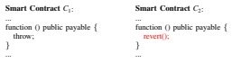

In this paper, we propose to use differentiated code to support the smart contract update. For a target smart contract, we firstly apply code syntactic and semantic similarities to discover the similar smart contracts from more than 120,000 smart contracts. Then, we compare the source code of the target smart contracts and the similar smart contracts to extract the differentiated code. At last, we recommend the differentiated code to the target smart contract, which might be used to support the update of the target smart contract. The case

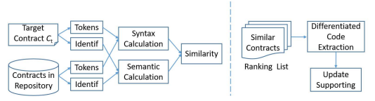

study shows that the differentiated code we recommended can exactly match the code change in evolving versions of 42 smart contracts. The encouraging experimental results demonstrated that the differentiated code can effectively support smart contract update.

The rest of this paper is organized as follows. Section 2 introduces blockchain and smart contract. Section 3 presents the overall framework, while Section 4 describes the main method of smart contracts syntax and semantic similarities analysis. The differentiated code recommendation is discussed in Section 5. Section 6 describes the case study. Section 7 presents the threats to validity. Section 8 overviews the related works. Section 9 summarizes our approach and outlines directions for future studies.

## Ii. Blockchain And Smart Contract

Blockchain was first introduced by Satoshi Nakamoto in 2008 as the underlying data structure of Bitcoin [1]. As its name suggested, a blockchain is a chain of blocks, in which each block contains a number of transactions which are hashed in a Merkle Tree [14]. By storing the hash value of the previous block, each block refers to its previous block, forming a chain structure. Together with peer-to-peer communication, consensus between miners such as Proof of Work (PoW),
asymmetric encryption and digital signature, a blockchain system can provide a temper-proof and immutable valuetransfer network without relying on a trusted third party[15].

Hence, many people think blockchain tends to be another technology revaluation of the Internet, due to its unique security, trustworthiness and reliability [16].

In order to make blockchain suitable for more scenarios other than cryptocurrency, Ethereum, a blockchain platform, introduced smart contract which can be constructed with turing-complete programming languages such as Solidity
(Solidity1 is a contract-oriented, high-level language whose syntax is similar to that of JavaScript). Smart contracts are self-executing contracts where the terms of the agreement between multiple parties are directly written into lines of code
[17]. The code and the agreements contained therein exist across a blockchain network. By developing different types of smart contracts, Ethereum can facilitate the construction and 1http://solidity.readthedocs.io/en/develop execution of complex applications such as financial exchanges, game, social and insurance contracts on the blockchain.

Any user can create a smart contract by publishing a transaction to a blockchain. It takes three steps to create a smart contract based on Ethereum [18]: 1) write the smart contract source code in a high-level language; 2) compile the source code into bytecode using the EVM2 compiler; and 3) upload the bytecode to the blockchain with an Ethereum client. The behavior of the smart contract is determined by the publisher while receiving a message. Smart contract can read and write stored files, send messages to other users or contracts. It can also deposit currency into the account balance or send it to other users or contracts.

Once a smart contract's program code has been deployed on the blockchain, it cannot be changed. As a result, to update the functionality of a smart contract, the developers usually make changes to the original contract code (similar to the software incremental development) in an off-line way, and then redeploy the contract on the blockchain. Note that, each time the smart contract is modified, a new smart contract has to be deployed, and the original smart contract cannot be overwritten by the new one. Then, there may be multiple versions for a smart contract existing on the blockchain.

## Iii. Overall Framework

Figure 1 shows the overall framework of the proposed approach. The framework includes two phases: smart contract similarity analysis phase and differentiated code recommendation phase. In the similarity analysis phase, our goal is to measure the similarity between smart contracts via the syntax and semantic analysis. In the differentiated code recommendation phase, we discover the similar smart contracts to the target one, and extract the differentiated code from the similar smart contracts in the ranking list to support the update of the target smart contract.

Our framework firstly extracts the syntax tokens and identifiers from the source code of smart contracts; next, our approach extracts the code syntactic information from the code syntax tokens and extracts semantic information from 2a decentralized Turing-complete virtual machine provided by Ethereum, which can execute smart contract using an international network of public nodes.

the code identifiers, respectively. In this paper, we employ an abstract syntax tree parser (i.e., AST parser) [19], [20]
to obtain the code syntactic information, and uses word embedding technique to model the code semantic information. The similarity between two smart contracts is measured by the weighted value of code syntactic and semantic similarities.

After the similarity calculation method is constructed, in the differentiated code recommendation step, we retrieve the similar smart contracts to the target smart contract to generate a ranking list according to the similarities. Then, the differentiated code between the target smart contract and the similar smart contracts is extracted, which is recommended to support the update of target smart contract.

## Iv. Smart Contracts Similarity Analysis A. Syntax Similarity Analysis

In fact, detecting the similar smart contracts is a code clone detection problem [21], [22]. There are many ways to detect code clone. One of the representative methods is to compare the similarity of abstract syntax trees of the source code of smart contracts, namely, tree-based method [23]. This method firstly calculates the subtrees' similarity, and then calculates entire trees' similarity. The tree-based method can achieve a exponential time complexity [24], which is not suitable for using in our scenario.

The second representative method to detect code clone is based on the token sequences of code fragments, which is called token-based method [25]. This method firstly generates token for each code line, and then calculates the syntax similarity by finding a longest matched token sequence of two code fragments. The token-based method achieves a time complexity of O(n×m) [25], and we apply it to calculate the code syntax similarity in this paper. Code Tokenizing. To obtain code syntax structure of a smart contract, we should identify the syntax of each code line containing in the smart contract. In this paper, code syntax is subdivided into 90 types (e.g., MappingExpression, ModifierDeclaration, IfStatement, ForStatement, AssignmentExpression, *ReturnStatement*, etc). Our algorithm parses abstract syntax tree to obtain the syntactic types of each code line.

It's worth noting that a single code line may contain multiple syntax types. For example, a if code line "if(_to ==
address(this))" contains 3 syntax types: *IfStatement*,
BinaryExpression, and *CallExpression*. Hash Sequence. For the source code coming from two smart contracts, we use the tokens to mark each code line, and each type of token corresponds to an unique hash value (10 digits).

If a code line contains multiple types of tokens, the hash values corresponding to the tokens of the code line are added together to generate a new unique hash value. After that, each code line maps to a hash value, and the source code of a smart contract corresponds to a hash sequence. Then, we utilize the hash sequences of the source code of two smart contracts to calculate their syntactic similarity. Matching Algorithm. For two hash sequences coming from pair of smart contracts, our goal is to find the longest matching

subsequence from these two hash sequences, and the longest

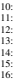

matching subsequence is used to measure their syntactic similarity. We employ the algorithm proposed by Wettel et al. [25] to look for the longest matching subsequence, while the difference is that we use abstract syntax tree to parse the code elements for obtaining the tokenization in this paper, and Wettel et al. use regular expressions to identify the code elements.

Algorithm 1: Syntax Matching Algorithm Input: *HashList1*: hash sequence 1 from contract Cn; HashList2: hash sequence 2 from contract Cm; Output: *SyntaxSimilarity* Begin

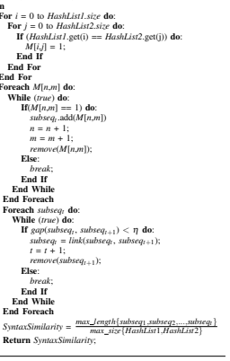 6: **End For**
7: **End For**
15: **Else**:
26: **Else**:
End
As shown in Algorithm 1, there are 4 steps in the matching

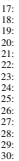

algorithm. Firstly, we compare every hash in hash sequence 1 with every hash in hash sequence 2. We use a matrix M to store the result, and every matrix cell M[i,j] stores the result of the comparison between the relevant hash i and the relevant hash j. M[i,j] = 1 means the relevant hashes are matched (i.e., identical). Secondly, we look for the matched cells from upper left corner of the matrix. From the first matched cell, we will further extend up to the first unmatched cell on the main diagonal direction. The continuously matched cells form a subsequence. We continue to find out all of the subsequences in the matrix. Thirdly, we check the gap between any two subsequences in the matrix. If the gap is less than a specific threshold η, we link these two subsequences to form a longer one. In the same manner the gap checking is repeated until we traverse all subsequences, then we can find a longest subsequences at last. Fourthly, dividing the length of the longest subsequences by the max length of hash sequence 1 and hash sequence 2 is the syntactic similarity. It's worth noting that because the matrix is symmetric, we can work with only one half of the matrix to find the longest subsequence.

## B. Semantic Similarity Analysis

Code syntax can catch the program similarity from a perspective of program logic, while code semantic can intuitionally catch the program similarity from the word-choices of the source code [26]. For example, if the identifiers of a code line contain the word 'withdraw', this code line probably implements the withdrawing functionality. Therefore, to evaluate how similar of two smart contracts, we can analyze their semantic similarity via analyzing the word-choices of two smart contracts.

Code Preprocessing. The source code of smart contract is represented by a set of significative words, punctuation and operational symbols, and we can regard the source code of smart contract as text document. However, the text document is different from normal one, which is not formed by sentences but a set of random words and symbols. Therefore, we cannot employ the method in [27] to firstly calculate the semantic similarity of sentences, and then calculate the semantic similarity of two text documents. Instead, we use word embeddings
[28] to vectorize each significative word, and then calculate the semantic similarity of two smart contracts.

Obviously, not all the words in the source code of a smart contract play a positive role for the semantic similarity analysis, some original words may weaken the code semantic.

Therefore, a series of preprocess rules are applied: 1) split the camel-case words into single words, such as: '*giveRightVote*' is divided into '*give*', '*right*' and '*vote*'. 2) filter out the function words in the source code, such as: 'and', 'the', 'an', etc.

3) filter out the keywords of Solidity, such as: '*mapping*', '*public*', '*function*', 'if', '*modifier*', 'for', etc. 4) filter out the letters sequence which does not denote a word, such as: '*tttt*', '*hhhk*', '*kkkk*', etc.

Word embeddings are unsupervised word representations that only require large amounts of unlabeled text to learn [28]. In this work, we collect the source code of smart contract as software engineering text. To reduce the amount of vocabulary in the entire corpus. First, we apply the stem segmentation technique. Because English verbs may appear in different tenses, such as past tense, future tense, and perfect tense, we transformed verbs of different tenses into their original forms.

Secondly, we filtered out words that appeared fewer than three times in the entire corpus.

Code Vectorization. To obtain the vector representation of a word, we used the continuous skip-gram model to learn the word embedding of a central word (i.e., wi) [28]. It is well known that the required word embedding is an intermediate result of the continuous skip-gram model. Continuous skipgram is effective at predicting the surrounding words in a context window of 2k+1 words (generally, k=2, and the window size is 5). The objective function of the skip-gram model aims at maximizing the sum of log probabilities of the surrounding context words conditioned on the central word
[28]:
n

$$\sum_{i=1}^{n}\sum_{-k\leq j\leq k,j\neq0}\log p(w_{i+j}|w_{i})$$

where wi and wi+j denote the central word and the context word, respectively, in a context window of length 2k+1 and n denotes the length of the word sequence. The term log p(wi+j|wi) is the conditional probability, defined using the softmax function:

$$(1)$$
$$\log p(w_{i+j}|w_{i})={\frac{e x p(v_{w_{i+j}}^{T}v_{w_{i}})}{\sum_{w\in W}e x p(v_{w}^{T}v_{w_{i}})}}$$
$$\mathbf{(2)}$$
) (2)
where vw and v w are the input and output vectors of a word w in the underlying neural model, and W is the vocabulary of all words. Intuitively, p(wi+j|wi) estimates the normalized probability of a word wi+j appearing in the context of a central word wi over all words in the vocabulary. Here, we employ negative sampling method [28] to compute this probability.

After training the model, each word in the corpus is associated with a vector representation and forms a word dictionary.

To obtain the semantic information of a smart contract, we first collect their preprocessing identifiers and then determine the corresponding vector representation of each identifier from the dictionary. Subsequently, we sum the vectors of all identifiers in the smart contract dimension by dimension. Then, we can calculate the semantic similarity of any two smart contracts via the vetorial angle of their semantic vectors.

## C. Similarity Calculation Of Smart Contracts

For the given source code of a pair of smart contracts Cn and Cm, our algorithm analyzes their code syntax to obtain the hash sequences, and extracts significative words to generate semantic vectors. After that, we calculate syntax similarity between the hash sequences of smart contracts Cn and Cm.

Meanwhile, we calculate the semantic similarity between Cn and Cm. After obtaining the syntax and semantic similarities, we use equation (3) to calculate a comprehensive similarity.

## Compsimi = Α · Syntsimi+Β · Semansimi, (3)

Where, CompSimi, *SyntSimi*, and *SemanSimi* correspond to comprehensive, syntax, and semantic similarity, respectively; α plus β equal to 1.0.

## V. Differentiated Code Recommendation

Based on the similarity calculation method, our approach can retrieve a number of similar smart contracts from the contract repository for any target smart contract. However, such an approach could perform a poor retrieval efficiency given that there are more than 120,000 smart contracts in the contract repository. Therefore, we can firstly cluster the smart contracts according to the comprehensive similarities, and then retrieve the similar contracts from the closer clusters to the target smart contract, which could significantly improve the retrieval efficiency. Then, we can compare the source code of similar smart contracts to obtain the code difference, which is used as differentiated code to support smart contract update.

## A. Similar Smart Contracts Clustering

To cluster the similar smart contracts, we employ K-means clustering [29] in this paper. The main idea behind K-means clustering is that given a specific parameter K, it will partition n instances into K clusters, and each instance belongs to the cluster with nearest mean.

When initializing K-means clustering, we should randomly select K smart contracts as the cluster center; Then, each smart contract is assigned to a cluster when the center of the cluster is closest to the smart contract according to the comprehensive similarity. After that, it should iteratively update the cluster center when new smart contracts are added in the cluster.

Finally, when the cluster center remains unchanged, we stop the iteration.

## B. Differentiated Code Extraction

To support the update of a target smart contract, we need to extract the differentiated code from its similar smart contracts.

Again, we apply the syntax matching algorithm (i.e., Algorithm 1) to extract the differentiated code. Specifically, for target smart contract Cn and its similar smart contract Cm, we can find the longest matching subsequence in matrix M[i,j]. On one hand, we can identify the matched code statements of Cn and Cm according to the longest matching subsequence. On the other hand, the non-matching code statements of Cn and Cm can be also identified by removing the matching ones in the longest matching subsequence in matrix M[i,j].

There are two types of non-matching statements, i.e., statements contained in smart contract Cn, but not in Cm (case 1); or statements contained in smart contract Cm, but not in Cn (case 2). When we try to use the differentiated code to support the update of smart contract Cn, the non-matching statements in case 2 can be used as differentiated code to recommend to smart contract Cn for updating. In the same manner, the nonmatching statements in case 1 can be used as differentiated code to support the update of smart contract Cm.

## Vi. Case Study A. Dataset

We downloaded 32,537 solidity files from Etherscan3, and each solidity file contains an average of 3.7 smart contracts
(ranges from 0 to 36). There are a total of 120,389 smart contracts, which are stored in a local repository. And these smart contracts were released before March 24, 2018. Table I shows the statistical characteristics of the dataset.

TABLE I: Statistical characteristics of the dataset

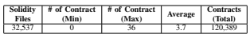

3https://etherscan.io

## B. Research Questions

With the purpose of analyzing our approach's capability to recommend differentiated code to support smart contract update, we would like to answer the following research questions in our evaluation:
RQ1: Can the recommended differentiated code guide the developers in updating smart contract?

RQ2: Does the choice of weight values (i.e., α and β )
affect the performance of our approach?

RQ3: What differentiated code can the developers obtain in the recommended smart contracts?

In whole experiment, our approach is executed on Windows 7, with a quad-core 3.3GHz Intel Core i5 processor and 8GB
memory. The gap parameter η = 3 in whole experiment.

## C. Evaluation Criteria

For RQ1, we want to evaluate whether the differentiated code in recommended smart contract can help developers in updating smart contract. To achieve this goal, we firstly collect the smart contracts with two versions (the earlier-released version is called target smart contract, and the later-released version is called evolving smart contract) in the dataset, and then apply the proposed method to recommend a number of similar smart contracts (called recommended smart contract)
for the target smart contract. Finally, we determine whether the recommended smart contracts and the evolving smart contract involve the same code change (i.e., differentiated code) when comparing with the target smart contract. If this is true, it can prove that the recommended smart contract can be used to guide future update of the target smart contract, as the code change in recommended smart contract is consistent with the ones in evolving version of the target smart contract. To identify whether a smart contract has two versions, we require the two smart contracts should be in the same account (i.e.,
released by the same author), in addition, we also require the similarity of these two smart contracts is equal to or greater than 0.7. If both of the two conditions are met, the smart contract is regarded as having two versions.

For RQ2, we want to evaluate whether there is a tradeoff between α and β that can make the proposed method get a best result. To achieve this goal, we propose a parameter optimization method. Specifically, for each target smart contract in RQ1, the goal of our parameter optimization method is to improve the ranks of the recommended smart contracts in the recommendation list via gradually adjusting the values of α and β. Because only when the recommended smart contract appears in the top of the recommendation list, it means our algorithm works well and can further effectively provide reference for the developers.

For RQ3, we try to conduct a quantitative analysis on the recommended smart contracts, and we want to see what differentiated code the developers can obtain in the recommended smart contracts, and further to determine whether the differentiated knowledge can be used to assist developers in version updating. To achieve this goal, we empirically analyze and classify the differentiated code in the recommended smart contracts.

## D. Results Analysis

1) RQ1: We found that a total number of 42 smart contracts have two versions. Due to the space limitation, Table II shows the information of part of the smart contracts. The Name column in Table II represents the contract name; The Address column represents the address of the smart contract in the blockchain. The *Address* consisted of a 40-bit hexadecimal number, also due to the space limitation, we only retained its first 5-bit in the Table II. The *Block Height* column represents the height of the block that current smart contract locates in. The *Simi* column represents the code similarity between target smart contract and recommended smart contract (or target smart contract and evolving smart contract), and *Rank* column represents the similarity rank of the recommended smart contract in the recommended list via applying the proposed method.

For a target smart contract, it may have the same name with its recommended smart contract and evolving smart contract, as the fist target smart contract (i.e., Owned in Table II) shows. It is worth noting that although the target smart contract and the recommended smart contract have the same name, they are created by different accounts. Therefore, the contract (Owned, with address 0x492a4) can be used as a recommended smart contract for the target smart contract (Owned, with address 0x2561b). In some cases, the target smart contract and its evolving smart contract have different names, as the second target smart contract (i.e., Owned) shows. We can determine the contract Owned is an evolving version of contract Managed because they are created by the same account and with a higher code similarity (i.e., 0.94). Moreover, the release time of contracts Owned and Managed can also confirm this fact, because the higher the block height, the later the contract releasing. Thus contract Owned is released later than contract Managed. Similarly, we require that the release time of recommended smart contract should be earlier than that of target smart contract. Because the developer of a target smart contract can only obtain reference from the smart contract that previously released.

In Table II, we can observe that there are some target smart contracts with overlapping name, i.e., the first and the last target smart contracts, the 3rd and 5th smart contracts, the 4th and 13th, 14th smart contracts. Although these smart contracts have same name, they are created by different accounts and have different addresses. More importantly, they are different in source code. For example, we compare source code of the first and the last smart contracts, and find that the code similarity of these two smart contracts is less than 40%. Then, when applying the proposed approach to retrieve similar smart contracts for them, the obtained recommended smart contracts are also different.

We conclude RQ1 that the recommended smart contracts of 42 target smart contracts are as same as their evolving smart contracts, and this finding enables developer employ the proposed approach to retrieve similar contracts to aid their smart contract update in practice development.

2) RQ2: In smart contract recommendation, we employ code syntactic and semantic information to measure the code similarity between smart contracts. We compute the comprehensive similarity according to Equation (3). To tune the best values of α and β, we gradually increase their values from 0.1 to 0.9 (every time we increase threshold by 0.1). And we should make sure that α + β = 1 in every iteration. Our goal is to find a pair of α and β resulting in the best ranks of the recommended smart contracts in the recommendation list.

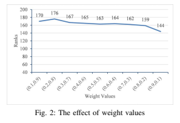

Figure 2 presents the detailed information to estimate the values of α and β. The vertical axis shows the total rank of the 42 recommended smart contracts when applying the proposed method, and the horizontal axis shows the value pairs of α and β. For example, (0.1, 0.9) represents the value of α equals 0.1 and β equals 0.9. We can observe that the total rank of recommended smart contracts is improve with α incrementally increasing. When α equals 0.9 and β equals 0.1, the total rank of recommended smart contracts achieves a best result in the recommendation list. This result indicates that the code syntax plays a dominant role in contract similarity calculation.

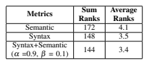

Table III shows the comparison of applying different metrics to measure the code similarity. When we only apply semantic information to calculate the code similarity, the recommended smart contracts can obtain a total rank of 172, and an average of 4.1; When we apply syntactic information alone, the recommended smart contracts can obtain a total rank of 148, and an average of 3.5. When we combine these two metrics with a weight values of 0.9 and 0.1, the recommended smart contracts get a best total rank of 144, and an average of 3.4.

We conclude RQ2 that a combination of syntactic and semantic information with weight values of 0.9 and 0.1 can TABLE II: The results of RQ1

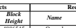

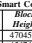

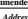

No.

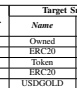

Target Smart Contracts Recommended Smart Contracts **Evolving Smart Contracts**

Name Address **Block**

Height Name Address **Block**

Height *Simi*

1 Owned 0x2561b 4886545 Owned 0x492a4 4704537 0.83 1 Owned 0x14b0d 4887631 0.83 2 ERC20 0x6c4fe 4928600 ABTokenBase 0x007e7 4547466 0.89 2 ERC20 0x01b84 5168599 0.89 3 Token 0x759a5 4538168 Token 0x273f5 4494277 0.8 3 Token 0x5d113 4627084 0.8 4 ERC20 0x37bda 4551394 ABTokenBase 0x007e7 4547466 0.73 3 ERC20 0x1dfa4 4685008 0.73 5 USDGOLD 0x00755 4879124 FireLottoToken 0x04939 4713248 0.87 2 ILoveYou 0xaeda4 4981202 0.87

6 FengShuiCoin 0x0661f 5158332 PI 0x69124 4649999 0.78 4 FSRatCoin 0x5ab63 5158430 0.78 7 BRM 0xd7732 5231383 MOT 0x263c6 4753082 0.82 1 BRM 0x61d16 5239862 0.82

8 AbstractToken 0xc25c2 4967169 ERC20 0x003f7 4508340 0.89 1 ERC20 0x15adb 4971923 0.89 9 ERC20Basic 0x6c4fe 4928600 ERC20Basic 0x0056A 4791096 0.8 1 ERC20Basic 0x01b84 5168599 0.8

10 VenusERC20 0xa723c 4837227 ELYTE 0x05d37 4506864 0.84 7 VenusToken 0x1e4e3 4846201 0.84

11 BIGCToken 0xa6768 4823807 TokenERC20 0x0445a 4526508 0.81 2 BIGCToken 0x574fa 4824268 0.81 12 Token 0x419ca 4209736 ERC20 0x01b6f 4135914 0.75 3 ERC20 0x661Eb 4163888 0.75 13 Token 0xbca13 4140369 ERC20Token 0x03698 3982761 0.8 1 Token 0xc14b3 4177015 0.8 14 Owned 0xd32c2 4424760 Managed 0x259b0 4343542 0.94 1 Managed 0x9a9f1 4430409 0.94

make the recommended smart contracts get the best ranks.

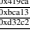 Therefore, we use α = 0.9 and β = 0.1 as default values in this study.

3) RQ3: We conduct an empirical analysis on the recommended smart contracts, and try to see what differentiated code the developers can obtain in the recommended smart contracts.

Table IV shows 10 types of differentiated code on the 42 recommended smart contracts, where the red font indicates the differentiated code. It is worth noting that a recommended smart contract may involve more than one differentiated code for a target smart contract.

The first kind of differentiated code is Events. Events are similar to the logging operation in object oriented programming languages such as Java, which is convenience interfaces with the EVM logging facilities. Events are a common programming practice of practical importance to collect EVM runtime information, as they can be used for assisting postmortem analysis [30]. In some cases, developers forget to insert Events to record the key runtime information of EVM, which may significantly increase the difficulty in failure diagnosis. In this sense, the differentiated code recommended by our method is an important reference for developers to add Events.

Another kind of differentiated code is the self-destruct function. Self-destruct function can end current execution. More importantly, self-destruct function can destroy current contract and send funds to a designated account. Therefore, when our method recommends the self-destruct function to the target smart contracts, it can not only enhance the controllability of the smart contracts' life cycle, but also increase the flexibility of the smart contracts.

The third kind of differentiated code is the Modifier. Modifier can be used to easily change the behaviour of functions, and they can automatically check a condition prior to execute the function. For example, the case 3 in Table IV shows that the Modifier requires owner is msg.sender, if so, the smart contract executes the function that references the Modifier; if not, the smart contract throws an exception. Therefore, the Modifier recommended to the target smart contracts plays an important role to restrict access authority of the function in this case.

Another kind of differentiated code is rollback function

optimization. Case 4 in Table IV shows that the throw is used in the target smart contract, while the revert() is used in the recommended smart contract. The throw can roll back all state changes, but consume the remaining gas; In contrast, revert() can also roll back all state changes, but return remaining gas to the caller. In this sense, revert() is more user friendly, which is an optimized rollback function.

The fifth kind of differentiated code is the condition strengthening. Case 5 in Table IV shows that when satisfying the additional condition of "allowTransfer == true", the if statement can be executed. This operation strengthens condition of the if statement, and can also help to avoid program vulnerability.

The next 3 differentiated code (i.e., from case 6 to 8)
can be classified as code refactoring. For example, case 6 abstracts some program functions as parent contract Iowned, and then Owned inherits from Iowned. Case 7 changes the initial value of variable totalSupply. Case 6 adds the keyword indexed to modify the variables _prevOwner and _newOwner, which makes the variables indexable.

The rest of two differentiated code are regarding variable declaration and function declaration. These two cases recommend some variables and functions to the original target smart contracts, and these variables and functions act different roles in the smart contracts, hence we cannot classify them more finer-grained. It should be noted that the self-destruct function
(case 2) and Modifier (case 3) are not included in the function declaration (case 10).

We conclude RQ3 that most of the differentiated code recommended by our method are useful for developers to update their smart contracts. The differentiated code range from Events, self-destruct function, Modifier to Rollback function, etc. These differentiated code can help the updated smart contracts increase the maintainability (e.g., Events),
flexibility (e.g., self-destruct function), controllability of function behaviour (e.g., Modifier), user-friendliness (e.g., rollback function), reasonableness of code structure (e.g., case 6 to 8),
etc.

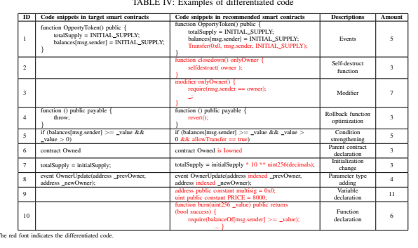

## E. Cluster Analysis

To further understand the effectiveness of our approach to support the smart contract update, we empirically study the clusters of smart contracts described in Section V.

Considering there are more than 120,000 smart contracts in the repository, we set the number of clusters of K-means as 6,000, i.e., K = 6,000. In addition, we require that when the similarity between a smart contract and the center smart contract of a cluster is greater than 0.6, the smart contract is allowed to add to the cluster. This is done to ensure that the smart contracts in the same cluster have a higher similarity.

However, this constraint may lead some smart contracts not belonging to any cluster.

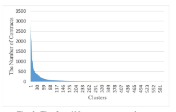

Figure 3 shows the first 600 clusters according to the number of smart contracts belonging to them. We can observe from the clusters that the largest number of cluster contains 2894 similar smart contracts, and the least number of cluster contains 2 similar smart contracts. There are 15,800 smart contracts that do not belong to any cluster. The result means that the remaining smart contracts (i.e., more than 104,000)
can find at least one similar smart contract from the repository.

This is an evidence that most of the smart contracts are similar in the dataset, and they share lots of code with similar syntax and semantics.

To further understand why there are so many similar smart contracts, we manually analyze the smart contracts in same cluster. The top reason causing the similar smart contracts is the implementation of the same "interface". For example, to achieve the "issue currency", the corresponding smart contracts should implement the "interface" of ERC20 4. As a result, all the smart contracts with the "issue currency" function have similar source code.

The second reason causing the similar smart contracts is the code reuse. Because many smart contracts on the Ethereum are open source, and developers can retrieve smart contracts on demand and do custom development based on the source code of the existing smart contracts. At present smart contract can only be used in a few limited fields, such as finance, game and social. The smart contracts in same field usually implement similar functionalities. For example, the finance-related smart contracts have the common functionalities, such as: *transfer*, allowance, and *approve*, etc. Then, developers can largely reuse the existing smart contracts for custom development in same field, which makes many smart contracts keep small code differences on the Ethereum.

Due to lots of similar smart contracts existing in the repository, our method can successfully retrieve similar smart 4A standard interface for tokens. https://eips.ethereum.org/EIPS/eip-20 contracts for a target smart contract in most cases, and further to extract the differentiated code from the similar smart contracts to support the update of the target smart contract.

## Vii. Threats To Validity

In this section we focus on the threats that could affect the results of our case studies. The main threat to validity is the scale of the dataset. Since we need to extract the syntax and sematic information from smart contract, it requires all collected smart contracts should be open-source. Then, we have collected 32,537 solidity files from Etherscan, and these solidity files include 120,389 open-source smart contracts in total. However, it needs to note that these open source smart contracts represent only a small part of the contracts on Ethereum, and most of the contracts on Ethereum are non-open source. In the future, we need to constantly crawl new opensource smart contracts from Etherscan to extend our repository.

Another threat to validity is the suitability of our evaluation measure. We use a new measure to evaluate the effectiveness of the proposed approach in this paper, which is different from traditional one. We propose the definitions of target, recommended, and evolving smart contracts. We use the recommended smart contract as a recommendation to the target smart contract, and the recommended smart contract should be the same with the later version of the target smart contract, i.e, its evolving smart contract. Such a setting demonstrates that the smart contract we recommend to developers (i.e., recommended smart contract) is a valid reference for developers when they try to update the target smart contract, because the developers will do the same update in the later version of the target smart contract (i.e., evolving smart contract). Thus, we believe there is little threat to suitability of our evaluation measure.

The last threat to validity is the generalizability of our results. We have recommended smart contracts to the target smart contracts in this paper. All of these smart contracts are written by Solidity language. When applying our approach to the smart contracts written by other programming languages, such as Serpent, Mutan, LLL, etc., some particular code syntax should be carefully handled when extracting the code syntax.

In the future, further investigation by analyzing even more smart contracts written by other programming languages is needed to mitigate this threat.

## Viii. Related Work

Smart contracts are applied in various domains, which have been studied by many researchers from various perspectives, such as concurrent programming [31], [32], security [33], [34], [35], [36] and scheme [18], [37]. The most related work to this study are the ones that assist programmers in smart contract development.

To facilitate collaborative development of smart contract, He et al. [11] proposed SPESC, a specification language for smart contracts development. SPESC enables users to specify a smart contract in a similar form to a real-world contract, in which the obligations and rights of parties and the transaction rules of cryptocurrencies are clearly defined. In addition, SPESC
can derive a program skeleton (or a program interface) in accordance with the contract terms and the account balance.

Their preliminary study results demonstrate that SPESC can be easily learned and understood by both IT and non-IT users.

Frantz et al. [12] proposed a modeling approach that supports the semi-automated translation of human-readable contract representations into computational equivalents. They adapted ADICO [38] for modeling smart contracts. From ADICO-based models, they also developed a code generator to derive partial source code. The ADICO format can specify a party's obligations and rights.

Chen et al. [39] conducted an investigation on smart contract and revealed the gas-costly programming patterns. They identified 7 gas-costly patterns, and divided them into 2 categories: useless-code related patterns, and loop-related patterns. They proposed and developed GASPER tool to discover gascostly patterns in smart contract automatically, which can help programmers locate 3 representative patterns in practice development.

Porru et al. [40] identified many challenges for blockchainoriented software engineering, focusing on collaboration among large teams, testing activities, and specialized tools for the creation of smart contracts. Their study proposed new directions for the blockchain-oriented software engineering.

Different from the mentioned studies, we are among the first to propose the differentiated code for smart contract development at code level. Differentiated code play a role of illustrating how a software feature is implemented and a programming issue is solved, hence the differentiated code can be reused by the programmers who want to update their smart contracts in the next version.

IX. CONCLUSIONS AND FUTURE WORK
In this paper, we propose an approach to automatically support the update of a smart contract. For a target smart contract, our method discovers the similar smart contracts in the repository based on calculating their code syntax and semantic similarities, and then our method extracts differentiated code from the similar smart contracts to support the update of the target smart contract. The experiment results show that the recommended smart contracts of 42 target smart contracts are as same as their evolving smart contracts by applying the proposed method. To improve the effectiveness of the proposed approach, we tune the weight values of α and β with 0.9 and 0.1. Besides, we analyze the differentiated code that the developers obtain in the recommended smart contracts.

Some efforts are in progress. One future research work mainly focuses on the expansion of the smart contract repository. Although our repository has saved more than 120,000 contracts until now, it is far from enough. We will further crawl more smart contracts to extend the repository.

## Acknowledgment

This research is supported by the National Key R&D Program of China (2018YFB1004804), the National Natural Science Foundation of China (61672545, 61722214, U1811462),
the Guangdong Province Universities and Colleges Pearl River Scholar Funded Scheme (2016) and the Program for Guangdong Introducing Innovative and Entrepreneurial Teams (2016ZT06D211), China Postdoctoral Science Foundation
(2018M640855).

## References

[1] S. Nakamoto, "Bitcoin: A peer-to-peer electronic cash system," *Cryptography Mailing list at https://metzdowd.com*, 03 2009.

[2] T. T. A. Dinh, R. Liu, M. Zhang, G. Chen, B. C. Ooi, and J. Wang,
"Untangling blockchain: A data processing view of blockchain systems," IEEE Transactions on Knowledge and Data Engineering, vol. 30, no. 7, pp. 1366–1385, July 2018.

[3] P. Zheng, Z. Zheng, X. Luo, X. Chen, and X. Liu, "A detailed and realtime performance monitoring framework for blockchain systems," in International Conference on Software Engineering Software Engineering in Practice - ICSE-SEIP '18, 05 2018, pp. 134–143.

[4] Z. Zheng, S. Xie, H. Dai, X. Chen, and H. Wang, "An overview of blockchain technology: Architecture, consensus, and future trends," in 2017 IEEE International Congress on Big Data (BigData Congress),
June 2017, pp. 557–564.

[5] S. Nick, "The idea of smart contracts (1997)," http://www.fon.

hum.uva.nl/rob/Courses/InformationInSpeech/CDROM/Liter ature/LOTwinterschool2006/szabo.best.vwh.net/idea.html, 2008.

[6] K. Christidis and M. Devetsikiotis, "Blockchains and smart contracts for the internet of things," *IEEE Access*, vol. 4, pp. 2292–2303, 2016.

[7] A. Juels, A. Kosba, and E. Shi, "The ring of gyges: Investigating the future of criminal smart contracts," in *Proceedings of the 2016 ACM* SIGSAC Conference on Computer and Communications Security, ser.

CCS '16. New York, NY, USA: ACM, 2016, pp. 283–295. [Online].

Available: http://doi.acm.org/10.1145/2976749.2978362
[8] A. Norta, "Creation of smart-contracting collaborations for decentralized autonomous organizations," in Perspectives in Business Informatics Research. Cham: Springer International Publishing, 2015, pp. 3–17.

[9] L. Luu, D.-H. Chu, H. Olickel, P. Saxena, and A. Hobor, "Making smart contracts smarter," in *Proceedings of the 2016 ACM SIGSAC* Conference on Computer and Communications Security, ser. CCS '16. New York, NY, USA: ACM, 2016, pp. 254–269. [Online]. Available: http://doi.acm.org/10.1145/2976749.2978309
[10] A. Sapirshtein, Y. Sompolinsky, and A. Zohar, "Optimal selfish mining strategies in bitcoin," vol. 9603 LNCS, Christ Church, Barbados, 2017, pp. 515 - 532.

[11] X. He, B. Qin, Y. Zhu, X. Chen, and Y. Liu, "Spesc: A specification language for smart contracts," in *2018 IEEE 42nd Annual Computer* Software and Applications Conference (COMPSAC), vol. 01, July 2018, pp. 132–137.

[12] C. K. Frantz and M. Nowostawski, "From institutions to code: Towards automated generation of smart contracts," in *2016 IEEE 1st International* Workshops on Foundations and Applications of Self* Systems (FAS*W), Sept 2016, pp. 210–215.

[13] Y. Huang, X. Chen, Z. Liu, X. Luo, and Z. Zheng, "Using discriminative feature in software entities for relevance identification of code changes," *Journal of Software: Evolution and Process*, vol. 29, no. 7, p. e1859, 2017, e1859 smr.1859. [Online]. Available:
https://onlinelibrary.wiley.com/doi/abs/10.1002/smr.1859
[14] R. C. Merkle, "Protocols for public key cryptosystems," in *1980 IEEE*
Symposium on Security and Privacy, April 1980, pp. 122–122.

[15] M. Swan, *Blockchain: Blueprint for a New Economy*, 1st ed. O'Reilly Media, Inc., 2015.

[16] B. Wang, S. Chen, L. Yao, B. Liu, X. Xu, and L. Zhu, "A simulation approach for studying behavior and quality of blockchain networks," in Blockchain - ICBC 2018. Cham: Springer International Publishing, 2018, pp. 18–31.

[17] R. M. Parizi, Amritraj, and A. Dehghantanha, "Smart contract programming languages on blockchains: An empirical evaluation of usability and security," in *Blockchain - ICBC 2018*. Cham: Springer International Publishing, 2018, pp. 75–91.

[18] W. Chen, Z. Zheng, J. Cui, E. Ngai, P. Zheng, and Y. Zhou, "Detecting ponzi schemes on ethereum: Towards healthier blockchain technology," in *Proceedings of the 2018 World Wide Web Conference*, ser. WWW
'18. Republic and Canton of Geneva, Switzerland: International World Wide Web Conferences Steering Committee, 2018, pp. 1409–1418. [Online]. Available: https://doi.org/10.1145/3178876.3186046
[19] Y. Huang, Q. Zheng, X. Chen, Y. Xiong, Z. Liu, and X. Luo, "Mining version control system for automatically generating commit comment," in *2017 ACM/IEEE International Symposium on Empirical Software* Engineering and Measurement (ESEM), Nov 2017, pp. 414–423.

[20] Y. Huang, N. Jia, X. Chen, K. Hong, and Z. Zheng, "Salientclass location: Help developers understand code change in code review," in Proceedings of the 2018 26th ACM Joint Meeting on European Software Engineering Conference and Symposium on the Foundations of Software Engineering, ser. ESEC/FSE 2018. New York, NY, USA: ACM, 2018, pp. 770–774. [Online]. Available: http://doi.acm.org/10.1145/3236024.3264841
[21] R. Yue, Z. Gao, N. Meng, Y. Xiong, X. Wang, and J. D. Morgenthaler,
"Automatic clone recommendation for refactoring based on the present and the past," in 2018 IEEE International Conference on Software Maintenance and Evolution (ICSME), Sep. 2018, pp. 115–126.

[22] J. Jiang, Y. Xiong, H. Zhang, Q. Gao, and X. Chen, "Shaping program repair space with existing patches and similar code," in Proceedings of the 27th ACM SIGSOFT International Symposium on Software Testing and Analysis, ser. ISSTA 2018. New York, NY, USA: ACM, 2018, pp. 298–309. [Online]. Available:
http://doi.acm.org/10.1145/3213846.3213871
[23] I. D. Baxter, A. Yahin, L. Moura, M. Sant'Anna, and L. Bier,
"Clone detection using abstract syntax trees," in Proceedings of the International Conference on Software Maintenance, ser. ICSM '98. Washington, DC, USA: IEEE Computer Society, 1998, pp. 368–. [Online]. Available: http://dl.acm.org/citation.cfm?id=850947.853341
[24] C. K. Roy, J. R. Cordy, and R. Koschke, "Comparison and evaluation of code clone detection techniques and tools: A qualitative approach,"
Sci. Comput. Program., vol. 74, no. 7, pp. 470–495, May 2009.

[Online]. Available: http://dx.doi.org/10.1016/j.scico.2009.02.007
[25] R. Wettel and R. Marinescu, "Archeology of code duplication: recovering duplication chains from small duplication fragments," in Seventh International Symposium on Symbolic and Numeric Algorithms for Scientific Computing (SYNASC'05), Sept 2005, p. 8.

[26] Y. Huang, N. Jia, Q. Zhou, X. Chen, Y. Xiong, and X. Luo,
"Guiding developers to make informative commenting decisions in source code," in Proceedings of the 40th International Conference on Software Engineering: Companion Proceeedings, ser. ICSE '18. New York, NY, USA: ACM, 2018, pp. 260–261. [Online]. Available: http://doi.acm.org/10.1145/3183440.3194960
[27] J. Oliva, J. I. Serrano, M. D. del Castillo, and A. Iglesias, "Symss: ´
A syntax-based measure for short-text semantic similarity," Data & Knowledge Engineering, vol. 70, no. 4, pp. 390–405, 2011.

[28] T. Mikolov, I. Sutskever, K. Chen, G. Corrado, and J. Dean,
"Distributed representations of words and phrases and their compositionality," in *Proceedings of the 26th International Conference* on Neural Information Processing Systems, ser. NIPS'13. USA: Curran Associates Inc., 2013, pp. 3111–3119. [Online]. Available:
http://dl.acm.org/citation.cfm?id=2999792.2999959
[29] J. A. Hartigan and M. A. Wong, "Algorithm as 136: A k-means clustering algorithm," *Journal of the Royal Statistical Society*, vol. 28, no. 1, pp. 100–108, 1979.

[30] J. Zhu, P. He, Q. Fu, H. Zhang, M. R. Lyu, and D. Zhang,
"Learning to log: Helping developers make informed logging decisions," in *Proceedings of the 37th International Conference* on Software Engineering - Volume 1, ser. ICSE '15. Piscataway, NJ, USA: IEEE Press, 2015, pp. 415–425. [Online]. Available: http://dl.acm.org/citation.cfm?id=2818754.2818807
[31] L. Yu, W. Tsai, G. Li, Y. Yao, C. Hu, and E. Deng, "Smart-contract execution with concurrent block building," in *2017 11th IEEE Symposium on Service-Oriented System Engineering (SOSE)*. Los Alamitos, CA, USA: IEEE Computer Society, apr 2017, pp. 160–167. [Online]. Available: https://doi.ieeecomputersociety.org/10.1109/SOSE.2017.33
[32] T. Dickerson, P. Gazzillo, M. Herlihy, and E. Koskinen, "Adding concurrency to smart contracts," in *Proceedings of the ACM Symposium* on Principles of Distributed Computing, ser. PODC '17. New York, NY, USA: ACM, 2017, pp. 303–312. [Online]. Available: http://doi.acm.org/10.1145/3087801.3087835
[33] A. Kosba, A. Miller, E. Shi, Z. Wen, and C. Papamanthou, "Hawk:
The blockchain model of cryptography and privacy-preserving smart contracts," in *2016 IEEE Symposium on Security and Privacy (SP)*, May 2016, pp. 839–858.

[34] S. Grossman, I. Abraham, G. Golan-Gueta, Y. Michalevsky, N. Rinetzky, M. Sagiv, and Y. Zohar, "Online detection of effectively callback free objects with applications to smart contracts," *CoRR*, vol. abs/1801.04032, 2018. [Online]. Available: http://arxiv.org/abs/1801.04032
[35] T. Chen, X. Li, Y. Wang, J. Chen, Z. Li, X. Luo, M. H. Au, and X. Zhang,
"An adaptive gas cost mechanism for ethereum to defend against underpriced dos attacks," in *Information Security Practice and Experience*,
J. K. Liu and P. Samarati, Eds. Cham: Springer International Publishing, 2017, pp. 3–24.

[36] N. Atzei, M. Bartoletti, and T. Cimoli, "A survey of attacks on ethereum smart contracts (sok)," in *Principles of Security and Trust*, M. Maffei and M. Ryan, Eds. Berlin, Heidelberg: Springer Berlin Heidelberg, 2017, pp. 164–186.

[37] M. Bartoletti, S. Carta, T. Cimoli, and R. Saia, "Dissecting Ponzi schemes on Ethereum: identification, analysis, and impact," *ArXiv eprints*, Mar. 2017.

[38] E. Ostrom, "A grammar of institutions," *American Political Science* Review, vol. 89, no. 3, pp. 582–600, 1995.

[39] T. Chen, X. Li, X. Luo, and X. Zhang, "Under-optimized smart contracts devour your money," in *2017 IEEE 24th International Conference on* Software Analysis, Evolution and Reengineering (SANER), Feb 2017, pp. 442–446.

[40] S. Porru, A. Pinna, M. Marchesi, and R. Tonelli, "Blockchainoriented software engineering: Challenges and new directions," in *2017* IEEE/ACM 39th International Conference on Software Engineering Companion (ICSE-C), May 2017, pp. 169–171.