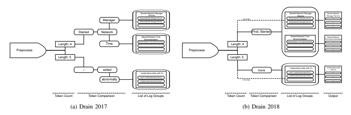
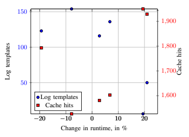

# Differences And Benefits Of Using Directed Acyclic Graphs Over Fixed-Depth Trees In Log Parsing

Nils Deckert deckert@campus.tu-berlin.de Abstract —Logs provide extensive amounts of information about the state of IT systems. However, the ever-increasing extent and complexity of those systems have made it unfeasible to analyse them manually. This essay aims to provide a extensive summary, comparison and benchmark for 6 log data sets of Drain 2017 and Drain 2018, two different approaches to log parsing by the same authors. For the tested datasets, Drain 2018 achieves an average 0.11% improvement in accuracy at an average increase in runtime of 3.8%. While the measured changes are minor, Drain 2018's self-adjustment of parameters could substantially improve usabiliity for system operators.

## I. I Ntroduction

Modern computer systems grow increasingly complex, utilising many different components by many different developers. Log messages give system operators crucial information for finding problem causes or detecting anomalies. As the employed components often evolve and their developers have different approaches to writing log templates though, it is hard to use the generated log messages for automated tasks.

Log parsing is used to identify log messages that describe the same event type, abstracting changing contents to infer the original logging statement. By extracting those log templates and the contents of their variable fi elds, log parser allow converting log messages from multiple applications into a structured format. This way, they facilitate manual inspection of system logs to find bugs or - in the case of online log parsers - allow system operators to structure log messages as they arise, enabling tasks like anomaly detection.

In 2017, He et al. proposed Drain - an online log parser that utilises a fixed-depth parse tree to transform raw log messages into a structured list of event types in a timely manner. One year later, He et al. published a revised version of their originally published paper [6], in which they deviate from their initial approach of using a fixed-depth tree, by opting for a directed acyclic graph instead. Additionally, they introduce a mechanism to autonomously initialise and adjust Drain's parameters, a cache mechanism and extend their previously conducted benchmarks by six additional log data sets.

This paper will summarise the common functionality of both log parser versions and then highlight and explain the differences between the preliminary and the final approach. Finally, it will compare accuracy and runtime of both log parsers on data sets that were previously only used to benchmark Drain 2018.

## Ii.  Related Work

Log Parsing is addressed through various approaches in the literature:
SLCT [9] and LogCluster [10] distinguish constant and variable parts by counting word occurrences and building templates out of the most commonly used tokens.

LKE [2] clusters similar messages by computing a weighted string editing distance, giving more significance to tokens in the beginning. Initial clusters are then split-up again, if their messages have too many variations at the same token position.

Spell [1] maintains the longest common subsequence for every existing log group. When a new log message arrives, it will be compared with every of the log groups and their LCS
will be determined. If a pre-defined threshold is surpassed, the new log message will be merged into the log group and the LCS will be adapted.

Zhang et al. give an comprehensive overview and benchmarks of current log parsers [11]. However, while they include Drain 2017, they are not considering Drain 2018 and only give shallow explanations about the functionality of each log parser. Zhu et al. provide tools and data sets to benchmark and compare various open-source log parsers [12].

## Iii.  Common Functionality

Upon receiving a new log message, both versions of Drain will utilise developer-supplied Regular Expressions to identify special tokens in the input and to preprocess the given log message [3, p. 3] [6, p. 35]. Following preprocessing, the messages will be grouped by their number of tokens, i.e.

space-separated strings or numbers. Then, Drain will look at the tokens contained in the log message to determine a corresponding list of log groups . In both versions, a log group is represented by a log template , which is a sequence of constants and wildcards characterising the format of related log messages [3, p. 5] [6, p. 35]. In addition to a log template, every log group consists of one or more log messages that fit the group's template. After finding a suiting list of log groups, Drain employs a heuristic to estimate the similarity between the new log message and the available log groups. If the respective threshold is met, the log message will be assigned l to one of the log groups [3, p. 5] [6, p. 36]. Otherwise, a new log group will be created based on the log message [3, p. 6] [6, p. 36]. After parsing, every log message will have exactly one corresponding log event, described by its log template.

## Iv.  Overview Of Parameters

Both [6] and [3] provide the option to influence the parsing process by adjusting parameter values. In [6], the depth parameter determines the number of tokens used for grouping a log message, thus deciding the structure of the parse tree
(see V). The structure of the graph is also affected by a second parameter, maxChild, which limits the number of children for each node [6, p. 35].

Additionally, the 2017 version of the log parser [6] requires providing a threshold st for the similarity checks between the log message and log groups (see VI-C1) [6, p. 36].

The available parameters for the 2018 parser [3] are a Boolean to enable or disable the merge mechanism described in VI-D1, as well as a threshold mt used in this optional step
[3, p. 7].

## V.  Graph Structure

The parsing process of both log parsers can be thought of as traversing through a list of nodes in a graph, eventually reaching a node that contains the message's template. The following section will layout the structure of both graphs. A visualisation can be seen in figure 1.

## A. Drain 2017

The proposed parse process for [6] is done by passing incoming log messages through a number of nodes in a fixeddepth parse tree. Limiting the depth of the parse tree - as well as the maximum number of children per node - is motivated by providing an upper bound for log groups that have to be considered when estimating the similarity between a new log message and existing log templates [6, p. 34]. The first layer of the fixed-depth parse tree groups the preprocessed log messages by their number of tokens. The following depth-2 layers collate the specific values of the first depth-2 tokens. The last layer consists of lists of log groups, matching every log message with exactly one log template. See figure 1a.

## B. Drain 2018

Similar to the 2017 version of the parser, [3] sorts the arriving log messages by their token count. Afterwards, instead of comparing the first few tokens for equality, [3] employs a split token heuristic (described in VI-B2) to infer a single decisive token in the log message. Consequently, this reduces the number of token comparison layers to one. Analogously to [6], the token comparison layer leads to a layer of lists of log groups, with all messages containing the same split token pointing to the same node [3, p. 5]. Again, each log group contains the template which defines it's log event.

To increase the speed of the parsing process, each node filtering the messages by their token count also has an edge pointing to the log group most recently used to assign a message with this length.

In contrast to [6] however, this is not the last layer of the parsing graph: Each log group points to one output node, containing the log messages that belong to the same log event.

If the Boolean parameter to enable Drain's merge mechanism is false , each output node has exactly one parent and its event corresponds to the template defined by that parent.

If the parameter is set to true however, an output node can have multiple parents, thus containing messages belonging to one event that is described by multiple templates. In this case, the graph deviates from the tree structure it previously maintained and converts into a directed acyclic graph. See figure 1b.

## Vi.  Comparison

After introducing the basic functionalities of the two log parsers, the following section will go through the parsing process from start to finish and highlight the different approaches in each stage.

## A. Preprocessing

Both [6] and [3] allow the developer to provide regular expressions to preprocess arriving log messages with the goal of improving parsing accuracy, as shown in a previous study
[4][6, p. 35].

While the 2017 version of the log parser will remove matched tokens from the log message [6, p. 35], the 2018 version allows the developer to replace the matched tokens with constants [3, p. 3]. This has the benefit of preventing branch explosion by removing variables, while still considering the token in the parsing process through it's replacement constant.

## B. Token Comparison

After removing / replacing tokens in the preprocessing stage, both versions of the log parser will sort the incoming messages by their token count identically. Next, Drain will group the log messages according to their specific tokens.

1) Drain 2017: Preceding Tokens: Reasoned with the assumption that log messages will likely contain constants in the beginning [6, p. 35], Drain 2017 will sort messages by comparing their exact tokens in the first depth-2 positions of the preprocessed message. To keep tokens like IP-addresses, user IDs etc. from 'overfitting' the parsing and exploding the branch, tokens that contain digits will be condensed into a wildcard "*" instead [6, p. 35].

2) Drain 2018: Split Token Heuristic: In their 2018 paper, He et al. approach the token comparison by identifying a split token in each log message: A split token is either the first, last or no token of the preprocessed log message, meant to hint the event type of the log message. When selecting the split token, Drain will prefer the first token of the message, falling back to the last token, if the first contains special characters commonly used in variables [3, p. 5]. If both the first and the last token contain such characters, no split token will be selected. The 2

message will then be sorted according to the split tokens value and position (first/last), or None if none was found.

C. Assigning messages to groups 1) Drain 2017: Global Similarity threshold: After sorting the log messages based on their preceding depth-2 tokens, Drain will arrive at a leaf node, containing a list of log group candidates for the new log message. To find the most suitable log group, Drain will compute the similarity between each log group's log template and the log message. To ensure a minimum level of similarity, the determined similarity between a log group and the log message must surpass a user-defined, global similarity threshold st .

Calculating the similarity between a template and a log message of length n with tokens seq 1 ( i ) and seq 2 ( i ) respectively can be described with the expression in (1), where equ ()
returns 1 if the tokens match and 0 if they don't [6, p. 36].

$$s i m S e q={\frac{\sum_{i=1}^{n}e q u\left(s e q_{1}(i),s e q_{2}(i)\right)}{n}}$$

(1)
Notably, the preliminary paper does not explain what happens if one of the tokens is the wildcard " * " .

2) Drain 2018: Group specific similarity thresholds: Similarly to the 2017 Version, Drain 2018 will compare the new log message to the log groups contained in the reached node using a similarity value. However, different to [6], [3] will use a specific, self-adjusting similarity threshold st for each log group instead of using a global, fixed threshold for all log groups. Equation (2) - used to calculate the similarity between message and template - is similar to (1), but comes with the following differences:
The equ () shorthand returns 0 if the i -th token in the template is the wildcard "*". Additionally, the denominator does now contain n c : the number of non-wildcard tokens in the event template - instead of n , the number of total tokens [3, p. 5]. Thus, the computed similarity will be higher for a template that has a wildcard "*" at a token's position, then for templates that have non-matching tokens at the same position.

$$s i m S e q={\frac{\sum_{i=1}^{n}e q u\left(s e q_{1}(i),s e q_{2}(i)\right)}{n_{c}}}$$
$$\left(2\right)$$

An exception to this rule is Drain's cache mechanism mentioned in section V: Drain will first consider the log group pointed to by the length node. If the similarity threshold is met, the new log message will be assigned to this group without regarding the other log groups [3, p. 6]. Through this mechanism, Drain 2018 favours parsing speed over accuracy, which could be problematic especially as new log groups start off with a low similarity threshold.

## D. Graph Update

Drain 2017 [6] and Drain 2018 [3] will modify the graph and it's nodes after reaching their respective leaf node.

If a suitable log group was found during the parsing process, both versions of Drain will show almost identical ways:
Drain will compare each token in the matched log message with the respective log template. If the two tokens differ, the token in that position in the log template will be replaces by a wildcard "*", denoting it as a position of variable content.

After adapting the log template, the 2018 version of the parser will perform one additional step, described in VI-D2. If no suitable log group was found, both parsers will traverse their graphs, following nodes whenever possible and creating new ones if no suitable nodes exist. In it's final layer, Drain 2017 [6] will create a new leaf node containing only a single log group, describing the incoming log message.

Similarly, after leaving/creating the split-token node, Drain 2018 [3] will create a new node with a single log group and log template, detailing the incoming message. If the merging mechanism described in VI-D1 is disabled, in addition to the newly created single-element list containing the log group, an output node will be created. This new output node has exactly one parent: the just created list node.

The behaviour of the enabled mechanism will be described in VI-D1.

1) Drain 2018: Merging log groups: Drain 2018 [3] provides a mechanism to merge multiple log templates into a single derived log event. This can be useful, if Drain separates log messages of the same event into too many single log groups, i.e. overparsing. The merging mechanism is an optional step in the parsing process, which can be toggled by the user. If the mechanism is enabled, the user has to provide a global similarity threshold which has to be surpassed to merge multiple log events.

In that case, if a new log group has been created, its template will be compared with the template of every other log group.

If the similarity surpasses the user-defined threshold mt , the node containing the new log group will point to the output node corresponding to the log group with highest similarity.

The similarity between two log templates can be determined using the expression in (3), where LCS is the longest common subsequence of the two templates new and existing and len()
returns the number of tokens in it's argument [3, p. 7].

$$t e m S i m={\frac{l e n(L C S)}{m i n\{l e n(n e w),l e n(e x i s t i n g)\}}}$$
$$(3)$$

2) Drain 2018: Self adjusting similarity thresholds: In contrast to [6], Drain 2018 [3] maintains individual similarity thresholds for ever individual log group.

On creation of a new log group with seqLen tokens, digLen of them containing digits, Drain initialises it's similarity threshold as the result of expression (4) [3, p. 7]:

$$s t_{i n i t}=0.5\times{\frac{s e q L e n-d i g L e n}{s e q L e n}}$$
$$(4)$$

When a log group is updated after assigning a new message
(See VI-D), Drain 2018 [3] will update the log group's similarity threshold st to account for the changes in the template.

With each update of the log template, Drain will increase the similarity value that must be reached to assign a message to the log group.

This is done using equation (5), where η is the total number of tokens in the group's template that have been changed since it's creation and base is the maximum of digLen + 1 and 2
[3, p. 7].

$$s t=m i n(1,s t_{i n i t}+0.5\times\log_{b a s e}(\eta+1))$$
$$(5)$$
$$\mathbf{VII},\ \mathbf{BENCHMARKING}$$

In the preliminary conference paper of Drain [6], He et al. benchmarked their log parser on the data sets BGL , HPC ,
HDFS, Zookeeper and Proxifier .

In their revised 2018 paper, they extended their benchmarking by the data sets Thunderbird , Hadoop , Spark , Windows, Linux and Apache . Each of the additional data sets comprise 2.000 lines of log messages and were made openly available together with their manually created ground truths 1 . This allows us to recreate the benchmarks and to test the 2017 log parser on data sets that were not considered in the original paper. Through this, we will gain insight into the measured differences between [3] and [6]. The following 1 logparser/data at main · logpai/logparser. GitHub. URL: https://github.

com/logpai/logparser/tree/main/data (visited on 11/26/2023).

section will elaborate on parsing those extending data sets with both log parsers and comparing their accuracy and run time. A. Evaluation Metric and Experimental Setup To create results comparable with those shared in [6] and
[3] we will also use F-measure as accuracy metric.

1) Metric: The F-measure or F1-score is the harmonic mean of precision and recall, where precision represents the ratio of all messages that were assigned the same log group and those that actually have the same log event.

Recall is the ratio of messages that have the same log event and the number of them that were assigned to the same log group.

F-measure = $\dfrac{2\times Precision\times Recall}{Precision+Recall}$ (6)
Precision = $\frac{TP}{TP+FP}$, Recall = $\frac{TP}{TP+FN}$ (7)
2) Hardware and software setup: The experiments were performed on a desktop machine running 64bit Arch Linux at kernel 6.7.2-arch1-1 with 32 GB of DDR4 memory and an AMD Ryzen 7 5800X at 3.800GHz. The logparsers were implemented in Python 2 and run using Python 3.11.6. [5] [13] The time measurements shared in section VII-C are averaged over 100 parsing runs to minimise the effects of possible aberrations.

3) Parameters: In alignment with the experiments conducted in [6], we are setting the maxChild parameter to 100 for all parsing runs with the 2017 version. The other parameters for the 2017 parser, introduced in section IV,
were adopted from an existing benchmarking setup 2 , chosen based on empirical observations of their effectiveness. Table I
provides a summary of the parameter values employed in the experiment for Drain 2017.

TABLE I: Parameter Values used for Drain 2017 [6]

| Dataset     | depth   |    |
|-------------|---------|----|
| st          |         |    |
| Thunderbird | 0.5     | 4  |
| Hadoop      | 0.5     | 4  |
| Spark       | 0.5     | 4  |
| Windows     | 0.7     | s  |
| Linux       | 0.39    |    |
| Apache      | 0.5     |    |

As with [3], the merging mechanism of the 2018 parser was not used for the examined data sets.

## B. Evaluation

In the following section, we will compare the measured accuracy and running time of both log parsers on the six data sets that extended the experiments in [3].

13b21315f5cdefe1a81d08bb4ec786c2a1ff74d9 .

2 logpai/logparser at GitHub. URL : https://github.com/logpai/logparser (visited on 02/01/2024).

4 1) Accuracy: To ensure comparability between the two log parsers, it is important that our results match those that were already shared in the original paper. In their 2018 paper, He et al. benchmarked their 2018 log parser on all of the here considered data sets [3]. Table II shares the results of our selfconducted benchmarks. We observe, that our accuracy results coincide with those in [3].

TABLE II: Accuracy

| Dataset     | 2017   | 2018   | se    |
|-------------|--------|--------|-------|
| Thunderbird | 0.9992 | 0.9998 | +0.06 |
| Hadoop      | 0.9954 | 0.9976 | +0.22 |
| Spark       | 0.9910 | 0.9919 | +0.09 |
| Windows     | 1.0000 | 0.9953 | -0.47 |
| 0.9752      | 0.9825 |        |       |
| Linux       | +0.75  |        |       |
| Apache      | 1.0000 | 1.0000 | 1.0   |

Except one, the 2018 version of the parser achieves better accuracy result than the 2017 parser with a relative improvement of 0.11%. We notice, that the 2018 parser achieves slightly worse results for the Windows data set. A look at the extracted log templates suggests, that in case of the Windows data set, the 2018 parser suffers from underparsing:
While the 2017 parser adopts log messages like PopulateComponentFamiliesKey - Begin and PopulateComponentFamiliesKey - End  as log events, Drain 2018 condenses those messages into a single log event: PopulateComponentFamiliesKey - *. This can also be observed for the log events TrustedInstaller finalization.

and TrustedInstaller initialization.

self-adjusting similarity threshold mechanism The introduced in section VI-D2, initialises the similarity threshold of the template PopulateComponentFamiliesKey similarity
- Begin with
=
0.5. The stinit between this template and a following log message PopulateComponentFamiliesKey - End will then be calculated as    > 0.5 using equation 2. As a result, the two log messages will merge into one template. C. Runtime During the experiments, we noticed degraded performance for most of the datasets, when comparing Drain 2017 and Drain 2018. On average, Drain 2018 showed a 3, 8% increase in runtime with variance σ 2 = 203.63. The results of recording the runtime are summarised in table III.

TABLE III: Runtime

| Dataset     | 2017    | 2018    | es     |
|-------------|---------|---------|--------|
| Thunderbird | 0.0166s | 0.0153s | -7.83  |
| Hadoop      | 0.0142s | 0.0146s | +2.81  |
| Spark       | 0.0162s | 0.0173s | +6.79  |
| Windows     | 0.0081s | 0.0098s | +20.98 |
| Linux       | 0.0191s | 0.0154s | -19.37 |
| Apache      | 0.0072s | 0.0086s | +19.44 |

in runtime of Drain 2018 compared to Drain 2017 and the number of log templates (ground truth) and the number of cache hits of the 2018 version.

However, these parameters seem unrelated to the change in performance and we were not able to conclude when Drain 2018 performed better or worse than Drain 2017.

## Viii.  Conclusion

Log parsing is an effective tool to facilitate system operators work of maintaining complex IT systems. This essay aims to provide a comprehensive overview of the functionality and differences of two log parsers with the same name: Drain.

While Drain 2017 factors in multiple leading tokens of a message in it's parsing process, Drain 2018 only regards one
"split token" to guide the parsing process. When arriving at a list of log event candidates, Drain 2018 uses a refined equation to compute similarity between a log message and the candidate template. Drain 2018 reduces the need of parameter tuning by auto-adapting its similarity threshold, aims to improve performance through a cache mechanism and allows to counter over-parsing by merging multiple log events into one. Overall, Drain 2018 brings minor improvements in parsing accuracy at the cost of slight increases in runtime for most data sets, despite the added cache mechanism. More than the accuracy improvements, the self-adjustment of parameters could make Drain 2018 more attractive to system operators, as it removes the effort to find suitable parameters.

[1] [2]
[3]
[4]
[5]
[6]
[7]
[8] [9]
[10]
REFERENCES
Min Du and Feifei Li. "Spell: Streaming Parsing of System Event Logs". In: 2016 IEEE 16th International Conference on Data Mining (ICDM). 2016 IEEE
16th International Conference on Data Mining (ICDM).

ISSN: 2374-8486. Dec. 2016, pp. 859-864. DOI: 10.

1109/ICDM.2016.0103. URL : https://ieeexplore.ieee.

org/document/7837916 (visited on 01/26/2024).

Qiang Fu et al. "Execution Anomaly Detection in Distributed Systems through Unstructured Log Analysis".

In: 2009 Ninth IEEE International Conference on Data Mining. 2009 Ninth IEEE International Conference on Data Mining (ICDM). Miami Beach, FL, USA: IEEE,
Dec. 2009, pp. 149-158. isbn: 978-1-4244-5242-2.

DOI: 10.1109/ICDM.2009.60. URL: http://ieeexplore.

ieee.org/document/5360240/ (visited on 01/26/2024).

Pinjia He et al. A Directed Acyclic Graph Approach to Online Log Parsing . June 12, 2018. DOI: 10.48550/
arXiv.1806.04356. arXiv: 1806.04356[cs]. url: http:
//arxiv.org/abs/1806.04356 (visited on 11/26/2023).

Pinjia He et al. "An Evaluation Study on Log Parsing and Its Use in Log Mining". In: 2016 46th Annual IEEE/IFIP International Conference on Dependable Systems and Networks (DSN) (2016), pp. 654–661.

URL:  https : / / api . semanticscholar . org / CorpusID :
9995103.

Pinjia He et al. "An Evaluation Study on Log Parsing and Its Use in Log Mining". In: Annual IEEE/IFIP
International Conference on Dependable Systems and Networks (DSN). 2016, pp. 654–661.

Pinjia He et al. "Drain: An Online Log Parsing Approach with Fixed Depth Tree". In: 2017 IEEE International Conference on Web Services (ICWS). 2017 IEEE
International Conference on Web Services (ICWS).

June 2017, pp. 33–40. doi: 10.1109/ICWS.2017.13.

URL: https://ieeexplore.ieee.org/abstract/document/
8029742 (visited on 11/07/2023).

logpai/logparser at 13b21315f5cdefe1a81d08bb4ec786c2a1ff74d9 .

GitHub. URL : https : / / github . com / logpai / logparser
(visited on 02/01/2024).

logparser/data at main · logpai/logparser . GitHub.

URL: https://github.com/logpai/logparser/tree/main/data
(visited on 11/26/2023).

R. Vaarandi. "A data clustering algorithm for mining patterns from event logs". In: Proceedings of the 3rd IEEE Workshop on IP Operations & Management
(IPOM 2003) (IEEE Cat. No.03EX764). 3rd IEEE
Workshop on IP Operations & Management (IPOM 2003). Kansas City, MO, USA: IEEE, 2003, pp. 119– 126. ISBN: 978-0-7803-8199-5. DOI: 10.1109/IPOM. 2003 . 1251233.  url:  http : / / ieeexplore . ieee . org /
document/1251233/ (visited on 01/26/2024).

Risto Vaarandi and Mauno Pihelgas. "LogCluster -
A data clustering and pattern mining algorithm for event logs". In: 2015 11th International Conference
[11] [12] [13]
on Network and Service Management (CNSM). 2015 11th International Conference on Network and Service Management (CNSM). Barcelona, Spain: IEEE, Nov. 2015, pp. 1–7. ISBN : 978-3-901882-77-7. DOI : 10.1109/
CNSM.2015.7367331. URL : http://ieeexplore.ieee.org/ document/7367331/ (visited on 01/26/2024).

T. Zhang et al. "System Log Parsing: A Survey". In: IEEE Transactions on Knowledge amp; Data Engineering 35.08 (Aug. 2023), pp. 8596–8614. ISSN: 15582191. DOI: 10.1109/TKDE.2022.3222417.

Jieming Zhu et al. Tools and Benchmarks for Automated Log Parsing . Jan. 3, 2019. arXiv: 1811.03509[cs]. url: http://arxiv.org/abs/1811.03509 (visited on 01/26/2024).

Jieming Zhu et al. "Tools and benchmarks for automated log parsing". In: Proceedings of the 41st International Conference on Software Engineering: Software Engineering in Practice (ICSE). 2019, pp. 121–130.