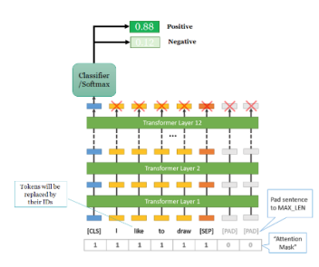
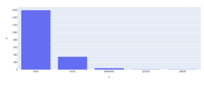
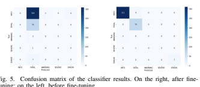
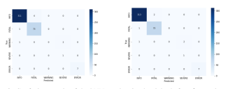
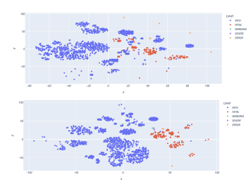

# Bert In Action: Enhancing Complex It System Diagnostics Through Intelligent Log Analysis

Abdelkader Alkadour Computer Science TU Berlin Abstract**—In the rapidly evolving domain of Information Technology (IT), ensuring the robustness and uninterrupted operation**
of complex and large-scale systems is a critical challenge. The advent of sophisticated software, hardware, and networking components has not only enhanced capabilities but also introduced a multitude of potential failure points. Downtimes or security breaches in such systems can lead to significant financial and reputational damages. Traditional log analysis methods, heavily reliant on keyword searches and rule-based matching, are increasingly inadequate in managing the vast and complex log data these systems generate. Against this backdrop, this study pioneers an alternative approach to log analysis and anomaly detection by employing BERT (Bidirectional Encoder Representations from Transformers). BERT's bidirectional nature offers a nuanced understanding of textual data, promising to elevate the accuracy and efficiency of anomaly detection processes.

This paper delves into the utilization of BERT for advanced log labeling and anomaly detection, presenting a comparative analysis for classification and clustering. A focal point of this investigation is the exploration of fine-tuning's impact on the performance of BERT in both classification and clustering tasks.

Through experiments on authentic datasets, this work elucidates the model's capability to discern anomalies with remarkable precision. The results reveal the transformative effects of finetuning on BERT's performance, showcasing its potential as a powerful tool for augmenting IT system reliability and preempting operational failures.

Index Terms**—IT, Log Analysis, Anomaly Detection, BERT,**
Classification, Clustering

## I. Introduction

Modern enterprise's systems depend heavy on Information Technology (IT) and have evolved characteristically into complex and large-scale structures. An increasing number of these systems are expected to run on a 24 × 7 basis serving millions of users worldwide. Any non-trivial downtime of them could lead to enormous revenue loss [2], [16]. Any given IT system could be broken down into enormous, highly connected components and each component is vulnerable to many failures, such as software bugs, hardware malfunction, network disruption, security incidents, and other unforeseen operational issues. Alone cybercrime costs businesses billions
[1], [4]. In addition, IT failures carry the potential beside the monetary losses, harm to reputation, and discontent among customers. Therefore, it is crucial to guarantee the smooth operation of all elements within any IT system [7].

System logs are valuable records that document events, different services, and the operational status. Logs are timeseries in nature and represent historical record of the state and the behavior of the system as it runs [12]. Through analysis of the system logs, system administration can observe and detect any anomalies or irregularities that could result in potential failures. Operation and maintenance personnel can inspect the system status throw the logs, identify anomalies, and diagnose the root cause of failures by utilizing log files. System logs typically exhibit semistructured or unstructured formats, encompassing numerous types and formats with hundreds of millions of records across diverse architectural layers [21].

As a results, the volume of the generated log is expanding rapidly, e.g. 50 GB/hour [15]. Conducting keyword searches, like for "exception" or "fail," and relying on rule matching is an outdated and ineffective approach [21].

In recent years, the IT field has experienced a paradigm shift, utilizing advanced Natural Language Processing (NLP)
techniques that hold promise for efficient system log analysis.

A noteworthy development in this domain is the adoption of BERT (Bidirectional Encoder Representations from Transformers), a game-changer pre-trained language model. BERT,
developed by Google, excels in understanding the context and nuances of natural language text [9]. Unlike older methods that typically relied on sequential processing of words, BERT
employs a bidirectional approach, considering both preceding and succeeding words simultaneously. This bidirectional understanding allows BERT to catch context more effectively, capturing dependencies and relationships between words.

Application of classification and clustering tasks on BERT
embedding: This study applies both classification and clustering algorithms to BERT-derived embedding to assess their utility in varied machine learning tasks. Exploration of fine-tuning effects: This work investigates how fine-tuning BERT models impacts the performance of classification and clustering tasks, offering insights into the adaptability and efficiency of pretrained models. Visualization of embedding pre- and post-finetuning: Through detailed visual analysis, this work compares the embedding before and after fine-tuning to demonstrate how adjustments to the model affect data representation.

The contribution of this work as follows: 1) **Utilization of BERT embedding**: This work leverages the advanced natural language processing capabilities of BERT to extract meaningful representations of log data.

2) **Application of classification and clustering tasks on**
BERT embedding: This study applies both classification and clustering algorithms to BERT-derived embedding to assess their utility in both classification and

## Clustering Tasks.

3) **Exploration of fine-tuning effects:** This work investigates how fine-tuning BERT models impacts the performance of classification and clustering tasks 4) **Visualization of embedding pre- and post-fine-tuning:**
Through detailed visual analysis, this work compares the embedding before and after fine-tuning to demonstrate how adjustments to the model affect data representation.

The remaining sections of this work are structured as follows: Section II discusses the log analysis flow. Section III
provides an overview of the related work, presenting existing literature in the field. Section IV introduces the preliminary methods applied in this work. Section V details the data and explores the outcomes derived from the applied methods. Finally, Section VI summarizes the key findings and conclusions of the study.

## Ii. Background

Logging is a critical practice in IT systems, serving multiple purposes that contribute to the overall reliability and efficiency of a system. Logging is crucial for inspecting runtime behavior, as well as documenting the chronological life of a system.

This documentation is useful for determining the reasons for failure and reducing the probability of downtime.

Figure 1 illustrates the log analytics pipeline. During the development phase, developers are tasked with writing logging statements within the code. When the system is running, logs are gathered and aggregated in a streaming manner. To minimize the storage associated with system logs, additional log compression techniques could be further applied. In the operational and maintenance phase, logs could be parsed into structured events using log parsing techniques and finally the log analytics part [22]. Log parsing techniques perform exactly the opposite of the log generation process; the log parser decomposes logs into log events and parameters [12].

## Iii. Related Works

Log analytic is an essential practice in IT systems, playing various roles that enhance the system's overall dependability and performance. Many researchers are focusing on the field of log analysis. LogFiT, as one of the log analytics systems, is trained on normal log data which is first transformed into semantic vectors before being passed to the anomaly detection model as a sequences of logs units. Notably, LogFiT does not require the extraction of log templates during the preprocessing step. Moreover, the model exhibits capabilities to reconstruct log data that has been intentionally corrupted via masking [5]. LogFiT employs the Longformer, a variant of the BERT family of models. The Longformer model enables LogFiT to handle log sequences that contain up to 4096 tokens, surpassing BERT's limit of 512 tokens [6]. Conversely, LogST employs the standard BERT and shares with LogFiT
noteworthy, good performance [21].

The objectives of Masked Language Modeling and Centroid Distance Minimization are prevalent in various log analytics systems. Notably, HilBERT [13] and LogBERT [10] are two such systems that incorporate these objectives. Both, as well as LogFiT and LogST, achieve a notably good performance.

Another relative to BERT, specifically Sentence-BERT,
has been implemented by LogADSBERT for log anomaly detection. Following log parsing, the system employs Sentence-BERT for semantic feature extraction. SentenceBERT (SBERT) is an extension of the BERT model specifically tailored for sentence embeddings. It employs siamese and triplet network architectures to enhance semantic similarity comparisons between sentences [18]. The obtained sequences of log embeddings are then passed into a Bidirectional Long Short-Term Memory Recurrent Neural Network model (BiLSTM) with an attention mechanism to determine whether a given sequence represents anomalies or not [12].

In contrast to previous approaches that focus on sampling logs as sequences and detecting anomalies within the sequences, Bhanage et al. proposed a novel anomaly detection system that classifies individual log units. In this approach, logs are initially parsed into templates and parameters. Sentence embedding is then applied to the derived log templates to discern the meaning of each entry. The extracted features, represented as embeddings, are fed into multiple machine learning classifiers to analyze log levels. The primary objective of the classification is to assess the effectiveness of semantic analysis accomplished through various NLP techniques, including K-Nearest Neighbors, Linear Regression, Support Vector Machines, Na¨ıve Bayes, Gradient Boosting Decision Trees, and Random Forests. The obtained results consistently demonstrate F1 scores exceeding 0.80, particularly with linear regression and support vector machines achieving accuracy

## Scores Surpassing 0.90 [7]. A. Bert Iv. Methods

The BERT model (Bidirectional Encoder Representations from Transformers) caused a paradigm shift in Natural Language Processing (NLP) when it was released by Google in 2018. The model capitalizes on a bidirectional perspective for interpreting text data, based on the transformer architecture which originated from Vaswani et al.

citevaswani2017attention. The training of this model involved a comprehensive corpus of 16GB, featuring over 3.3 billion words from the repositories of Wikipedia and the Brown Corpus. BERT's architectural design includes 12 transformer encoder layers, each having 768 hidden states. This architecture utilizes multi-head self-attention and feed-forward layers for the essential task of contextually understanding words in a sentence. BERT's training involves a masked language model—masking 15 percent of words for prediction based on context—and next-sentence prediction to bolster its sequential comprehension.

In the realm of sentence classification tasks, BERT offers a dedicated class known as *BertForSequenceClassification*. This class is essentially the conventional BERT model, enhanced with an appended single linear layer specifically designed for classification purposes, serving as the designated log classifier. The fine-tuning process for sentence classification involves capitalizing on the pre-existing weights of a pre-trained model.

Subsequently, these weights are utilized in conjunction with the input data to train the classifier layer. By default, this process utilizes the embeddings of the [CLS] token; however, alternative layers can be employed by aggregating the embeddings to generate sentence embeddings. Figure 2 displays the architecture of *BertForSequenceClassification*.

## B. Dimensional Reduction

Visualizing high-dimensional data is a complex task that often requires the use of special techniques to provide meaningful insights. This is especially true when working with BERT embeddings that exist in a high-dimensional space [9].

However, one powerful tool for the visualization of highdimensional data that has been employed in the context of BERT embeddings is t-SNE (t-distributed Stochastic Neighbor Embedding).

t-SNE is a machine learning algorithm, specifically designed for the visualization of high-dimensional datasets. It converts the similarities between data points into joint probabilities and seeks to minimize the Kullback-Leibler divergence between the joint probability distribution in high-dimensional space and the low-dimensional space. This technique has been found to be particularly effective in preserving local structures, making it a suitable method to represent BERT embeddings [19].

The application of t-SNE to BERT embeddings provides a two-dimensional map where proximity indicates semantic similarity. It allows for a point-wise visualization where each point represents a particular word or sentence, as embedded by BERT. Using t-SNE allows the understanding of how BERT clusters similar sentences or words, thus providing insight into its working mechanism.

## C. Clustering

The K-Nearest Neighbor (kNN) algorithm is a robust machine learning algorithm widely used for classification. Since the kNN algorithm endeavors to classify unclassified instances by recognizing 'k' number of its nearest neighboring instances, it belongs to the class of instance-based, competitive learning and lazy learning algorithms [8].

kNN method operates by taking a majority vote of the neighbors. The instance is assigned to the class that has the majority of closest neighbors. The kNN algorithm has been proven to be one of the simplest but highly effective machine learning algorithms due to its nonparametric nature and easy implementation. It is worthy to note that the KNN algorithm possesses a user-defined parameter, 'k,' which dictates the number of nearest neighbors the algorithm considers while performing the prediction. This number, 'k,' is a crucial hyperparameter that largely influences the performance of the kNN model. Selecting the optimal 'k' in kNN is critical as a small value of 'k' means that noise will have a higher influence on the result and a large value make it computically expensive.

## D. Evaluation Metrics

Logs can be classified according to the designated level for each log entry. In different IT infrastructures, log entries hold numerous types of levels. Thus, a multi-class classification technique is favored to accomplish the classification. Generally, a multi-class classifier's performance is appraised by the Micro-F1 score and Macro-F1 Score [14].

Therefore, TP (True Positives), TN (True Negative), FP
(False Positives), and FN (False Negatives) values were collected from each category of level and further utilized to calculate micro precision, macro precision, micro recall, macro recall, and macro-F1.

For a provided log category i, outcomes are labeled as TPi, TNi, FPi, and FNi. Where TPi represents the number of true positives in logs belonging to the i category. TNi represents the true negative in logs belonging to the i category. FPi represents false positives, and FNi means false negatives in logs belonging to the i category.

Considering values of TPi, TNi, FPi, and FNi, precisioni, and recalli are evaluated as:
Precisioni can be calculated as the percentage of positively labeled predictions made out of all predictions under the i category of the level [11].

$$P r e c i s i o n_{i}={\frac{T P_{i}}{T P_{i}+F P_{i}}}$$

The Recall can be calculated as the number of correct predicted results divided by applicable instances. Recall provides the number of accurately predicted results divided by all relevant samples [11].

$$R e c a l l_{i}={\frac{T P_{i}}{T P_{i}+F N_{i}}}$$

Weighted precision and recall for multi-class settings are calculated as:

$$P r e c i s i o n_{\mathrm{weighted}}={\frac{\sum_{i=1}^{N}(T P_{i}\cdot w_{i})}{\sum_{i=1}^{N}(T P_{i}+F P_{i})}}$$ $$R e c a l l_{\mathrm{weighted}}={\frac{\sum_{i=1}^{N}(T P_{i}\cdot w_{i})}{\sum_{i=1}^{N}(T P_{i}+F N_{i})}}$$
Where:
wi: Weight assigned to class i.

The weight is based on its prevalence in the dataset The weighted F1 score for multi-class classification is calculated as follows:

$$F1_{\mathrm{{weighted}}}={\frac{\sum_{i=1}^{N}w_{i}\cdot F1_{i}}{\sum_{i=1}^{N}w_{i}}}$$
Where:
N : Number of classes F1i: F1 score for class i wi: Weight of class i based on its prevalence in the dataset The F1 score for each class is calculated using precision and recall:

$$F1_{i}={\frac{2\cdot\mathrm{Precision}_{i}\cdot\mathrm{Recall}_{i}}{\mathrm{Precision}_{i}+\mathrm{Recall}_{i}}}$$

Where:

on for class $\small i$  . 
Precisioni: Precision for class i Recalli: Recall for class i The metrics used to measure model performance are training and testing splits accuracy. Accuracy is the rate of the absolutely classified data to all the data [20].

$$A c c u r a c y={\frac{T P+T N}{T P+T N+F P+F N}}$$

Finally, employing the confusion matrix provides a visual representation of results, akin to a scoreboard for a machine learning model. This matrix illustrates the model's performance by juxtaposing its predictions against the real outcomes.

## V. Evaluation

This section presents the obtained results and findings from the experimental analysis conducted in accordance with the proposed methods.

## A. Data

Fig. 3. Example of a log line [22]
Researchers on log analysis often work on their own log data. Logs are scarce data in public for research, because companies are often reluctant to release their production logs due to privacy concerns. Thus, an approach that works well on one type of log data may become ineffective on another type of logs [22].

BGL is an open dataset of logs collected from a BlueGene/L
supercomputer system at Lawrence Livermore National Labs
(LLNL) in Livermore, California, with 131,072 processors and 32,768GB memory. The log contains alert and nonalert messages identified by alert category tags. In the first column of the log, "-" indicates non-alert messages while others are alert messages. The label information is amenable to alert detection and prediction research. It has been used in several studies on log parsing, anomaly detection, and failure prediction [17].

Loghub1 provides 19 real-world log datasets collected from a wide range of software systems, including distributed systems, supercomputers, operating systems, mobile systems, server applications, and standalone software. Six of the provided datasets in Loghub are labeled (e.g., normal or abnormal, alerts or not alerts). The logs are not sanitized, anonymized or modified in any way.

1https://github.com/logpai/loghub A log message records a specific system event, including various fields such as timestamp (the event's occurrence time, for example, "2008-11-09 20:46:55,556"), verbosity level (the event's severity level, for instance, "INFO"), and a descriptive message in free text, as shown in the example below. Some log lines are illustrated in Figure 3. The data split used in this study is BGL, which categorizes logs into five levels:
'INFO', 'FATAL', 'WARNING', 'SEVERE', and 'ERROR'. The BGL's dataset from Loghub contains 2,000 log entries.

Figure 4 shows the distribution of the levels in the BGL
dataset.

## B. Classification

The BGL dataset has been divided into an 80% training set and a 20% testing set to simplify the evaluation of the builtin classifier in *BertForSequenceClassification*. the train data is used to fine-tune the transformer, what include the model and the classifier. the fine tuning is setted to only one epoch.

In Table I, a comprehensive display of the model's performance metrics, such as accuracy, precision, recall, and F1 score, is provided. Importantly, these metrics are specifically linked to the classifier integrated into the *BertForSequenceClassification* model under two conditions: before fine-tuning and after fine-tuning.

 $$\begin{array}{c|c|c|c}&\text{Accuracy}&\text{Precision}&\text{Recall}&\text{F1}\\ \hline\text{Before FT}&0.18&0.034&0.18&0.05\\ \hline\text{After FN}&0.98&0.97&0.98&0.97\\ \text{}&\text{}&\text{TABLE I}\\ \end{array}$$  Results of the CLASSIFIER BEFORE AND AFFER FINE-TUNING. 
Figure 5 explores the Confusion matrix, a crucial aspect of evaluating classifier results. The matrix is strategically presented, with the outcomes illustrated on the left side before fine-tuning and on the right side after fine-tuning.

C. Clustering The BGL dataset has undergone a partition, allocating 80%
for the training set and reserving 20% for the testing set. This strategic division aims to streamline the assessment of the kNN
classification model.

The data in Table II provides a detailed overview of kNN
classification metrics, including accuracy, precision, recall, and F1 score. It covers assessments before and after fine-tuning, with the parameter k set to 10 for the analysis.

 $\begin{array}{c|ccc}&\text{Accuracy}&\text{Precision}&\text{Recall}&\text{F1}\\ \hline\text{Before F7}&0.98&0.97&0.98&0.97\\ \hline\text{After FN}&0.98&0.98&0.98&0.98\\ \hline\text{TABLE II}&&\end{array}$  Results of the KNN before AND afterren fine-tuning. 
Figure 6 delves into the Confusion Matrix, a critical component in assessing kNN results. The matrix is strategically

depicted, showcasing outcomes on the left side before finetuning and on the right side after fine-tuning Fig. 6. Confusion matrix of the kNN results. On the right, before fine-tuning; on the left, after fine-tuning

## D. Visualisation

The embedding of all entries in the BGL dataset have been analyzed through t-SNE.

Figure 7 illustrates two settings. The upper plots display the representation of the data points before fine-tuning, while the lower plot depicts the representation after fine-tuning.

## Vi. Conclusion

The key takeaways from the study are encapsulated in this conclusion, with contributions summarized and potential avenues for future research suggested.

Table I presents the performance metrics of a classifier model before and after fine-tuning, highlighting four key metrics: Accuracy, Precision, Recall, and F1 Score.

Before fine-tuning (FT), an accuracy of 0.18, precision of 0.034, recall of 0.18, and an F1 score of 0.05 were observed in the model's performance. These numbers indicate poor performance. It is noted in Figure 5, as per the confusion matrix, that most of the test data is classified into only one category. The lack of performance could be attributed to the classifier's randomly initialized weights.

After fine-tuning (FN), significant improvements are observed across all metrics: accuracy increased to 0.98, precision to 0.97, recall to 0.98, and the F1 score to 0.97. These improvements suggest that the fine-tuning process greatly

enhanced the model's ability to classify correctly. Figure 5 demonstrates that the classifier correctly classifies most of the test data after one epoch of fine-tuning. This leads to the conclusion that classification using BERT cannot be achieved out-of-the-box; rather, it requires at least one epoch to achieve a significant increase in performance.

Table II presents the results of the kNN classification model from a research paper, both before and after fine-tuning. The kNN model's performance metrics are depicted in Table II,
which show no change in accuracy (remaining at 0.98) but slight improvements in precision, recall, and F1 score (from 0.97 to 0.98) after fine-tuning. The accompanying confusion matrix in Figure 7 illustrates the classification results, enabling a visual assessment of the model's predictive capabilities and displaying the true positives, false positives, true negatives, and false negatives for various log levels, such as 'INFO,'
'FATAL,' 'WARNING,' 'SEVERE,' and 'ERROR.'
Figure 7 displays two t-SNE visualizations of the BGL
dataset embeddings, one before fine-tuning and one after finetuning.

The upper plot reveals the data points before fine-tuning, displaying a more scattered distribution of points. This suggests less distinction between different types of log levels, which could imply that the model had a harder time correctly classifying them.

In conclusion, this study highlights the importance of finetuning for classification using BERT, as it significantly enhances performance. The kNN model also benefits from finetuning, even with slight improvements. The t-SNE visualizations reinforce these findings by illustrating the impact of finetuning on data embeddings, improving the model's ability to distinguish between log levels. Future research could explore further fine-tuning techniques and their effects on classification models.

## References

[1] Cost of a data breach 2023 | IBM.

[2] The Cost of Downtime At The World's Biggest Online Retailer | UpGuard.

[3] Sentiment Analysis through Natural Language Processing: A Classification Task with BERT.

[4] Australia's Cyber Security Strategy 2020, 2020.

[5] Crispin Almodovar, Fariza Sabrina, Sarvnaz Karimi, and Salahuddin Azad. Can Language Models Help in System Security? Investigating Log Anomaly Detection using BERT. In Pradeesh Parameswaran, Jennifer Biggs, and David Powers, editors, Proceedings of the The 20th Annual Workshop of the Australasian Language Technology Association, pages 139–147, Adelaide, Australia, December 2022. Australasian Language Technology Association.

[6] Iz Beltagy, Matthew E Peters, and Arman Cohan. Longformer: The long-document transformer. *arXiv preprint arXiv:2004.05150*, 2020.

[7] Deepali Arun Bhanage and Ambika Vishal Pawar. Robust Analysis of IT Infrastructure's Log Data with BERT Language Model. International Journal of Advanced Computer Science and Applications, 14(6), 2023.

[8] Thomas Cover and Peter Hart. Nearest neighbor pattern classification.

IEEE transactions on information theory, 13(1):21–27, 1967.

[9] Jacob Devlin, Ming-Wei Chang, Kenton Lee, and Kristina Toutanova.

BERT: Pre-training of Deep Bidirectional Transformers for Language Understanding, May 2019. arXiv:1810.04805 [cs].

[10] Haixuan Guo, Shuhan Yuan, and Xintao Wu. LogBERT: Log Anomaly Detection via BERT. In *2021 International Joint Conference on Neural* Networks (IJCNN), pages 1–8, Shenzhen, China, July 2021. IEEE.

[11] Mohammad Hossin and Md Nasir Sulaiman. A review on evaluation metrics for data classification evaluations. *International journal of data* mining & knowledge management process, 5(2):1, 2015.

[12] Caiping Hu, Xuekui Sun, Hua Dai, Hangchuan Zhang, and Haiqiang Liu. Research on Log Anomaly Detection Based on Sentence-BERT.

Electronics, 12(17):3580, August 2023.

[13] Shaohan Huang, Yi Liu, Carol Fung, He Wang, Hailong Yang, and Zhongzhi Luan. Improving Log-Based Anomaly Detection by PreTraining Hierarchical Transformers. *IEEE Transactions on Computers*,
72(9):2656–2667, September 2023.

[14] David D Lewis, Yiming Yang, Tony Russell-Rose, and Fan Li. Rcv1:
A new benchmark collection for text categorization research. *Journal* of machine learning research, 5(Apr):361–397, 2004.

[15] Haibo Mi, Huaimin Wang, Yangfan Zhou, Michael Rung-Tsong Lyu, and Hua Cai. Toward fine-grained, unsupervised, scalable performance diagnosis for production cloud computing systems. *IEEE Transactions* on Parallel and Distributed Systems, 24(6):1245–1255, 2013.

[16] Polly Mosendz. When It Goes Down, Facebook Loses $24,420 Per Minute, October 2014. Section: Technology.

[17] Adam Oliner and Jon Stearley. What supercomputers say: A study of five system logs. In *37th annual IEEE/IFIP international conference* on dependable systems and networks (DSN'07), pages 575–584. IEEE,
2007.

[18] Nils Reimers and Iryna Gurevych. Sentence-bert: Sentence embeddings using siamese bert-networks. *arXiv preprint arXiv:1908.10084*, 2019.

[19] Laurens Van der Maaten and Geoffrey Hinton. Visualizing data using t-sne. *Journal of machine learning research*, 9(11), 2008.

[20] Swapnil Vishwakarma. Different metrics to evaluate the performance of a Machine Learning model, April 2021.

[21] Mingyang Zhang, Jianfei Chen, Jianyi Liu, Jingchu Wang, Rui Shi, and Hua Sheng. LogST: Log Semi-supervised Anomaly Detection Based on Sentence-BERT. In *2022 7th International Conference on Signal and* Image Processing (ICSIP), pages 356–361, Suzhou, China, July 2022.

IEEE.

[22] Jieming Zhu, Shilin He, Pinjia He, Jinyang Liu, and Michael R. Lyu.

Loghub: A Large Collection of System Log Datasets for AI-driven Log Analytics, September 2023. arXiv:2008.06448 [cs].