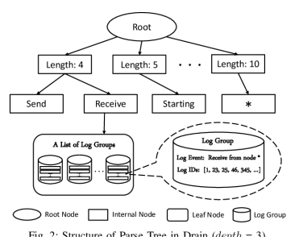

# Analysis And Comparison Of Drain And Drain3 With Similar Log Parsing Methods

Ahmet Utku Kilic Seminar Operating Complex IT-Systems Technische Universitat Berlin ¨
Berlin,Germany kilic.2@campus.tu-berlin.de Abstract**—As the prevalence and usage of real-time web services and cloud computing escalate so does the need for optimised**
and mostly automated error detection and correction systems. To achieve that one of the most important aspects is creating log templates from unstructured logs by parsing them efficiently.

Older methods were either not built for a real-time log analysis or they were not as fast as wanted. The purpose of this paper is to show the accuracy and efficiency of a log parsing method, Drain, and how it manages to reach high accuracy when implemented on common log parsing datasets. It does it by applying a fixed depth tree method to the log messages and analyses the token count and compares tokens in the fixed segments of the log messages.

The updated version,Drain3, implements some new methods to make it more suitable for production usage. The examples shown in the paper show that Drain is a very successful method for log parsing.

Index Terms**—Log parsing, Drain, Log analysis**

## I. Introduction

As technology advances, its integration becomes more widespread. We are getting more familiar with the fact that many devices and vehicles we have been using for a long time are now connected with the internet and feed us and the companies data. There are smart ovens which can be preheated before we reach home or we can click update to upgrade our car's software before we go to sleep. Likewise the systems which already had a big amount of data flow now have more information to process and analyse. Naturally this huge amount of information should keep a history of the events and that should be analysed, preferably as fast and accurate as possible to keep the services provided healthily running. These services are mainly enabled by cloud computing service providers like Amazon Web Services.

However this also means the data flow is impossible to track manually. There are many requests being sent to the system and each of them invoke around 100 methods [1]. Real-time systems should be always up and running and errors should be fixed without disrupting the rest of system if possible.

For this reason artificial intelligence for IT operations(AIOps)
applications are being developed to monitor time, usage or memory related activities, to increase the time saved for developers and improve end-user satisfaction by detecting possible problems and reducing outage periods [2].

For an AIOps system to be successful what it takes is very similar to the system of any industry. It needs to find the root of the problems and detect anomalies in the system [3]. The difference is that the the colossal size of information is given with log lines in the software systems. Logs do not have the same structure always and can be very unstructured by nature, but they have always fixed and variable parts in their nature
[4]. There are many different log parsing methods that try to automate this process [5].

The more recent developments in this area are the open source log parser project Drain and its successor Drain3. To increase the speed of the log parsing and template creation, Drain utilises a fixed depth tree method. It reaches up to 99 percent accuracy when tested on sample data sets that are commonly used for log parsing and templating purposes [6].It is very accurate, because Drain focuses on the length and the non-numerical tokens in the logs, especially the first tokens. It also has thresholds for fine tuning that makes it flexible.It is also has an accuracy of up to 99 percent on the 2000 lines of datasets provided by HDFS (Apache Hadoop Distributed File System) [4].

The newer version Drain3 is very similar to Drain. Its improvements are mostly for practicality in an environment with a huge amount of dynamic data. It removes some dependencies, enables saving of the state to a Apache Kafka topic, Redis or a file. Enables caching and adds possibility of the inference mode, which enables a faster matching based on the existing templates. It also allows users to add more delimiters for the log file. Drain has whitespace as its default.

In this paper we explain the structure of Drain and how it uses the fixed depth tree, its method of deciding the similarity of a new log message. The paper also explains possible configuration settings of the method to make it more suitable to real world scenarios. Then it shows the improvements which are included in the newer version Drain3 by an example.Drain3 takes more time in preprocessing in general but provides better results.

The rest of the work is organised as follows. Section 2 explains the background knowledge about the topic, which depicts the previous work and the gap Drain fills. Section 3 elaborates on the approach of this paper to the topic. Section 4 describes how the suggested approach for testing has been implemented. Section 5 depicts the results of the comparison conducted in this paper. Section 6 mentions the related work in the field and what they aim to achieve. Section 7 summarises the work and finally concludes.

## Ii. Background

Log parsing and log analysis have been researched more heavily in the recent times [7] [8].

It is important for anomaly detection, program verification, performance monitoring, security assurance, root causes analysis and many other related topics [8]. There is so far not one single solution to all questions which needs to be answered to improve log parsing and analysing. The prior methods had their own solutions to different problems.

LKE is an offline parser that uses hierarchical clustering [8].

It is really good at analysing smaller datasets, but as a setback of using hierarchical clustering its effectiveness reduces a lot when used on larger datasets. Also it being an offliner parser does not provide the best usage in a real-time system.

IPLoM is an another offline parser that applies a three-step hierarchical partitioning before generating templates [9]. It is very similar to LKE when it comes to its capabilities and shortcomings.

Shiso is an online parser with predefined number of children in each node to increase efficiency. It also has a hierarchical structure [10].

The online parsers are better adjusted for real-time web services and cloud computing as they can analyse real-time, something offline parsers cannot do. Offline parsers require a snapshot of the logs to be sent to them and then analyse, while online parsers can theoretically analyse it dynamically on the go and can change its templates.

## A. Drain Iii. Approach

The main method used in Drain is a fixed depth tree. The minimum depth is three. A common method that is used in log parsing happens before processing the logs. During the preprocessing one can make use of their domain knowledge.

Drain has a method that lets users to apply regular expressions to the logs and remove for example IDs. That way the amount of data that needs to be traversed can be reduced and abundance of it will be prevented.

Then the traversing of the tree starts. Drain considers every entry delimited by the space character in a log as a token. First step checks number of tokens in the log message. And then it creates a node which responds to number of tokens in the log message, also known as the length of the message. Drain assumes log messages with similar information have generally the same length [4].

Second node in the tree checks for the first token of the log message. The method assumes that the very first token is mostly a fixed token and not a variable. It puts in the second node of the traversed tree. If it is a variable, for Drain it means a number input, then it puts a < ∗ > to mark it to the node.

This step inhibits branch explosion. If a log history received has many log lines with variables as their first token, it will not create a new branch for every line, and if the rest of the message is in the same template, will put it in the same group.

Each path leads to the leaf nodes, where the log events, the log message template is stored. It has the structure according to the path that leads to this node. Length is the matching length of the first node in that path. When we say first node in the path, we exclude the root node, as it is not part of the parsing process used in the depth tree. Then it has the same token as second node in the path as its starting token. It also keeps an array of the IDs matching the same log pattern.

When it reaches to the leaf node, it will check for similarity between tokens. The formula for that is:

$$\mathrm{simSeq}={\frac{1}{n}}\sum_{i=1}^{n}\mathrm{equ}(s e q_{1}(i),s e q_{2}(i))$$

. Where equ function returns 1 if the two tokens, one from

node and one from the log message in the same position are the same [4]. If this adjustable threshold has been reached, then it belongs to the same group as other logs. It their tokens that show up in the path completely match, then the ID of the new message will be added to the group. If the tokens in the positions of the tree do not fully match, but the the similarity value exceeds the threshold, then these tokens will be updated to < ∗ > . If the similarity value is less than the threshold, then it will create a new node as a child of the parent of the node with a different token value.

You can see this in the figure 1 [4] with two nodes that have the values "length:4" and "length:5" and also in "Send" and "Receive" nodes, which are the children of the node
"Length:4".

The configuration attributes of the method are the maximum depth, the similarity threshold, the maximum number of children per node and the regular expression for preprocessing.

The one not yet mentioned attribute here is the maximum number of children per node. It is applied so that we can limit the branch explosion at the worst case and also reduce the runtime of the method on very large datasets.

## B. Drain3

Drain3 is not that different from Drain. It adds some new methods and removes some external dependencies. The main differences are targeted at making it available for long term real-time use. These methods enables state saving and restarting the process and using it only with existing templates to only match. The newer version also supports feeding new messages to it constantly with its streaming feature.

The main improvement we focus on this paper is masking. In addition to the core masking of parameters (mainly numbers) of Drain, it enables an extra masking that can help increase the accuracy. It can be utilised to mask for example addresses or hostnames, that might not be caught by the Drain core.

## Iv. Implementation

We work with the HDFS 2k dataset1. We first apply the default configuration and the default regular expression implementation in the Github file of Drain. After that we implement it with an increased maximum depth of the tree. Then we apply same configurations to Drain3 with extra masking input to increase the accuracy. These are the default examples in the Drain3 package. We then compare these results to the datasettemplate matchings created by the logparser team 2.

V. EVALUATION

| Version    | Parameter   |        |         |      |
|------------|-------------|--------|---------|------|
| Similarity | Depth       | Number | Time(s) |      |
| Threshold            | of Templates             |        |         |      |
| Drain      | 0.4         | 4      | 17      | 0.09 |
| Drain      | 0.4         | 8      | 413     | 0.17 |
| Drain      | 0.8         | 4      | 1186    | 0.09 |
| Drain3     | 0.4         | 4      | 16      | 0.05 |
| Drain3     | 0.4         | 8      | 29      | 0.05 |
| Drain3     | 0.8         | 4      | 20      | 0.05 |
| Correct    | -           | -      | 14      | -    |
| TABLE I    |             |        |         |      |

As depicted in the table 1 both Drain and Drain3 with the default values (0.4 threshold and maximum depth of 4) get really close to the actual number of templates. When the values are changed, Drain3 is more successful and also consistent with its time usage. That is because most of the time it needs is for masking. After that it can create way more accurate number of templates even with non fitting threshold numbers. It is also the very same reason for its time consistency.

When we also add the results in comparison to its competitors showing that it is almost topping accuracy rate with almost any data set that is used against the methods LKE,
IpLom, Shiso and Spell [4], it is very successful.

1https://github.com/logpai/logparser/tree/main/data/loghub2*k/hdfs* 2Available at: https://github.com/logpai/logparser

## Vi. Related Work

This section provides information about some of the sources this paper is based upon which give valuable information, experiment and explain the terms and methods that have been mentioned in this research or that have led to many developments in this area.

"Drain: An Online Log Parsing Approach with Fixed Depth Tree" [4]: The main source of information of this paper. The paper explains, compares and evaluates their proposed method, Drain, in comparison to the existing methods. It also shows a pathway for future improvements in this area, which leads to eventual development of Drain3.

"Characterizing Logging Practices in Open-Source Software
[11]": This paper is one of the very first sources that researches the quality of logging in the software industry and the log messages themselves. It quantifies the importance of logging for software development at its time.

## Vii. Conclusion

We the results collected by this paper also the main reference paper [4], one can conclude that Drain provides a very strong algorithm that can reliably create accurate log templates. It is more accurate than other methods that try to achieve the same result. The accuracy does not go down significantly when the data set gets larger. The developed version of it, Drain3 is even more suitable to the real-life scenarios. With its data streaming it can be used for dynamic, real-time anomaly detection and can be a good basis for a successful root cause analysis.

The method has many configuration options, which allows users to optimize it in a way that suits their needs and their log data structure. With the improvements of Drain3, files can be saved and reused without retraining of the data if a fast matching is required, which can be time saving in very time sensitive error fixing situations.

We suggest that Drain3 method should and could be used for large scale data training and at this stage is a stronger fit for the use case in comparison to other methods.

## References

[1] Mi, H., Wang, H., Zhou, Y., Lyu, M. R. T., Cai, H. (2013). Toward finegrained, unsupervised, scalable performance diagnosis for production cloud computing systems. IEEE Transactions on Parallel and Distributed Systems, 24(6), 1245-1255.

[2] Rijal, L., Colomo-Palacios, R., Sanchez-Gord ´ on, M. (2022). Aiops: A ´
multivocal literature review. Artificial Intelligence for Cloud and Edge Computing, 31-50.

[3] Abdelrahman, O., Keikhosrokiani, P. (2020). Assembly line anomaly detection and root cause analysis using machine learning. IEEE Access, 8, 189661-189672.

[4] He, P., Zhu, J., Zheng, Z., Lyu, M. R. (2017, June). Drain: An online log parsing approach with fixed depth tree. In 2017 IEEE international conference on web services (ICWS) (pp. 33-40). IEEE.

[5] He, P., Zhu, J., He, S., Li, J., Lyu, M. R. (2016, June). An evaluation study on log parsing and its use in log mining. In 2016 46th annual IEEE/IFIP international conference on dependable systems and networks
(DSN) (pp. 654-661). IEEE.

[6] He, S., Zhu, J., He, P., Lyu, M. R. (2020). Loghub: A large collection of system log datasets towards automated log analytics. arXiv preprint arXiv:2008.06448.
[7] Xu, W., Huang, L., Fox, A., Patterson, D., Jordan, M. I. (2009, October). Detecting large-scale system problems by mining console logs. In Proceedings of the ACM SIGOPS 22nd symposium on Operating systems principles (pp. 117-132).

[8] Fu, Q., Lou, J. G., Wang, Y., Li, J. (2009, December). Execution anomaly detection in distributed systems through unstructured log analysis. In 2009 ninth IEEE international conference on data mining (pp.

149-158). IEEE.

[9] Makanju, A., Zincir-Heywood, A. N., Milios, E. E. (2011). A
lightweight algorithm for message type extraction in system application logs. IEEE Transactions on Knowledge and Data Engineering, 24(11), 1921-1936.

[10] Mizutani, M. (2013, June). Incremental mining of system log format. In 2013 IEEE International Conference on Services Computing (pp. 595602). IEEE.

[11] Yuan, D., Park, S., Zhou, Y. (2012, June). Characterizing logging practices in open-source software. In 2012 34th International Conference on Software Engineering (ICSE) (pp. 102-112). IEEE.