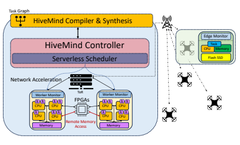
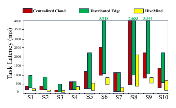
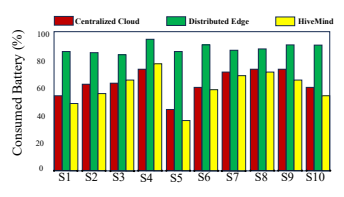

# Hivemind: Towards A Coordination Platform For Serverless Edge Swarms

Ettore Carlo Marangon Technische Universitat Berlin ¨
Berlin, Germany ettore.carlo.marangon@campus.tu-berlin.de Abstract**—The emergence of swarms of edge devices has**
opened up transformative possibilities across various industries.

However, designing efficient and robust coordination platforms for these swarms is challenging due to the unique characteristics of their devices. In this paper we examines these challenges, exploring both centralized and distributed coordination approaches, along with the constraints that affect edge swarm devices. We then introduce HiveMind, an innovative framework for serverless edge swarm coordination that effectively addresses these demands. We provide a comprehensive understanding of its design and vision, accompanied by a summary of its performance evaluation. Lastly, we discuss related work in the context of HiveMind.

Index Terms**—Edge Swarms, Serverless Computing, Domain**
Specific Language, Coordination Platform, Cloud Computing

## I. Introduction

The emergence of swarms of autonomous devices, concurrently on the rise in both number and size, has garnered significant attention across various industries [1]–[4]. This paradigm shift in autonomous systems constitutes a transformative force with profound implications for efficiency, scalability, and adaptability in numerous application scenarios [5].

Its diffusion is driven by the widespread adoption of modern technologies including intelligent sensors and actuators, lowcost IoT devices, autonomous robots, and drones [6]. The motivation to further explore swarms of autonomous devices is rooted in several compelling factors. First, edge swarms present a powerful solution to the growing complexity of tasks in diverse domains. Whether in providing support in disaster zones, executing targeted search and rescue operations, implementing smart agricultural practices, or in the field of logistics, the collective intelligence of a swarm enables the simultaneous execution of tasks with unprecedented efficiency [4], [6]–
[10]. Second, by leveraging distributed decision-making and their scalability potential, these swarms excel in navigating complex, large-scale dynamic environments, demonstrating a level of adaptability and resilience that outstrips traditional singular autonomous systems [7], [11]. However, it is crucial to recognize that the devices constituting these swarms are characterized by low-power configurations, modest computational resources, and a susceptibility to unreliable network connections [4]. This inherent nature needs, therefore, to be considered when designing the architecture of swarm coordination platforms. Additionally, as the size of the swarm grows, the need to devise a proper hardware-software system stack for configurable and efficient task allocation across both cloud and edge resources increases in importance [4]. To address these challenges, past efforts have delved into diverse system architectures, investigating both centralized and distributed approaches [1], [4]. Centralized systems benefit from a comprehensive view of the swarm status and the ability to fully exploit the capabilities of cloud resources. However, their efficiency declines as more devices are added to the fleet, thus encountering scalability problems [4], [10]. On the other hand, distributed systems show improved scalability but face hurdles in coordinating a large number of edge devices [4], [12]. To overcome the limitations of both centralized and decentralized coordination approaches, *HiveMind* [4] emerges as a novel solution. This swarm coordination platform is designed to optimize the definition and execution of task workflows in cloud-edge environments. Scalability challenges are addressed through the introduction of serverless computing, while on the hardware level, it harnesses acceleration fabrics to improve remote memory access and networking. Additionally, HiveMind introduces its own Domain Specific Language (DSL)
which allows developers to avoid the configuration of lowlevel system details, simplifying thus the programmability of their cloud-edge applications.

This paper aims to provide a comprehensive summary of HiveMind's vision and will therefore be structured as follows:
(i) We introduce the notion of a swarm of edge devices as well as the serverless computing paradigm (Section II)
(ii) We discuss the unique challenges of a coordination platform for edge swarms (Section III)
(iii) We present HiveMind's design and discuss its evaluation
(Sections IV and V)
(iv) We present related work in the context of HiveMind
(Section VI)
II. BACKGROUND
A. Swarms of edge devices A swarm of edge devices1is commonly defined as a collective of interacting entities exhibiting coordinated behavior and applying swarm intelligence to accomplish a shared objective [10], [14]–[17]. The field of robotic technology 1Please note that this paper will refer to a swarm of edge devices as a swarm of autonomous vehicles (e.g., drones and robotic cars). This term does not encompass the entirety of smart devices connected to the Internet, as outlined in reference [13].

is experiencing increased affordability, pushing thus the deployment of robot swarms as viable solution for a wide range of use cases. Common examples of swarm devices are Unmanned Aerial Vehicles (UAVs) also known as drones and Unmanned Ground Vehicles (UGVs) [1], [18]. Compared to single autonomous devices, swarms present unique advantages in terms of scalability, robustness, and overall efficiency in task execution [2]. Scalability refers to the ability of the swarm of applying consistent control algorithms across all its devices.

A truly scalable approach ensures that the same algorithms remain effective whether dealing with a small- or a largesized swarm [17]. Furthermore, robustness is a critical attribute that denotes the swarm's resilience and adaptability in the face of uncertainties [19]. In a homogeneous swarm, where no vehicle is specialized, each robot possesses the capability to replace the others. This homogeneity contributes to a high degree of redundancy whit in the swarm, further enhancing its robustness [17]. Lastly, robot swarms offer a high degree of efficiency, opening the doors to novel application scenarios. In the logistics sector for example, the application of drones has the potential to enhance productivity, adaptability, and cost-effectiveness in the transit of goods [10]. Amazon [20]
and UPS [21] are already testing air delivery systems to further optimize their package delivery process. By employing a coordinated fleet of drones, these companies could achieve time-efficient deliveries in the future, reducing the need for extensive human labor and associated operational expenses.

## B. Serverless Computing

The serverless Function-as-a-Service (FaaS) technology emerged as a widely used service model in cloud environments, offering a cost-efficient alternative for those applications whose components rely on substantial data-level parallelism, intermittent activity, and fluctuating load [4], [22]. FaaS
allows developers to focus on the application's code leaving the management burden of the underlying infrastructure (e.g.,
provision, and configuration of servers) to the cloud provider
[22]–[24]. Moreover, FaaS provides a highly scalable eventdriven programming paradigm in which single stateless cloud functions are triggered in response to incoming events [23].

Their execution occurs in isolated short-lived run environments called *function containers* (e.g., Docker containers [25]) which are, whenever necessary, promptly launched and killed by the FaaS platform [4], [24], [26]. These characteristics make the serverless paradigm well-suited for edge applications, benefiting scenarios with sporadic activity, and constrained computational resources [4], [22].

Opportunities: The work of Patterson et al. [4] explores the opportunities of serverless computing in the context of swarms of autonomous devices, unveiling significant advantages across three key dimensions: concurrency, elasticity, and fault tolerance. Analyzing how latency varies across different swarm tasks (S1 to S9 - Table I) serverless shows a significant improvement in efficiency. When moving from a containerized backend to a serverless environment, serverless consistently outpaces fixed allocations, demonstrating nearly an order of magnitude increase in speed. This advantage arises from serverless harnessing parallelism across tasks without being constrained by the limitations on the number of cores it can occupy. Furthermore, elasticity benefits become evident when examining task latency under changing loads. A
comparison between a serverless deployment and two fixed alternatives (one provisioned for average load and another for worst-case load scenarios) reveals the elasticity advantages. As the load fluctuates, serverless dynamically adjusts to the changing demand, showcasing its ability to closely align with workload variations. In contrast, the fixed average-load deployment saturates quickly, whilst the fixed worst-case load deployment significantly underutilizes its resources. Lastly, serverless computing demonstrates robust fault tolerance by efficiently handling function failures. Even with a percentage of tasks failing during execution, serverless platforms quickly respawn tasks on new cores, preventing degradation in endto-end execution time. This resilience is vital for edge swarm applications, ensuring consistent performance in the presence of faulty or missing sensor data [22], [24].

Challenges: Besides the opportunities, Patterson et al. [4]
also study the challenges of serverless deployments. Experimental results show that these tend to exhibit consistently higher latency variability, particularly noticeable under modest load conditions. This performance unpredictability can stem from instantiation overheads, termination of unused containers, and the communication between dependent functions.

Moreover, instantiation overheads can constitute a challenge, particularly for short-lived functions or those with irregular workloads. These overheads can constitute a substantial portion of the overall execution time, thereby undermining the anticipated advantages. Serverless function communication can constitute a further obstacle, given the methods' inability to directly exchange data with each other. This limitation introduces noticeable data flow overheads, which can in turn significantly affect the performance of latency-critical tasks.

## Iii. Challenges For Swarm Platforms

The development of a robust swarm coordination platform faces numerous challenges that need to be addressed. Firstly, it is crucial to choose the coordination architecture that best aligns with the specific application requirements of the swarm. This choice should facilitate the optimal load distribution across both edge and cloud resources, while also fostering efficient task coordination among swarm devices [4], [19]. Furthermore, challenging elements like the resource constraints of individual edge devices, and the configuration of the system components should also be taken into account. These aspects will be thoroughly explored in the subsequent sections.

## A. Swarm Coordination Design

Next, we will explore the trade-offs associated with centralized and decentralized coordination approaches.

Centralized coordination: Centralized coordination locates the entirety of computation and data aggregation processes within the bounds of a server cluster [4]. All control aspects, including decisions on task allocation, subsequent task execution, and machine learning mechanisms, are exclusively handled within the backend of a resourceful cloud infrastructure [4], [27], [28]. This results therefore in enhanced levels of parallel computation on the cluster nodes, contributing to improve the overall performance and resource efficiency
[29]. Centralization also facilitates application development, as the data from all devices is collected in just one place, offering a comprehensive system view for task control [28].

Despite the advantages, centralized coordination also come with drawbacks. As the swarm increases in number, centralized systems encounter scalability bottlenecks and network overheads, impeding their ability to efficiently manage the growing requests of the edge devices [4], [27], [30]. Additionally, centralization introduces vulnerabilities to single points of failure, compromising the overall robustness of the swarm system [2], [31]. These limitations make therefore a fully centralized approach more suitable for small edge swarms [1].

Distributed coordination: On the other side, distributed approaches imply on-board execution of all computation tasks, with only the final results being transmitted to the cloud backend [4]. This distinctive feature not only provides the swarm devices with a higher degree of autonomy but also enhances the swarm's resilience, scalability, and modularity without introducing network overheads [2], [31]–[33]. However, the deployment of identical resource-intensive control algorithms across all devices can result in redundant task computations, and contributes to a rapid depletion of the devices' battery. [4],
[34]. Moreover, distributed approaches face challenges related to coordination and synchronization among the devices, which can impede the seamless execution of tasks and compromise the overall efficiency of the system [2], [4], [35]. In contrast to centralization, designing decentralized systems poses greater challenges. The limited information possessed by the swarm entities about the swarm state necessitates the implementation of elaborate robot-to-robot communication strategies to achieve effective coordination and decision-making [31].

## B. Constrains In Swarms Of Edge Devices

Edge devices typically exhibit resource constraints. A comprehensive perspective on the possible limitations affecting the individual swarm members, is therefore crucial for optimizing the system design of a swarm coordination platform [9].

Performance constraints: Devices within a swarm (e.g.,
drones or terrestrial robots) encounter notable performance constraints that can significantly influence their operational capabilities. The limited size of the swarm members and their batteries restrict the capacity of onboard computational resources, leading to challenges in processing complex tasks and executing intricate maneuvers [1]. Real-time application scenarios demand swift decision-making and precise coordination among swarm members, making computational constraints a critical consideration [9]. The limited processing power may thus impede the devices' ability to promptly analyze sensor data, adapt to dynamic environments, or efficiently communicate with swarm members.

Energy constraints: Limitations on battery capacity are also significant factors to consider in swarm applications, as they directly impact the devices' performance. With limited onboard power, swarm members must carefully manage their energy consumption to ensure extended mission durations [1],
[36]. For instance, in a package delivery scenario, the size and weight of the payload burden the drone's mechanics which in turn demand more energy from the battery [9], [37].

## C. Composition And Deployment Complexity

Swarm coordination platforms are complex systems that extend across cloud-edge environments. The distribution of the various services and infrastructures, constituting these platforms, introduces difficulties for their development and deployment [38], [39]. As a result, programmers face challenges such as implementing sophisticated cross-task APIs, defining data sharing and task placement strategies, as well as partitioning work between cloud and edge resources [4], [38],
[40], [41]. Furthermore, the dynamic nature of (micro-) service locations, subject to change over time, further amplifies the configuration burden, adding to the overall overhead [39], [42],
[43]. These complexities can usually be the cause of many errors and performance setbacks, and may also lead developers to hesitate in choosing one platform over another [4], [43], [44]. Therefore, programmers should prioritize focusing on the overarching goals of the application computations, rather than getting bogged down by the complicate and time-consuming system specifics necessary for their accomplishment [4].

## Iv. Hivemind'S System Design

In this section, we will present the system design of HiveMind, a novel hardware-software system stack to coordinate swarms of edge devices [4]. HiveMind's vertical design aims to build a performant, resource-efficient swarm platform that allows programmable execution of workflow tasks [4].

HiveMind's system components will address the challenges outlined in Section III. Figure 1 illustrates the platform's architecture.

## A. Hivemind Dsl

As discussed in Section III-C, the development and configuration of applications in cloud-edge environments is cumbersome, time-consuming, and error-prone. To help developers, HiveMind introduces a DSL that simplifies the definition of the applications' high-level computations by abstracting low-level system complexities away. The DSL is a Pythonbased declarative language that allows to define the exact task execution order in a swarm application. Singular tasks (e.g., collect image) together build a task graph which in turn represents a whole application scenario (e.g., recognition of human faces in a field). Once a multi-task scenario has been defined, the DSL compiler together with the synthesis tool automatically composes the cross-task APIs and dependencies, reducing thus the developer's configuration effort. Additionally, programmers have the flexibility to define whether tasks can run concurrently, may have partial overlaps, or must be carried out in a sequential manner. Lastly, users can also articulate performance metrics, encompassing execution time, and latency along with the ability to set limits on the cost of cloud resources. HiveMind utilizes then this information to optimize the partitioning of computational tasks between edge and cloud resources.

## B. Hybrid Coordination Approach

In the previous section, we discussed the trade-offs between centralized and decentralized coordination. To address the drawbacks of both approaches, HiveMind introduces a hybrid execution model. On the one side, the platform employs a centralized control mechanism that effectively partitions and distributes workloads across the swarm members. Because of its location in the backend cluster, it also attains comprehensive visibility of the status and sensor data of the swarm.

Moreover, the controller includes interfaces with the serverless cloud scheduler, an interface for edge device communication, and a tracing system for monitoring both edge and cloud resources. On the other side, HiveMind's distributed trait shows off once its program synthesis tool generates all possible and meaningful execution modalities for the defined scenario task graph. Here, computation jobs are distributed on the different swarm members according to the user's specifications.

These requirements may pertain to performance or energy constraints, allowing users to determine whether specific tasks should be executed at the edge or in the cloud. Executing a portion of the scenario tasks directly on the edge devices, by leveraging on-board computation, reduces network overheads.

An illustrative example for such cases are latency-sensitive tasks demanding real-time processing (*S4, S6* - Table I). On the contrary, tasks that lack time sensitivity and/or demand substantial computational power can be offloaded to the cloud. By doing so, the edge devices are released from resource-intensive jobs (*S1, S2, S8, S10* - Table I), preventing unnecessary battery depletion and avoiding any performance losses.

## C. Serverless Cloud Scheduler

HiveMind exploits the advantages of serverless computing to solve any scalability bottlenecks introduced by the centralized controller. This is ensured by using Apache OpenWhisk, an open-source serverless framework [45]. Its main functions are to control the placement and instantiation of singular serverless functions in the cloud backend. HiveMind's serverless scheduler is directly integrated into OpenWhisk's centralized controller, responsible for launching functions and managing function data. Users can set scheduling constraints through HiveMind's DSL, allowing the scheduler to optimize function placement based on the available resources. If these limitations are not defined, HiveMind deploys on each server lightweight processes (called *worker monitors*) to track function performance and server utilization. The serverless scheduler aims to achieve two key optimizations. First, for multi-level tasks, it attempts to place dependent functions in the same container to minimize data exchange costs. In cases where this is not feasible, the remote memory protocol

facilitates fast in-memory data exchange between functions
(Section IV-D). Second, it delays the termination of idle containers, allowing their reuse for incoming functions and thereby reducing instantiation overheads.

## D. Fast Remote Memory Access

In certain scenarios, co-locating two dependent functions
(child-parent methods) in the same container may not be feasible. When this happens, OpenWhisk makes use of a costly default data exchange communication mechanism involving requests to the Controller and the CouchDB, where the outcomes of serverless methods are stored. This becomes particularly expensive when multiple functions try to access the CouchDB data at the same time [46]–[49]. To optimize serverless function communication, HiveMind leverages a hardware-accelerated platform comprising an Intel FPGAbased setup that processes requests directly by using a Remote Direct Memory Access (RDMA) [50]. This solution eliminates the need for data copying between the application memory and the OS buffers, significantly enhancing communication efficiency. The performance gains resulting from this implementation are notable due to a bypass of the host's network stack. Additionally, the tight fusion of the host and the FPGA ensures seamless function communication and data transfer without incurring the typical overheads linked to Peripheral Component Interconnect express (PCIe) interfaces [47], [51]–
[53].

## E. Hardware-Based Networking Acceleration

The congestion of networks in cloud-edge environments may lead to performance losses and energy inefficiencies [46], [49], [51], [53]–[57]. Addressing this concern is crucial, particularly given the dependency of swarm devices on Remote Procedure Calls (RPCs) for the smooth exchange of data with the cloud [49], [58]–[62]. To do so, HiveMind strategically incorporates network acceleration into the above-mentioned FPGA-based acceleration fabric. This involves offloading the entire RPC stack onto a tightly-coupled FPGA connected to the host servers and network. The FPGA-driven approach

| Scenario   | Scenario Description                         |
|------------|----------------------------------------------|
| S1         | Face recognition                             |
| S2         | Tree recognition                             |
| S3         | Drone detection                              |
| S4         | Obstacle avoidance                           |
| S5         | People deduplication                         |
| S6         | Navigation through a walled maze             |
| S7         | Weather analytics                            |
| S8         | Soil analytics                               |
| S9         | Image-to-text recognition                    |
| S10        | Simultaneous Localization And Mapping (SLAM) |

effectively minimizes the overhead associated with traditional network stacks, significantly enhancing the speed and efficiency of data transmission to/from the cloud. HiveMind's implementation also supports multiple threads of asynchronous RPCs, ensuring optimized communication between singular swarm members. Moreover, the use of an FPGA for network acceleration is also driven by the advantage of enabling a reconfigurable networking fabric, tailored to the diverse demands of edge applications. This adaptability is categorized into hard and *soft* reconfigurations. Hard reconfiguration handles fundamental control decisions, such as the choice of CPUNIC interface protocols or transport layers like TCP or UDP.

Soft reconfiguration, on the other hand, relies on soft register files accessible via PCIe by the host CPU, along with their associated control logic. While soft reconfiguration introduces some minor overhead, it proves valuable for precisely tailoring the acceleration fabric to the specific requirements of diverse applications.

## F. Other Features

Continuous learning: HiveMind maximizes learning capabilities through centralized coordination, pooling data from all swarm devices. When activated, HiveMind improves decision quality across all edge devices by retraining the machine learning model with the behavior of the entire swarm.

Fault tolerance: HiveMind addresses the inherent vulnerability of edge devices to failures through its fault tolerance feature. Each second, all devices transmit a heartbeat to the central controller which identifies a device as failed if no heartbeat is received for over 3 seconds. In such cases, HiveMind dynamically repartitions the workload among the still-operating devices.

Straggler mitigation: HiveMind incorporates a robust monitoring system to oversee function progress and identify potential stragglers. Should a function execution take longer than a defined threshold, OpenWhisk takes action by restarting it on new servers. The system would then consider the result of the first one to finish successfully.

## V. Evaluation

To assess the system design of HiveMind, Patterson et al. [4]
employed a benchmarking suite consisting of 10 application scenarios designed for a swarm of 16 Parrot AR drones.

The suite includes compute-intensive scenarios more suited for powerful cloud backends, alongside with lightweight tasks that can be directly computed by the drones at the edge (see Table I). Each job had a runtime of 120s. HiveMind was deployed on a cluster with 12, 2-socket, 40-core Intel servers, each with 128-256GB of RAM.

Performance analysis: HiveMind's system design introduces quite some performance benefits compared to pure centralized and decentralized coordination approaches. The implementation of network acceleration improves significantly latency between cloud and edge, resulting in an average reduction of networking time by one-third. Furthermore, the overall instantiation and scheduling time of containers demonstrate enhanced response times, irrespective of the fact that OpenWhisk's default scheduler still introduces fewer overheads than HiveMind's. Moreover, the proposed acceleration fabric for remote memory access avoids caching the preliminary results of dependent serverless functions, thereby diminishing the data exchange overheads between them. HiveMind consistently surpasses both other system architectures in performance, and exhibits lower variability (see Figure 2). The design of HiveMind proves especially advantageous for resource- and memory-intensive tasks, such as S6, S9, in which otherwise offloading data to the cloud would result in high network overheads while relying just on on-board computation would lead to poor and unpredictable performance. However, for more lightweight jobs (S3, S4), HiveMind's benefits are less evident. This is due to the fact that the overheads of serverless such as container instantiation, task placement, and function communication are more pronounced under lower loads (see Section II-B).

Power consumption: HiveMind achieves power efficiency by strategically offloading resource-intensive computations to the cloud (see Figure 3). This results in significantly lower power consumption compared to distributed systems. It also outperforms centralized approaches by minimizing excessive data transfer and saving thus battery. Despite drone motion being the primary contributor to energy consumption, communication also plays a role in depleting the devices'

batteries. This can be observed for specific tasks (S3, S4),
where HiveMind exhibits marginally higher consumption than the centralized system.

Network bandwidth: HiveMind utilizes more bandwidth than distributed systems due to the partial data offloading to the cloud. However, its bandwidth usage remains significantly lower compared to centralized systems, as it effectively avoids network congestion linked to data offloading into the cloud.

Scalability: To evaluate scalability, Patterson et al. [4]
build and validate a simulator to replicate experiments on significantly larger drone swarms, which otherwise would be impractical in real-life settings. The simulator shows that the swarm expansion results in increased consumption of bandwidth, yet the rate of growth is significantly less pronounced when compared to the escalation in the number of involved devices. This contrast is particularly evident in comparison to the centralized system, where a linear increase is observed.

Applicability to other swarms: Patterson et al. [4] further evaluate HiveMind with a swarm of 14 robotic cars. Despite the cars having more energy resources than the drones, the performance comparison among centralized, decentralized, and HiveMind reveals comparable results to the drone experiments.

The cars benefit also from the hardware acceleration fabrics for remote memory access and networking, as well as from the offloading of resource-intensive tasks to the serverless cluster.

## Vi. Related Work

The research field of swarm devices is currently in its nascent stage, marked by continuous exploration and development. Studies in this domain indicate that attaining a mature research status, characterized by standardized designs, is yet to be realized [63], [64]. Consequently, research papers tend to concentrate on the individual aspects (e.g., coordination architectures [28], [31], [65], [66], control algorithms [30],
[67], [68], and communication mechanisms [69]–[71]) that constitute swarm coordination platforms, often overlooking the holistic structure of the hardware-software system stack. In the following, we present a selection of studies in the context of HiveMind.

Rubenstein et al. [72] present **Kilobot**, a decentralized robot system developed to study scalability and the collective behavior of large swarms. Designed to be cost-effective and small in size, Kilobots run a lightweight on-board algorithm that allows them to perform simple tasks such as path following and shape formation. However, the robot system comes with certain limitations, including basic sensor capabilities, dependence on low-range infrared communication, and restrictions on battery life, making it unsuitable for complex applications in real-world scenarios. Moreover, the **SwarmBot** project [73] studies the cooperation between *s-bots*,
small fully autonomous ground vehicles able to execute basic transport tasks. The platform implements distributed on-board controllers that locally compute the information gathered by the robots, neglecting the overall swarm status. This design choice aims to achieve both robustness and adaptivity for the swarm by sacrificing a centralized control unit. Hecker et al. [74] present a similar system, drawing inspiration from ant colonies, where robots collaboratively collect tags through decentralized control. The research emphasizes a coordinated approach to achieve efficient forage tasks without relying on intra-swarm communication. Pinciroli et al. [75] introduce **ARGoS**, a multi-robot simulator designed for testing the performance of swarm system prototypes through simulation. The objective is to provide controllable, safe, and cost-effective means for designing and evaluating complex swarm platforms, especially in situations where conducting experiments in real-world settings is impractical. Cai et al. [76] share a similar objective, albeit without the utilization of a simulation software. Their approach involves proposing a costefficient, open-source software-hardware platform designed to facilitate research in the field of swarms of autonomous devices. Depending on the intended use, the platform allows both centralized and decentralized coordination approaches.

However, because of the rather simple 2-tier architecture and limited application purpose, the platform doesn't dispose of complex mechanisms to manage resource allocation, task placement, and computational efficiency as seen in HiveMind.

## Vii. Conclusion

In this paper, we presented HiveMind, a novel hardwaresoftware system stack for swarms of edge devices. HiveMind seamlessly integrates the advantages of both centralized and decentralized architectures, creating a hybrid coordination approach that leverages the capabilities of serverless computing to optimize resource efficiency, task allocation, and scalability. To address the challenges of the serverless framework, HiveMind implements a DSL for enhanced programmability and improved cloud-edge resource management. Additionally, at the hardware level, it introduces acceleration fabrics to enable rapid memory access and network acceleration. Finally, the platform's evaluation showed better performance predictability, scalability, and power efficiency compared to traditional architectures. This underscores the critical importance of jointly designing the software and hardware stack in a swarm coordination platform.

REFERENCES
[1] M. Abdelkader, S. Guler, H. Jaleel, and J. S. Shamma, "Aerial Swarms: ¨
Recent Applications and Challenges," *Current Robotics Reports*, Sep.

2021.

[2] A. Phadke, F. A. Medrano, C. N. Sekharan, and T. Chu, "Designing UAV
Swarm Experiments: A Simulator Selection and Experiment Design Process," *Sensors*, Jan. 2023.

[3] K. Telli, O. Kraa, Y. Himeur, A. Ouamane, M. Boumehraz, S. Atalla, and W. Mansoor, "A Comprehensive Review of Recent Research Trends on Unmanned Aerial Vehicles (UAVs)," *Systems*, Aug. 2023.

[4] L. Patterson, D. Pigorovsky, B. Dempsey, N. Lazarev, A. Shah, C. Steinhoff, A. Bruno, J. Hu, and C. Delimitrou, "HiveMind: a hardwaresoftware system stack for serverless edge swarms," in Proceedings of the 49th Annual International Symposium on Computer Architecture, New York, NY, USA, Jun. 2022.

[5] D. Tarapore, A. L. Christensen, and J. Timmis, "Generic, scalable and decentralized fault detection for robot swarms," *PLOS ONE*, Aug.

2017. [Online]. Available: https://journals.plos.org/plosone/article?id= 10.1371/journal.pone.0182058
[6] B. Anuraj, "Agent-based Orchestration on a Swarm of Edge Devices," in Proceedings of the 17th ACM International Conference on Distributed and Event-based Systems. New York, NY, USA: Association for Computing Machinery, Jun. 2023.

[7] M. M. Shahzad, Z. Saeed, A. Akhtar, H. Munawar, M. H. Yousaf, N. K.

Baloach, and F. Hussain, "A Review of Swarm Robotics in a NutShell,"
Drones, Apr. 2023.

[8] "Fleets of drones could aid searches for lost hikers," Nov. 2018. [Online]. Available: https://news.mit.edu/2018/
fleets-drones-help-searches-lost-hikers-1102
[9] B. Boroujerdian, H. Genc, S. Krishnan, W. Cui, M. Almeida, K. Mansoorshahi, A. Faust, and V. Janapa Reddi, *MAVBench: Micro Aerial* Vehicle Benchmarking, May 2019.

[10] M. Campion, P. Ranganathan, and S. Faruque, "UAV swarm communication and control architectures: a review," Journal of Unmanned Vehicle Systems, Jun. 2019.

[11] T. Mastery, "Swarm Robotics-Top Five Important Things You Need To Know." Aug. 2023. [Online]. Available: https://dotcommagazine.com/ 2023/08/swarm-robotics-top-five-important-things-you-need-to-know/
[12] Y. Wan, J. Tang, and S. Lao, "Distributed Conflict-Detection and Resolution Algorithm for UAV Swarms Based on Consensus Algorithm and Strategy Coordination," *IEEE Access*, pp. 100 552–100 566, 2018, conference Name: IEEE Access.

[13] E. A. Lee, B. Hartmann, J. Kubiatowicz, T. Simunic Rosing, J. Wawrzynek, D. Wessel, J. Rabaey, K. Pister, A. SangiovanniVincentelli, S. A. Seshia, D. Blaauw, P. Dutta, K. Fu, C. Guestrin, B. Taskar, R. Jafari, D. Jones, V. Kumar, R. Mangharam, G. J. Pappas, R. M. Murray, and A. Rowe, "The Swarm at the Edge of the Cloud,"
IEEE Design & Test, Jun. 2014.

[14] M. C. Jeffrey, S. Subramanian, C. Yan, J. Emer, and D. Sanchez, "A
scalable architecture for ordered parallelism," in Proceedings of the 48th International Symposium on Microarchitecture. New York, NY, USA:
Association for Computing Machinery, Dec. 2015.

[15] E. Teague, J. Kewley, and Robert H., "Swarming Unmanned Aircraft Systems:," Defense Technical Information Center, Fort Belvoir, VA,
Tech. Rep., Sep. 2008.

[16] A. Burkle, F. Segor, and M. Kollmann, "Towards Autonomous Micro ¨
UAV Swarms," *Journal of Intelligent and Robotic Systems*, Mar. 2011.

[17] M. K. Heinrich, M. D. Soorati, T. K. Kaiser, M. Wahby, and H. Hamann,
"Swarm robotics: Robustness, scalability, and self-X features in industrial applications," *it - Information Technology*, Aug. 2019.

[18] K. Asadi, A. Kalkunte Suresh, A. Ender, S. Gotad, S. Maniyar, S. Anand, M. Noghabaei, K. Han, E. Lobaton, and T. Wu, "An integrated UGVUAV system for construction site data collection," *Automation in Construction*, Apr. 2020.

[19] S.-C. Lin, "Cross-Layer System Design for Autonomous Driving," 2019. [20] "11 photos of Amazon's new Prime Air drone that can fly in light rain and deliver packages up to 5 pounds in under an hour," Oct. 2023, section: Transportation. [Online]. Available: https://www.aboutamazon.com/news/transportation/
amazon-prime-air-drone-delivery-mk30-photos
[21] "UPS drivers may tag team deliveries with drones," 2017.

[Online]. Available: https://money.cnn.com/2017/02/21/technology/
ups-drone-delivery/index.html
[22] I. Baldini, P. Castro, K. Chang, P. Cheng, S. Fink, V. Isahagian, N. Mitchell, V. Muthusamy, R. Rabbah, A. Slominski, and P. Suter,
"Serverless Computing: Current Trends and Open Problems," in *Research Advances in Cloud Computing*, Dec. 2017.

[23] T. Pfandzelter and D. Bermbach, "tinyFaaS: A Lightweight FaaS Platform for Edge Environments," in *2020 IEEE International Conference* on Fog Computing (ICFC), Apr. 2020.

[24] L. Baresi and D. Filgueira Mendonc¸a, "Towards a Serverless Platform for Edge Computing," in *2019 IEEE International Conference on Fog* Computing (ICFC), Jun. 2019.

[25] "Docker: Accelerated Container Application Development," May 2022.

[Online]. Available: https://www.docker.com/
[26] D. Bermbach, J. Bader, J. Hasenburg, T. Pfandzelter, and L. Thamsen,
"AuctionWhisk: Using an auction-inspired approach for function placement in serverless fog platforms," *Software: Practice and Experience*,
2022.

[27] A. Dimakos, D. Woodhall, and S. Asif, "A study on centralised and decentralised swarm robotics architecture for part delivery system," Oct.

2021.

[28] "Who will control the swarm? | Stanford University School of Engineering," Jun. 2017. [Online]. Available: https://engineering.

stanford.edu/magazine/article/who-will-control-swarm
[29] L. Tong, Y. Li, and W. Gao, "A hierarchical edge cloud architecture for mobile computing," in IEEE INFOCOM 2016 - The 35th Annual IEEE International Conference on Computer Communications. San Francisco, CA, USA: IEEE, Apr. 2016.

[30] A. L. Alfeo, M. G. C. A. Cimino, N. De Francesco, A. Lazzeri, M. Lega, and G. Vaglini, "Swarm coordination of mini-UAVs for target search using imperfect sensors," *Intelligent Decision Technologies*, Mar. 2018.

[31] N. Lomas, "MIT creates a control algorithm for drone swarms,"
Apr. 2016. [Online]. Available: https://techcrunch.com/2016/04/22/
mit-creates-a-control-algorithm-for-drone-swarms/
[32] S. J. Plathottam and P. Ranganathan, "Next generation distributed and networked autonomous vehicles: Review," Jan. 2018.

[33] S. Wolf, R. Cooley, J. Fantl, and M. Borowczak, "Secure and Resilient Swarms: Autonomous Decentralized Lightweight UAVs to the Rescue,"
IEEE Consumer Electronics Magazine, Jul. 2020.

[34] M. Almeida, H. Hildmann, and G. Solmaz, "DISTRIBUTED UAVSWARM-BASED REAL-TIME GEOMATIC DATA COLLECTION
UNDER DYNAMICALLY CHANGING RESOLUTION REQUIREMENTS," The International Archives of the Photogrammetry, Remote Sensing and Spatial Information Sciences, Aug. 2017.

[35] G. Vas´ arhelyi, C. Vir ´ agh, G. Somorjai, T. Nepusz, A. E. Eiben, and ´
T. Vicsek, "Optimized flocking of autonomous drones in confined environments," *Science Robotics*, 2018.

[36] U. S. G. A. Office, "Science & Tech Spotlight: Drone Swarm Technologies | U.S. GAO." [Online]. Available: https://www.gao.gov/
products/gao-23-106930
[37] X. Liu, K. Lam, B. Alkouz, B. Shahzaad, and A. Bouguettaya,
"Constraint-based Formation of Drone Swarms," Jan. 2022.

[38] S. A. Noghabi, J. Kolb, P. Bodik, and E. Cuervo, "Steel: Simplified Development and Deployment of Edge-Cloud Applications," 2018.

[39] K. Fu, W. Zhang, Q. Chen, D. Zeng, and M. Guo, "Adaptive Resource Efficient Microservice Deployment in Cloud-Edge Continuum," IEEE
Transactions on Parallel and Distributed Systems, Aug. 2022.

[40] Y. Gan, M. Liang, S. Dev, D. Lo, and C. Delimitrou, "Sage: practical and scalable ML-driven performance debugging in microservices," in Proceedings of the 26th ACM International Conference on Architectural Support for Programming Languages and Operating Systems. Virtual USA: ACM, Apr. 2021.

[41] Y. Gan, Y. Zhang, K. Hu, D. Cheng, Y. He, M. Pancholi, and C. Delimitrou, "Seer: Leveraging Big Data to Navigate the Complexity of Performance Debugging in Cloud Microservices," in Proceedings of the Twenty-Fourth International Conference on Architectural Support for Programming Languages and Operating Systems. Providence RI USA:
ACM, Apr. 2019.

[42] H. Team, "5 Ways You're Probably Messing Up Your Microservices | Harness," Aug. 2023.

[43] "Eight Common Microservices Performance Problems
(and how to Solve Them)," Jul. 2020, section: Artikel. [Online]. Available: https://devm.io/microservices/
microservices-performance-problems-172291-001
[44] "Contracts, Addressing, and APIs for Microservices | App Engine standard environment for Java 8." [Online]. Available: https://cloud.google.

com/appengine/docs/legacy/standard/java/designing-microservice-api
[45] "Apache OpenWhisk is a serverless, open source cloud platform."
[Online]. Available: https://openwhisk.apache.org/
[46] M. Blott, K. Karras, L. Liu, and K. Vissers, "Achieving 10Gbps line-rate key-value stores with FPGAs," 2013.

[47] A. Kalia, M. Kaminsky, and D. G. Andersen, "Design Guidelines for High Performance RDMA Systems," 2016.

[48] ——, "FaSST: Fast, Scalable and Simple Distributed Transactions with Two-sided (RDMA) Datagram RPCs," 2016.

[49] M. Sutherland, S. Gupta, B. Falsafi, V. Marathe, D. Pnevmatikatos, and A. Daglis, "The NEBULA RPC-Optimized Architecture," in *2020* ACM/IEEE 47th Annual International Symposium on Computer Architecture (ISCA), May 2020.

[50] T. P. Morgan, "A Peek Inside That Intel Xeon-FPGA Hybrid Chip,"
May 2018. [Online]. Available: https://www.nextplatform.com/2018/05/ 24/a-peek-inside-that-intel-xeon-fpga-hybrid-chip/
[51] M. Flajslik and M. Rosenblum, "Network Interface Design for Low Latency Request-Response Protocols," 2013.

[52] A. Belay, G. Prekas, M. Primorac, A. Klimovic, S. Grossman, C. Kozyrakis, and E. Bugnion, "The IX Operating System: Combining Low Latency, High Throughput, and Efficiency in a Protected Dataplane," *ACM Transactions on Computer Systems*, Dec. 2016.

[53] E. Y. Jeong, S. Woo, M. Jamshed, H. Jeong, S. Ihm, D. Han, and K. Park,
"mTCP: a highly scalable user-level TCP stack for multicore systems,"
in *Proceedings of the 11th USENIX Conference on Networked Systems* Design and Implementation. USA: USENIX Association, Apr. 2014.

[54] M. Alizadeh, S. Yang, M. Sharif, S. Katti, N. McKeown, B. Prabhakar, and S. Shenker, "pFabric: minimal near-optimal datacenter transport," in Proceedings of the ACM SIGCOMM 2013 conference on SIGCOMM.

New York, NY, USA: Association for Computing Machinery, Aug. 2013.

[55] A. M. Caulfield, E. S. Chung, A. Putnam, H. Angepat, J. Fowers, M. Haselman, S. Heil, M. Humphrey, P. Kaur, J.-Y. Kim, D. Lo, T. Massengill, K. Ovtcharov, M. Papamichael, L. Woods, S. Lanka, D. Chiou, and D. Burger, "A cloud-scale acceleration architecture," in *The 49th* Annual IEEE/ACM International Symposium on Microarchitecture, ser.

MICRO-49. Taipei, Taiwan: IEEE Press, Oct. 2016.

[56] D. Firestone, A. Putnam, S. Mundkur, D. Chiou, A. Dabagh, M. Andrewartha, H. Angepat, V. Bhanu, A. Caulfield, E. Chung, H. K.

Chandrappa, S. Chaturmohta, M. Humphrey, J. Lavier, N. Lam, F. Liu, K. Ovtcharov, J. Padhye, G. Popuri, S. Raindel, T. Sapre, M. Shaw, G. Silva, M. Sivakumar, N. Srivastava, A. Verma, Q. Zuhair, D. Bansal, D. Burger, K. Vaid, D. A. Maltz, and A. Greenberg, "Azure Accelerated Networking: {SmartNICs} in the Public Cloud," 2018.

[57] B. Montazeri, Y. Li, M. Alizadeh, and J. Ousterhout, "Homa: a receiverdriven low-latency transport protocol using network priorities," in Proceedings of the 2018 Conference of the ACM Special Interest Group on Data Communication. New York, NY, USA: Association for Computing Machinery, Aug. 2018.

[58] A. Daglis, M. Sutherland, and B. Falsafi, "RPCValet: NI-Driven TailAware Balancing of µs-Scale RPCs," in *Proceedings of the TwentyFourth International Conference on Architectural Support for Programming Languages and Operating Systems*. New York, NY, USA:
Association for Computing Machinery, Apr. 2019.

[59] N. Lazarev, S. Xiang, N. Adit, Z. Zhang, and C. Delimitrou, "Dagger:
Accelerating RPCs in Cloud Microservices Through Tightly-Coupled Reconfigurable NICs," Jun. 2021, arXiv:2106.01482 [cs].

[60] M. Liu, S. Peter, A. Krishnamurthy, and P. M. Phothilimthana, "E3:
{Energy-Efficient} Microservices on {SmartNIC-Accelerated} Servers,"
2019.

[61] S. Novakovic, A. Daglis, E. Bugnion, B. Falsafi, and B. Grot, "Scaleout NUMA," in Proceedings of the 19th international conference on Architectural support for programming languages and operating systems. New York, NY, USA: Association for Computing Machinery, Feb. 2014.

[62] A. Pourhabibi, S. Gupta, H. Kassir, M. Sutherland, Z. Tian, M. P.

Drumond, B. Falsafi, and C. Koch, "Optimus Prime: Accelerating Data Transformation in Servers," in *Proceedings of the Twenty-Fifth* International Conference on Architectural Support for Programming Languages and Operating Systems. New York, NY, USA: Association for Computing Machinery, Mar. 2020.

[63] N. Nedjah and L. S. Junior, "Review of methodologies and tasks in swarm robotics towards standardization," Swarm and Evolutionary Computation, Nov. 2019.

[64] M. Brambilla, E. Ferrante, M. Birattari, and M. Dorigo, "Swarm robotics: a review from the swarm engineering perspective," Mar. 2013.

[65] Z. Cai, X. Chang, Y. Wang, X. Yi, and X.-J. Yang, "Distributed control for flocking and group maneuvering of nonholonomic agents," Computer Animation and Virtual Worlds, 2017.

[66] C. Liu, M. Wang, Q. Zeng, and W. Huangfu, "Leader-following flocking for unmanned aerial vehicle swarm with distributed topology control,"
Science China Information Sciences, Mar. 2020.

[67] M.-T. Lee, S.-T. Kuo, Y.-R. Chen, and M.-L. Chuang, "UAV Swarm Real-Time Rerouting by Edge Computing under a Changing Environment," in *2021 IEEE 3rd Eurasia Conference on IOT, Communication* and Engineering (ECICE), Oct. 2021.

[68] Y. Zhang, Y. Liu, J. Zhou, J. Sun, and K. Li, "Slow-movement particle swarm optimization algorithms for scheduling security-critical tasks in resource-limited mobile edge computing," Future Generation Computer Systems, vol. 112, Nov. 2020.

[69] H. Khalil, S. U. Rahman, I. Ullah, I. Khan, A. J. Alghadhban, M. H. AlAdhaileh, G. Ali, and M. ElAffendi, "A UAV-Swarm-Communication Model Using a Machine-Learning Approach for Search-and-Rescue Applications," *Drones*, Dec. 2022.

[70] D. Yu, C. L. P. Chen, C.-E. Ren, and S. Sui, "Swarm Control for Self-Organized System With Fixed and Switching Topology," IEEE Transactions on Cybernetics, Oct. 2020.

[71] S. Misra, A. Mukherjee, A. U. Rahman, and N. S. Raghuwanshi, "ROSE:
Random Opportunistic and Selective Exploration for Cooperative Edge Swarm of UAVs," in *2020 International Conference on COMmunication* Systems & NETworkS (COMSNETS), Jan. 2020.

[72] M. Rubenstein, C. Ahler, and R. Nagpal, "Kilobot: A low cost scalable robot system for collective behaviors," in *2012 IEEE International* Conference on Robotics and Automation, St Paul, MN, USA, May 2012.

[73] M. Dorigo, "SWARM-BOT: an experiment in swarm robotics," in Proceedings 2005 IEEE Swarm Intelligence Symposium, 2005. SIS
2005., Jun. 2005.

[74] J. Hecker, K. Letendre, K. Stolleis, D. Washington, and M. Moses,
"Formica ex Machina: Ant Swarm Foraging from Physical to Virtual and Back Again," Sep. 2012.

[75] C. Pinciroli, V. Trianni, R. O'Grady, G. Pini, A. Brutschy, M. Brambilla, N. Mathews, E. Ferrante, G. Di Caro, F. Ducatelle, M. Birattari, L. M. Gambardella, and M. Dorigo, "ARGoS: a modular, parallel, multi-engine simulator for multi-robot systems," *Swarm Intelligence*, Dec. 2012.

[76] Z. Cai, X. Chang, and M. Li, "A Cost-Efficient Platform Design for Distributed UAV Swarm Research," in Proceedings of the 3rd International Conference on Advanced Information Science and System.

New York, NY, USA: Association for Computing Machinery, Jan. 2022.